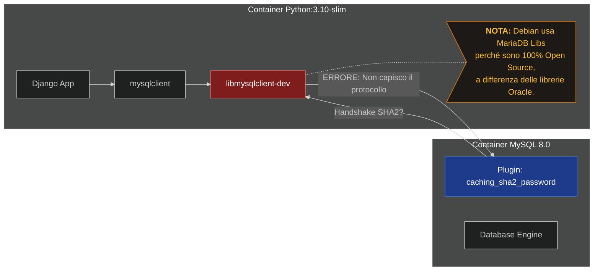

# Case Study: Debugging dell'Integrazione CI/CD tra Django e MySQL 8.0

## Introduzione: Il Conflitto Silenzioso

L'obiettivo di questa attività era elevare la qualità della pipeline di Continuous Integration (CI) su GitLab. Volevamo passare dall'uso di **SQLite** (database basato su file, usato per comodità) a **MySQL 8.0** (database server reale), per garantire la **Parità Dev/Prod**: testare lo stesso motore database usato in produzione.

Tuttavia, ci siamo scontrati con un problema di incompatibilità sistemica tra i container Docker standard. Cerchiamo di analizzare meglio il problema, che purtroppo si nasconde dietro un generico "Access Denied" e richiede una comprensione profonda dell'architettura dei driver MySQL in Python, delle immagini Docker e del protocollo di autenticazione di MySQL 8.0.

### 1. La Differenza Architetturale (Il "Cuore" del problema)

La distinzione fondamentale risiede nel **linguaggio** in cui sono scritti i driver e nel modo in cui comunicano con il database:

*   **mysqlclient (il modulo `MySQLdb`):**
    *   Soluzione iniziale del progetto, e che ho voluto mantenere per compatibilità con la produzione.
    *   È un **wrapper Python** attorno alla libreria C nativa (`libmysqlclient`).
    *   Non parla direttamente col database; delega il lavoro "sporco" (la comunicazione di rete e la crittografia) alla libreria C installata nel sistema operativo.
    *   Richiede strumenti di compilazione (`gcc`, `pkg-config`) e header di sviluppo (`libmysqlclient-dev`) per essere installato.
    *   Motivo per cui nel `Dockerfile` dell'applicazione abbiamo dovuto installare `default-libmysqlclient-dev` e `pkg-config` per farlo funzionare. 

*   **PyMySQL:**
    *   Soluzione a cui avevo pensato all'inizio, ma che ho evitato perché non volevo cambiare i requisiti del progetto (non volevo aggiungere un nuovo driver e fare monkey-patching). (pessima scelta) 
    *   È scritto al **100% in Pure Python**.
    *   Implementa l'intero protocollo di rete di MySQL (il *wire protocol*) direttamente in Python.
    *   Non dipende da nessuna libreria di sistema C; basta un `pip install` e funziona ovunque giri Python.


### 2. Il Problema "Invisibile": MySQL 8.0 e Docker

Il motivo per cui molti sviluppatori passano a PyMySQL non è solo la comodità, ma un problema critico di compatibilità che si verifica spesso nelle pipeline CI/CD (come su GitLab o GitHub Actions) o nei container Docker basati su Debian (es. `python:3.x-slim`).

Ecco la catena causale del problema:
1.  **Il Server:** MySQL 8.0 utilizza di default il plugin di autenticazione `caching_sha2_password` (più sicuro).
2.  **Il Sistema Operativo:** Le immagini Docker basate su Debian/Ubuntu, quando installi `default-libmysqlclient-dev`, scaricano in realtà le librerie client di **MariaDB** (un fork di MySQL, nato nel 2009 quando Oracle ha acquisito MySQL rendendolo closed source, il che ha portato il creatore originale a creare un'alternativa completamente open source). 
3.  **Il Conflitto:** Le librerie C di MariaDB spesso non supportano o gestiscono male l'handshake crittografico `caching_sha2_password` specifico di MySQL 8.0.
4.  **L'Errore:** `mysqlclient` (che usa quelle librerie C) fallisce la connessione restituendo un generico errore "Access Denied", che fa impazzire gli sviluppatori perché le credenziali sono corrette, ma il protocollo fallisce silenziosamente.

Punto estremamente importante: questo problema subentra solo quando cerchiamo di fare dei TEST, perché Django, durante i test, crea un database di test (es. `test_blog`) e cerca di connettersi come `root` per crearlo. Questo siccome l'utente `root` è l'unico che può creare nuovi database, e se `root` è stato creato con SHA2 (come avviene con MySQL 8.0) e il client non lo supporta, allora la connessione fallisce. Invece tutto questo non subentra per il database di produzione (blog) perché quello quando viene creato viene specificato: 
      MYSQL_DATABASE: blog
      MYSQL_USER: django
Di conseguenza, l'utente `django` ha tutti i permessi per poter operare, non richiedendo i privilegi di `root` e quindi non subendo il problema di autenticazione. 
Questo in teoria perché gli utenti normale non hanno bisogno di autenticarsi con SHA2, ma l'utente `root` sì.



**La Soluzione PyMySQL:** Essendo scritto in Python, PyMySQL contiene la *sua* implementazione di `caching_sha2_password`. Ignora completamente le librerie del sistema operativo e si connette con successo a MySQL 8.0 senza configurazioni extra.

### 3. Confronto Tecnico Dettagliato

Quali possono essere le differenze pratiche tra i due driver? Ecco una tabella di confronto:

| Caratteristica | mysqlclient (`MySQLdb`) | PyMySQL |
| :--- | :--- | :--- |
| **Natura** | Estensione C (Wrapper) | Pure Python |
| **Dipendenze OS** | Pesanti (`gcc`, `libmysqlclient-dev`) | Nessuna |
| **Installazione** | Lenta (richiede compilazione, 30-60s) | Immediata (copia file, 1-2s) |
| **Compatibilità Auth** | Dipende dalla libreria di sistema (rischio errore con MySQL 8 su Debian) | Nativa (supporta SHA2 ovunque) |
| **Performance** | **Più veloce** (10-15% in meno di overhead) | Leggermente più lento (interpretato) |
| **Utilizzo Ideale** | Produzione ad alto traffico (se l'ambiente è configurato bene) | Container Docker, CI/CD, Sviluppo rapido |

### 4. Integrazione con Django: Il "Monkey Patching"

Django è costruito per utilizzare `mysqlclient` come driver predefinito. Tuttavia, poiché entrambi i driver rispettano lo standard **PEP 249** (Python Database API Specification), sono intercambiabili a livello logico.

Per usare PyMySQL con Django, bisogna "ingannare" il framework facendogli credere che PyMySQL sia il modulo `MySQLdb` che si aspetta. Questo si fa inserendo il seguente codice nel file `__init__.py` della cartella del progetto o nel `settings.py`:

```python
import pymysql
pymysql.install_as_MySQLdb()
```

**È sicuro?**
Sì. Come confermato dall'esperienza diretta nel progetto analizzato, dopo questo cambio:
*   Le migrazioni, i modelli e le view rimangono identici.
*   L'ORM di Django continua a funzionare esattamente come prima.
*   La differenza di performance (es. 1ms vs 1.2ms per query) è solitamente irrilevante per la maggior parte delle applicazioni web rispetto ai vantaggi di portabilità.


Compreso il problema? Spero di sì. Adesso qui ci sono due strade: 
1.  Vedere direttamente le due soluzioni implementate nel progetto (una che mantiene `mysqlclient` e una che passa a `PyMySQL`), con i rispettivi pro e contro. Se vuoi vedere solo la soluzione finale, puoi saltare direttamente a [Soluzione con mysqlclient](#passo-9-la-soluzione-infrastrutturale-ubuntu) oppure [Soluzione con PyMySQL](#passo-10-la-soluzione-software-definitiva-pymysql).

2. Vedere come ho perso una mattinata di vita a cercare di far andare il job di testing con `mysqlclient` e MySQL 8.0, senza capire che il problema era l'incompatibilità del driver. Ho compreso tutti gli errori che facevo, passando per 7 step di debugging e configurazioni fallite (con relative spiegazioni tecniche). Tutto ciò l'ho fatto più per mettere ordine nella mia testa e capire meglio il disastro che avevo combinato piuttosto che per reale necessità. 

---

## Passo 1: La Configurazione "Ingenua"

### L'Obiettivo

Avviare una pipeline standard dove un container `python:3.10-slim` (Django) si connette a un servizio `mysql:8.0` per eseguire i test di integrazione.

### La Configurazione Iniziale

Nel file `.gitlab-ci.yml`, abbiamo definito il servizio database e il job di test nel modo più standard possibile:

```yaml
services:
  - name: mysql:8.0
    alias: mysql
```

Il container Python installava il driver standard:

```bash
apt-get install default-libmysqlclient-dev  # Librerie C di sistema
pip install mysqlclient                     # Driver Python

```

### L'Errore Riscontrato

Django ha fallito immediatamente la connessione con questo errore:

```text
django.db.utils.OperationalError: (1045, "Access denied for user 'root'@'172.17.0.x' (using password: YES)")

```

### Analisi Tecnica: Perché è fallito?

Questo è stato il **"Peccato Originale"**. L'errore 1045 solitamente indica una password sbagliata, ma qui le credenziali erano corrette. Il problema era un **Conflitto di Identità e Protocollo**, che abbiamo già visto prima, ma che ripetiamo brevemente per chiarezza:

1. **Il Server (Oracle MySQL 8.0):** Di default, utilizza il plugin di autenticazione **`caching_sha2_password`**. È un protocollo moderno che richiede uno scambio di chiavi crittografiche (challenge-response) basato su SHA-256.
2. **Il Client (Debian/MariaDB):** L'immagine `python:3.10-slim` è basata su Debian. Su Debian, il pacchetto `default-libmysqlclient-dev` installa in realtà le librerie client di **MariaDB** (un fork open source), non quelle ufficiali di Oracle.
3. **Il Cortocircuito:** Il client MariaDB (più vecchio o divergente) non supporta nativamente il protocollo `caching_sha2_password`.
* Il Client invia la richiesta per poter creare il database di test (es. `test_blog`) come `root`
* Il Server risponde: "Ok, autenticati usando SHA2".
* Il Client non capisce la richiesta o risponde con un protocollo vecchio (`mysql_native_password`).
* Il Server rifiuta la connessione.

---

## Passo 2: Il Tentativo di Networking (`MYSQL_ROOT_HOST`)

### L'Obiettivo

Ipotizzando che l'errore "Access Denied" fosse dovuto a una restrizione di **provenienza** (IP), abbiamo tentato di allentare le regole di sicurezza del server MySQL per permettere connessioni da qualsiasi origine.

### L'Azione

Abbiamo aggiunto una variabile d'ambiente specifica per configurare l'utente `root` all'avvio del container MySQL:

```yaml
variables:
  MYSQL_ROOT_HOST: '%'  # Wildcard: accetta connessioni da qualsiasi IP

```

### L'Errore Riscontrato

Il risultato è stato identico al Passo 1:

```text
django.db.utils.OperationalError: (1045, "Access denied for user 'root'@'172.17.0.x' (using password: YES)")

```

### Analisi Tecnica: Perché è fallito ancora?

Questo passo era logicamente sensato ma tecnicamente inefficace perché agiva sul livello sbagliato della pila ISO/OSI (o quasi).

1. **Cosa fa `%`:** Dice a MySQL: "Se qualcuno bussa alla porta TCP con le credenziali di root, fallo entrare a prescindere dal suo indirizzo IP".
2. **La Realtà:** Il container Python *stava già* raggiungendo il server (la porta era aperta). Il blocco non avveniva a livello di **Rete** (IP), ma a livello di **Applicazione** (Autenticazione).

**Diagnosi:** Abbiamo aperto la porta "fisica", ma i due interlocutori continuavano a parlare lingue diverse. L'errore "Access Denied" persisteva perché la negoziazione falliva *dopo* la connessione di rete, ma *durante* l'handshake.

---


## Passo 3: Forzare il Protocollo (`--default-authentication-plugin`)

### L'Obiettivo

Dato che il client non parlava la lingua "moderna" (SHA2), abbiamo provato a configurare il Server MySQL affinché utilizzasse di default la lingua "antica" (`mysql_native_password`) per i nuovi utenti.

### L'Azione

Abbiamo modificato la definizione del servizio nel `.gitlab-ci.yml` passando un argomento specifico al comando di avvio del demone MySQL:

```yaml
services:
  - name: mysql:8.0
    command: ["--default-authentication-plugin=mysql_native_password"]

```

### L'Errore Riscontrato

Nonostante il flag, l'errore è rimasto invariato:

```text
django.db.utils.OperationalError: (1045, "Access denied for user 'root'@'...' (using password: YES)")

```

### Analisi Tecnica: Perché è fallito?

Questo fallimento è dovuto al funzionamento interno dell'immagine Docker di MySQL e al concetto di **Inizializzazione (Entrypoint)**.

1. **Il Comando:** Il flag `--default-authentication-plugin` istruisce il server a usare il vecchio plugin per *i nuovi utenti creati da quel momento in poi*.
2. **Il Problema di Tempismo:** Quando un container database parte per la prima volta, esegue uno script di inizializzazione che crea gli utenti base (`root` e l'utente applicativo `django`).
3. **Il Bug/Comportamento:** Nelle versioni recenti di MySQL 8.0, questo script di inizializzazione tende a ignorare il flag globale per l'utente `root`, creandolo comunque con `caching_sha2_password` per motivi di sicurezza hardcodati.
4. **Risultato:** Il server girava effettivamente in modalità compatibile, ma solo per i nuovi utenti, non per l'utente root, e quando i test di Django cercavano di un database (test_blog) (operazione per cui sono necessari i privilegi di root) il server rispondeva "Access Denied" perché root era ancora SHA2.

**Diagnosi:** Il flag era corretto in teoria, ma inefficace in pratica a causa delle policy di sicurezza dello script di avvio dell'immagine Docker ufficiale.

---

## Passo 4: Lo Switch a MariaDB e l'Errore di Alias

### L'Obiettivo

Qui documentandomi ho iniziato a capire che il problema era un conflitto di protocolli tra il client (MariaDB) e il server (MySQL 8.0). Se il client non capisce SHA2, perché non usare un server che parla la stessa lingua? L'idea era passare a **MariaDB** come database server, eliminando l'incompatibilità alla radice.
Contemporaneamente, per sicurezza, abbiamo tentato di forzare manualmente i permessi dell'utente lanciando un comando SQL diretto.
Per quanto la soluzione non era ottima, in quanto avremmo avuto comunque un database diverso da quello di produzione, ma quanto meno mi serviva per vedere (sperare) che qualcosa funzionasse e che quindi non stessi impazzendo.

### L'Azione

Abbiamo cambiato l'immagine del servizio e aggiunto un comando di fix manuale nel `before_script`:

```yaml
services:
  - name: mariadb  # Cambio immagine
    # Manca l'alias! (Errore critico)

script:
  # Tentativo di fix manuale dell'utente via CLI
  - mysql -h mysql -u root -p"$MYSQL_ROOT_PASSWORD" -e "ALTER USER 'test_django'@'%' IDENTIFIED WITH mysql_native_password BY '$MYSQL_PASSWORD';"

```

### Cosa fa il comando `ALTER USER`?

Il comando lanciato (`mysql -h mysql ... -e "ALTER USER ..."`) serve a modificare un utente esistente nel database.

* `IDENTIFIED WITH mysql_native_password`: Dice al database "Dimentica SHA2, da ora in poi la password di questo utente deve essere gestita con il vecchio algoritmo".
* **Scopo:** Era un tentativo disperato di "downgradare" la sicurezza di uno specifico utente per permettere al client Django di connettersi.

### L'Errore Riscontrato

Questa volta l'errore è cambiato drasticamente, passando da "Access Denied" a un errore di rete:

```text
ERROR 2005 (HY000): Unknown MySQL server host 'mysql' (-2)

```

### Analisi Tecnica: Perché è fallito?

Qui siamo inciampati in un errore di configurazione **DNS** di GitLab CI, introducendo un nuovo problema mentre cercavamo di risolverne un altro.

1. **La Regola dei Nomi in GitLab:** Quando definisci un servizio *senza* specificare un `alias`, GitLab assegna un hostname basato sul nome dell'immagine, sostituendo i caratteri speciali con trattini.
* Immagine: `mariadb:latest` -> Hostname: `mariadb-latest` (o simile).
2. **La Richiesta:** Il nostro comando (`mysql -h mysql`) e la configurazione di Django cercavano un server all'indirizzo `mysql`.
3. **Il Disguido:** Non avendo una riga `alias: mysql` il container database non rispondeva più al nome "mysql".
4. **Conseguenza:** Il comando `ALTER USER` non è mai stato eseguito perché il client non ha mai trovato il server.

**Diagnosi:** Un errore di distrazione nella configurazione YAML (mancanza di `alias`) ha causato un fallimento DNS, impedendo di verificare se la soluzione MariaDB avrebbe funzionato.

---


## Passo 5: Il Ritorno a MySQL 8 e il Muro SSL

### L'Obiettivo

Dopo aver corretto l'errore dell'alias (DNS), siamo tornati all'immagine `mysql:8.0`, stupidamente senza testare che la soluzione MariaDB funzionasse. L'idea era: "Se il server usa SHA2 di default, connettiamoci manualmente come root e costringiamolo a cambiare la password dell'utente Django nel vecchio formato `mysql_native_password`", esattamente come avevamo tentato di fare con MariaDB.

### L'Azione

Nel `before_script` del file `.gitlab-ci.yml`, abbiamo aggiunto questo comando:

```bash
mysql -h mysql -u root -p"$MYSQL_ROOT_PASSWORD" -e "ALTER USER 'test_django'@'%' IDENTIFIED WITH mysql_native_password BY '$MYSQL_PASSWORD';"

```

### L'Errore Riscontrato

Il comando ha fallito, ma **non** con un errore di password ("Access Denied"), bensì con un errore di sicurezza:

```text
ERROR 2026 (HY000): TLS/SSL error: self-signed certificate in certificate chain

```

### Analisi Tecnica: Cosa significa?

Questo errore è stato fondamentale perché ci ha rivelato che **la connessione di rete funzionava**, ma c'era un nuovo ostacolo.

1. **Il Contesto:** Il container Python (client) ha contattato con successo il container MySQL (server).
2. **L'Handshake:** Il server MySQL 8.0, appena contattato, ha proposto di cifrare la connessione (SSL) per sicurezza. Ha inviato il suo certificato digitale.
3. **Il Problema dei Certificati:** Essendo un container effimero (creato e distrutto per il test), MySQL genera automaticamente un certificato SSL **autofirmato** all'avvio. Non esiste un'autorità garante (CA) esterna che lo validi.
4. **La Paranoia del Client:** Il client `mysql` (che in realtà è il client di **MariaDB** installato su Debian) ha ricevuto il certificato, ha notato che era autofirmato ("self-signed") e lo ha considerato insicuro, temendo un attacco *Man-in-the-Middle*.
5. **Il Risultato:** Il client ha interrotto la connessione immediatamente per "proteggerci", impedendo l'invio del comando `ALTER USER`.

**Diagnosi:** Abbiamo superato il problema di rete (DNS/IP), ma siamo stati bloccati dal livello di sicurezza SSL prima ancora di poter risolvere il problema di autenticazione SHA2.

Perché questo non avveniva prima? 

---

## Passo 6: Il Tentativo di Downgrade (MySQL 5.7)

### L'Obiettivo

Esausti dai problemi di protocollo (SHA2) e certificati (SSL) della versione 8.0, abbiamo tentato la strada del "Downgrade". Abbiamo ipotizzato che usando **MySQL 5.7** (una versione del 2015), avremmo trovato nativamente il vecchio protocollo di password e una gestione SSL meno rigida, risolvendo tutto "gratis".

### L'Azione

1. Modificato il servizio nel `.gitlab-ci.yml` in `image: mysql:5.7`.
2. **Rimozione Configurazioni:** Nel tentativo di "pulire" l'ambiente, abbiamo rimosso le variabili extra aggiunte nei passi precedenti, come `MYSQL_ROOT_HOST: '%'`, credendo che con la 5.7 non servissero.

### L'Errore Riscontrato

Contrariamente alle aspettative, siamo tornati al punto di partenza:

```text
django.db.utils.OperationalError: (1045, "Access denied for user 'test_django'@'172.17.0.x' (using password: YES)")

```

### Analisi Tecnica: Perché ha fallito se la versione era compatibile?

Sebbene MySQL 5.7 e il client Debian parlino la stessa lingua (protocollo `mysql_native_password` OK), abbiamo introdotto un problema di **Permessi (Grants)** rimuovendo le configurazioni di rete.

1. **Sicurezza di Default:** Anche nella versione 5.7, l'utente `root` è configurato di default per accettare connessioni **solo da localhost**.
2. **Il Nostro Scenario:** Il client (Django) si trova su un container diverso (`172.17.0.x`). Per MySQL, questa è una connessione **remota**.
3. **L'Errore:**
* Django provava a creare il database di test (`test_blog`). Questo richiede permessi da superuser o privilegi speciali.
* Se Django usava `root`: MySQL lo bloccava perché l'IP non era `localhost` (avendo noi rimosso `MYSQL_ROOT_HOST: '%'`).


**Diagnosi:** Il downgrade ha risolto il problema di compatibilità del protocollo (Software), ma la rimozione delle configurazioni di rete ha probabilmente reintrodotto un problema di permessi di accesso (Configurazione). Non potendo accedere come `root` da remoto, non potevamo aggiustare i permessi degli altri utenti.


---

## Passo 7: Ritorno a MySQL 8 e l'Illusione dei Permessi (`GRANT ALL`)

### L'Obiettivo

Dopo il fallimento del downgrade, siamo tornati alla versione `mysql:8.0`.
L'ipotesi era: *"Forse l'autenticazione funziona, ma l'utente Django non ha i permessi per fare nulla, nemmeno connettersi. Proviamo a renderlo un Super Admin (GRANT ALL) con un comando brutale da riga di comando."*

### L'Azione

1. **Installazione Pacchetti:** Abbiamo aggiornato la lista dei pacchetti nel container Python:
```bash
apt-get install -y -qq gcc python3-dev net-tools default-mysql-client default-libmysqlclient-dev

```


* **Cosa cambia:** Abbiamo aggiunto `net-tools`. Questo pacchetto contiene strumenti di debug di rete come `netstat` e `ifconfig`. È utile per il debugging manuale, ma **irrilevante** per la risoluzione del problema di connessione DB. Il core del problema rimaneva la presenza di `default-mysql-client` (client MariaDB).


2. **Il Comando di "Forza Bruta":**
```bash
echo "GRANT ALL on *.* to '${MYSQL_USER}';" | mysql -u root --password="${MYSQL_ROOT_PASSWORD}" -h mysql

```


* **Spiegazione del Comando:**
* `echo "..."`: Genera una stringa di testo contenente il comando SQL.
* `|` (Pipe): Passa questa stringa direttamente all'input del programma successivo.
* `GRANT ALL on *.*`: È il permesso massimo esistente. Significa "Dai tutti i poteri, su tutti i database, su tutte le tabelle".
* `mysql ...`: Il client si connette al server per eseguire quell'ordine.

### L'Errore Riscontrato

Il comando è fallito, ma non per un problema di permessi SQL. Siamo stati bloccati ancora una volta sulla porta d'ingresso:

```text
ERROR 2026 (HY000): TLS/SSL error: self-signed certificate in certificate chain

```

### Analisi Tecnica: Perché il `GRANT` non è mai partito?

Questo step conferma definitivamente che il problema non è mai stato "cosa stiamo cercando di fare" (Alter User, Grant All, Select), ma "come stiamo cercando di connetterci".

1. Il client (`mysql` alias MariaDB Client) ha contattato il server (`mysql` alias Oracle Server).
2. Il server ha risposto iniziando l'handshake SSL e inviando il suo certificato autofirmato.
3. Il client MariaDB ha rifiutato il certificato come "non sicuro".
4. **Conseguenza:** La connessione è caduta **prima** che il comando `GRANT ALL` venisse inviato. La query non è mai stata eseguita. I permessi nel DB non sono cambiati.

---

## Passo 8: Disabilitare SSL (`--skip-ssl`) e il Ritorno alle Origini

### L'Obiettivo

Avendo identificato l'SSL come il "blocco" attuale, abbiamo deciso di rimuoverlo dall'equazione.
L'idea era: *"Se il client si lamenta del certificato, diciamo al client di ignorare completamente la crittografia. Così passeremo sicuramente!"*

### L'Azione

Abbiamo modificato il comando di connessione aggiungendo il flag di bypass SSL:

```bash
mysql -h mysql -u root -p... --skip-ssl ...

```

### L'Errore Riscontrato

Finalmente l'errore SSL è sparito! Ma al suo posto è tornato il nostro vecchio nemico del Passo 1:

```text
ERROR 1045 (28000): Access denied for user 'root'@'172.17.0.x' (using password: YES)

```

### Analisi Tecnica: Il Cerchio si Chiude

Questo è stato il momento della verità. Abbiamo rimosso strato dopo strato ogni problema accessorio, arrivando al nucleo indivisibile dell'incompatibilità.

1. **Rete:** Superata (DNS e IP ok).
2. **SSL:** Superata (Disabilitata con `--skip-ssl`).
3. **Autenticazione (Il vero problema):**
* Il client (MariaDB) ora può finalmente parlare con il server.
* Invia la password.
* Il Server (MySQL 8) dice: *"Ok, la connessione è insicura (no SSL), ma per farmi accettare la password devi usare l'algoritmo `caching_sha2_password`"*.
* Il Client (MariaDB) risponde: *"Non so cosa sia. Ti mando la password con l'hash nativo vecchio style"*.
* Il Server risponde: **Access Denied**.


**Diagnosi Finale:**
Tutti i tentativi di configurazione (Grant, Root Host, SSL skip) erano palliativi. Non importava quanto configurassimo la rete o i permessi: **il Client (Debian/MariaDB) e il Server (Oracle MySQL 8) erano fondamentalmente incompatibili a livello di protocollo di autenticazione.**

---

## Conclusioni della Fase di Debugging

Abbiamo dimostrato empiricamente che per far funzionare questa pipeline **non è possibile usare le librerie di sistema standard di Debian (`default-libmysqlclient-dev`) contro MySQL 8.0**, a meno di non degradare pesantemente la sicurezza del server o creare immagini custom complesse.

Questo ci ha portato alle due soluzioni risolutive:

1. **Cambiare il Sistema Operativo (Soluzione Ubuntu):** Usare un OS che fornisce i driver client compatibili (Oracle MySQL Client).
2. **Cambiare il Driver (Soluzione PyMySQL):** Usare un driver Pure Python che bypassa completamente il problema delle librerie di sistema. **(Scelta adottata)**.

---

## Passo 9: La Soluzione Infrastrutturale (Ubuntu)

### L'Intuizione

Se il problema è che Debian usa le librerie client di MariaDB, cambiamo sistema operativo nel container dei test! Ubuntu, a differenza di Debian, pacchettizza i client ufficiali compatibili con MySQL 8.

Questa soluzione affronta il problema di connessione tra Django e MySQL 8.0 nella CI/CD agendo sull'ambiente di esecuzione (il Container), mantenendo inalterato il codice applicativo e utilizzando i driver standard.

### 1. Il Concetto: Adattare il Container, non il Codice

Invece di modificare le dipendenze del progetto (passando a driver Pure Python come `PyMySQL`), questa soluzione mantiene il driver standard `mysqlclient` (basato su C) e fornisce un sistema operativo capace di compilarlo ed eseguirlo correttamente contro MySQL 8.0.

* **Requisiti:** Nessuna modifica al `requirements.txt` (rimane `mysqlclient`).
* **Codice:** Nessuna modifica a `settings.py` (nessun monkey-patching).
* **Strategia:** Sostituire l'immagine base leggera (`python:3.10-slim`, basata su Debian) con una completa (`ubuntu:22.04`) che dispone delle librerie client native compatibili con l'autenticazione SHA2 di MySQL 8.

### 2. Implementazione Locale: `docker-compose.ci.yml`

Abbiamo trasformato il file di test locale per simulare un ambiente di compilazione completo.

**Modifiche chiave:**

1. **Immagine Base:** Passaggio da `python:3.10-slim` a `ubuntu:22.04`.
2. **Installazione Dipendenze:** Aggiunta di compilatori (`build-essential`, `gcc`) e header di sviluppo (`libmysqlclient-dev`, `python3-dev`) necessari per compilare il driver `mysqlclient`.

```yaml
version: '3.8'

services:
  mysql:
    image: mysql:8.0
    # Nota: Con Ubuntu e i driver giusti, questo flag NON serve più,
    # perché il client supporterebbe SHA2 nativamente.
    # command: ["--default-authentication-plugin=mysql_native_password"]
    environment:
      MYSQL_DATABASE: blog
      MYSQL_ROOT_PASSWORD: ci_root_pass
    healthcheck:
      test: ["CMD", "mysqladmin", "ping", "-h", "localhost", "-pci_root_pass"]
      interval: 2s
      timeout: 5s
      retries: 30

  test:
    # CAMBIAMENTO 1: Usiamo Ubuntu invece di Python Slim
    image: ubuntu:22.04
    
    working_dir: /app
    volumes:
      - .:/app
    
    environment:
      DJANGO_SETTINGS_MODULE: django_project.production_settings
      DJANGO_SECRET_KEY: ci-test-key
      MYSQL_USER: root
      MYSQL_PASSWORD: ci_root_pass
      MYSQL_HOST: mysql
      MYSQL_PORT: 3306
      MYSQL_DATABASE: blog
      # Su Ubuntu/Debian frontend non interattivo evita blocchi durante apt install
      DEBIAN_FRONTEND: noninteractive 

    depends_on:
      mysql:
        condition: service_healthy

    # CAMBIAMENTO 2: Il comando diventa molto più lungo e complesso
    command: >
      bash -c "
        echo '--- 1. Aggiornamento Repo ---' &&
        apt-get update &&
        
        echo '--- 2. Installazione Python e Tool di Build ---' &&
        apt-get install -y python3.10 python3-pip python3-dev build-essential pkg-config libmysqlclient-dev mysql-client &&
        
        echo '--- 3. Installazione Dipendenze Python (Compilazione mysqlclient) ---' &&
        pip install --upgrade pip &&
        pip install -r requirements.txt &&
        pip install coverage &&
        
        echo '--- 4. Esecuzione Test ---' &&
        python3 manage.py migrate --noinput &&
        coverage run --source='.' manage.py test accounts articles pages --verbosity=2 &&
        coverage report
      "
```

### 3. Implementazione Pipeline: `.gitlab-ci.yml`

Il job nella CI riflette la stessa logica: prepara un ambiente Ubuntu "pesante" prima di eseguire i test.

```yaml
test_django_mysql_ubuntu:
  # 1. Usiamo l'immagine "pesante" ma compatibile
  image: ubuntu:22.04
  stage: test

  # 2. Il servizio MySQL rimane lo stesso (è l'altro lato della connessione)
  services:
    - name: mysql:8.0
      alias: mysql
      # Potremmo mantenere  il plugin legacy per massima sicurezza, ma meglio commentarlo
      # command: ["--default-authentication-plugin=mysql_native_password"]

  variables:
    # Configurazione Database (Environment Variables)
    MYSQL_DATABASE: blog
    MYSQL_ROOT_PASSWORD: ci_root_password
    # Variabili per Django
    DJANGO_SETTINGS_MODULE: "django_project.production_settings"
    DJANGO_SECRET_KEY: "ci-test-secret-key"
    # Evita che apt-get ti chieda conferme interattive (Timezone, ecc.)
    DEBIAN_FRONTEND: noninteractive

  before_script:
    # 3. Aggiornamento repository
    - apt-get update -q

    # 4. Installazione Dipendenze di Sistema (La parte "pesante")
    # Qui installiamo Python, pip, compilatori (build-essential) e librerie MySQL
    - apt-get install -y python3.10 python3-pip python3-dev build-essential pkg-config libmysqlclient-dev mysql-client

    # 5. Installazione Dipendenze Python
    # Nota: requirements.txt deve contenere 'mysqlclient', NON 'PyMySQL'
    - python3 -m pip install --upgrade pip
    - pip install -r requirements.txt
    - pip install coverage

    # 6. Setup Variabili Ambiente per Django (per connettersi al servizio 'mysql')
    - export MYSQL_HOST=mysql
    - export MYSQL_PORT=3306
    - export MYSQL_USER=root
    - export MYSQL_PASSWORD=ci_root_password

    # 7. Wait-for-it 
    # Aspettiamo che MySQL sia pronto prima di lanciare i test
    - |
      echo "Waiting for MySQL..."
      for i in $(seq 1 30); do
        if mysqladmin ping -h mysql -u root -pci_root_password --silent; then
          echo "MySQL is ready!"
          break
        fi
        echo "Waiting..."
        sleep 2
      done

  script:
    # 8. Esecuzione Migrazioni e Test
    - python3 manage.py migrate --noinput
    - coverage run --source='.' manage.py test accounts articles pages --verbosity=2
    - coverage report

  # Configurazione Artifacts e Coverage (uguale a prima)
  coverage: '/TOTAL.*\s+(\d+%)$/'
  artifacts:
    reports:
      coverage_report:
        coverage_format: cobertura
        path: coverage.xml
```

### 4. Analisi Costi/Benefici

| Aspetto | Soluzione "Ubuntu" (Infrastruttura) | Soluzione "PyMySQL" (Codice) |
| --- | --- | --- |
| **Modifiche al Codice** | **Nessuna.** Si usa il driver standard `mysqlclient`. | Richiede switch a `PyMySQL` e monkey-patching in `settings.py`. |
| **Compatibilità** | **Nativa.** Usa librerie C ufficiali. Massima fedeltà alla produzione bare-metal. | Emulata. PyMySQL riscrive il protocollo in Python. |
| **Performance CI** | **Più lenta.** Deve scaricare apt-get e compilare gcc ogni volta (~2-3 min in più). | Veloce. Nessuna compilazione. |
| **Immagine Docker** | Pesante (`ubuntu:22.04` ~600MB). | Leggera (`python:slim` ~150MB). |

Questa soluzione è ideale quando si vuole **massima parità con l'ambiente di produzione standard** e si preferisce pagare un costo in termini di tempo di esecuzione della pipeline piuttosto che introdurre dipendenze diverse (PyMySQL) solo per far passare i test.


---

## Passo 10: La Soluzione Software Definitiva (PyMySQL)

### L'Intuizione

Invece di appesantire la CI con un sistema operativo intero (Ubuntu) solo per un driver, usiamo un driver scritto in **Puro Python** (`PyMySQL`). Essendo codice Python, non dipende dalle librerie C del sistema operativo.

### 1. Il Concetto: "Software Bypass"

Invece di appesantire il container con librerie di sistema compatibili (come nella soluzione Ubuntu), sostituiamo il driver `mysqlclient` (che richiede librerie C compilate) con **PyMySQL**.

* **Vantaggio:** PyMySQL implementa il protocollo MySQL direttamente in Python. È portabile, leggero e non richiede compilazione.
* **Sicurezza (SHA2):** Per supportare l'autenticazione sicura `caching_sha2_password` di MySQL 8.0, PyMySQL necessita della libreria di supporto `cryptography`.

### 2. Modifiche al Codice Applicativo

Dobbiamo intervenire sul progetto per sostituire il motore di connessione.

**A. `requirements.txt`**
Sostituiamo il driver C con quello Python e aggiungiamo il supporto crittografico.

```text
# Driver database
PyMySQL==1.0.3
cryptography>=3.4.0  <-- Libreria usata da PyMySQL per supportare SHA2
# mysqlclient==2.1.1  <-- RIMOSSO

```

**B. `production_settings.py` (Monkey Patching)**
Django cerca nativamente `MySQLdb`. Usiamo un trucco per iniettare PyMySQL al suo posto.

```python
import pymysql

# Inganna Django facendogli credere di usare il driver standard
pymysql.install_as_MySQLdb()

DATABASES = { ... }

```

### 3. Configurazione Infrastruttura (`.gitlab-ci.yml`)

La pipeline diventa molto più efficiente perché possiamo usare immagini "Slim" senza dover installare compilatori (`gcc`) o header file.

**Punto Critico Risolto:** Lo script di attesa (`wait-for-it`) in Python.
Poiché non installiamo il client MySQL di sistema (`mysqladmin`), dobbiamo attendere che il DB sia pronto usando Python. 

Ecco la configurazione funzionante:

```yaml
test_django_mysql_pymysql:
  # IMMAGINE LEGGERA: Possiamo usare slim perché non dobbiamo compilare nulla C
  image: python:3.10-slim
  stage: test

  services:
    - name: mysql:8.0
      alias: mysql

  variables:
    MYSQL_DATABASE: blog
    MYSQL_ROOT_PASSWORD: ci_root_pass
    DJANGO_SETTINGS_MODULE: "django_project.production_settings"
    DJANGO_SECRET_KEY: "ci-test-secret-key"

  before_script:
    - apt-get update -y && apt-get install -y gcc python3-dev
    # 1. SETUP VELOCISSIMO
    # Non serve apt-get update, non serve gcc, non serve libmysqlclient-dev!
    # PyMySQL è solo codice Python, si installa in un attimo.
    - pip install --upgrade pip
    - pip install -r requirements.txt
    - pip install coverage
    - pip install cryptography  # Per risolvere un errore di importazione di PyMySQL

    # 2. Configurazione Variabili
    - export MYSQL_HOST=mysql
    - export MYSQL_PORT=3306
    - export MYSQL_USER=root
    - export MYSQL_PASSWORD=ci_root_pass

    # 3. Wait-for-it (Python-based)
    # Dato che non abbiamo installato mysql-client (che contiene mysqladmin),
    # usiamo Python stesso per controllare se il DB è pronto.
    - |
      echo "Waiting for MySQL..."
      python3 -c "
      import time, pymysql, sys, os
      
      print('Debug: Inizio ciclo di connessione...')
      for i in range(30):
        try:
          # Stampiamo cosa stiamo facendo per essere sicuri
          print(f'Tentativo {i+1}...')
          
          pymysql.connect(
            host=os.environ['MYSQL_HOST'], 
            user=os.environ['MYSQL_USER'], 
            password=os.environ['MYSQL_PASSWORD'],
            database=os.environ['MYSQL_DATABASE']
          )
          
          print('MySQL ready!')
          sys.exit(0)
          
        except Exception as e:
          print(f'Errore connessione: {e}') 
          time.sleep(2)
      
        print('Timeout!')
        sys.exit(1)"

  script:
    - python manage.py migrate --noinput
    - coverage run --source='.' manage.py test accounts articles pages --verbosity=2
    - coverage report
```


### 4. Verifica Locale (`docker-compose.ci.yml`)

Per testare questa soluzione in locale prima del push, usiamo un `docker-compose` che simula l'assenza di librerie di sistema.

**Comando Fondamentale:** `docker-compose -f docker-compose.ci.yml down -v` (per rimuovere volumi vecchi e testare l'inizializzazione pulita).

```yaml
version: '3.8'

services:
  mysql:
    image: mysql:8.0
    environment:
      MYSQL_DATABASE: blog
      MYSQL_ROOT_PASSWORD: ci_root_pass
    healthcheck:
      test: ["CMD", "mysqladmin", "ping", "-h", "localhost", "-pci_root_pass"]
      interval: 2s
      timeout: 5s
      retries: 30

  test:
    # VANTAGGIO: Torniamo all'immagine slim!
    image: python:3.10-slim
    
    working_dir: /app
    volumes:
      - .:/app
    
    environment:
      # Fondamentale: deve puntare al file con il monkey-patching
      DJANGO_SETTINGS_MODULE: django_project.production_settings
      DJANGO_SECRET_KEY: ci-test-key
      MYSQL_USER: root
      MYSQL_PASSWORD: ci_root_pass
      MYSQL_HOST: mysql
      MYSQL_PORT: 3306
      MYSQL_DATABASE: blog
      
    depends_on:
      mysql:
        condition: service_healthy
    # COMANDO:
    # 1. Installiamo 'gcc' SOLO per compilare uWSGI (presente nei requirements).
    # 2. NON installiamo 'libmysqlclient-dev' (la prova del nove che PyMySQL funziona).
    command: >
      bash -c "
        apt-get update && 
        apt-get install -y gcc python3-dev &&
        
        pip install --upgrade pip &&
        pip install -r requirements.txt &&
        pip install coverage &&
        pip install cryptography &&  # Questo è qui perché all'inizio non l'avevo messo nei requirements 

        echo '
      import time, pymysql, sys, os
      
      for i in range(30):
          try:
            pymysql.connect(
              host=os.environ[\"MYSQL_HOST\"], 
              user=os.environ[\"MYSQL_USER\"], 
              password=os.environ[\"MYSQL_PASSWORD\"],
              database=os.environ[\"MYSQL_DATABASE\"]
            )
            print(\"MySQL ready!\")
            sys.exit(0)
          except Exception as e:
            print(f\"Waiting... {e}\")
            time.sleep(2)
      sys.exit(1)' > wait_db.py &&
        
        python3 wait_db.py &&
      

        python manage.py migrate --noinput &&
        coverage run --source='.' manage.py test accounts articles pages --verbosity=2 &&
        coverage report
      "
```

### 6. Conclusione: PyMySQL vs Ubuntu

| Caratteristica | Soluzione PyMySQL | Soluzione Ubuntu |
| --- | --- | --- |
| **Complessità Setup CI** | **Bassa** (Solo pip install) | **Alta** (apt-get, compilazione C) |
| **Tempo Esecuzione Job** | **Veloce** (Setup immediato) | **Lento** (Setup richiede minuti) |
| **Portabilità** | **Totale** (Pure Python) | **Dipendente dall'OS** |
| **Fedeltà Prod** | Media (Emulazione protocollo) | Alta (Driver ufficiali Oracle) |

Abbiamo scelto **PyMySQL** per la sua leggerezza e velocità nella pipeline CI/CD, accettando l'uso del "Monkey Patching" come compromesso accettabile per evitare la gestione complessa delle librerie di sistema.

## Conclusione Finale del Case Study

L'errore `1045 Access Denied` in ambienti Docker/CI moderni spesso nasconde un problema di **incompatibilità binaria** tra le distribuzioni Linux (Debian/MariaDB) e i Database Server proprietari (Oracle MySQL 8).

Tentare di risolvere il problema agendo sui flag di configurazione (`--default-authentication`), sulla rete (`ROOT_HOST`) o sui permessi (`GRANT`) è inefficace perché il blocco avviene a livello di **Handshake del Protocollo**, a monte dell'autenticazione.

La soluzione più robusta per la CI/CD è **disaccoppiare l'applicazione dal sistema operativo** utilizzando driver puramente software (PyMySQL), garantendo portabilità e velocità di esecuzione.

---

