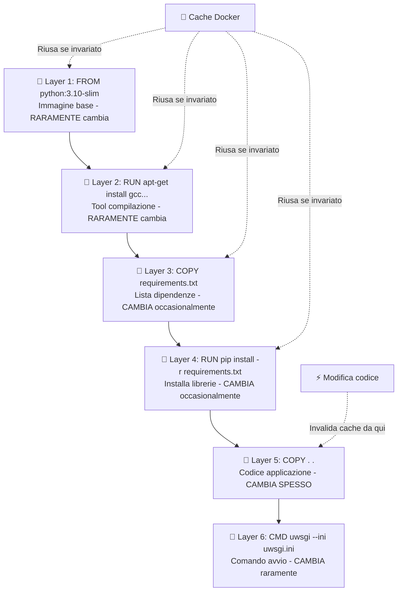
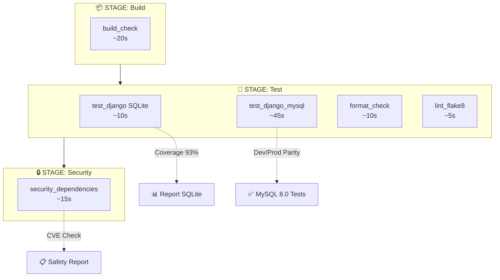
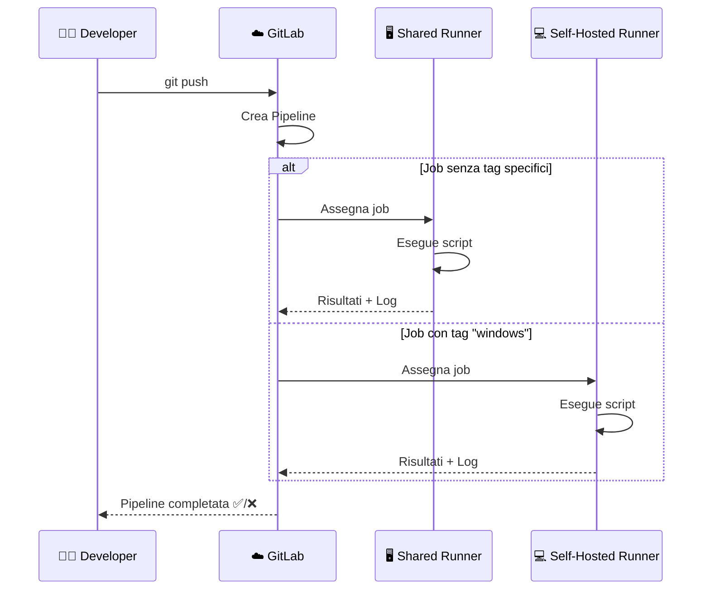
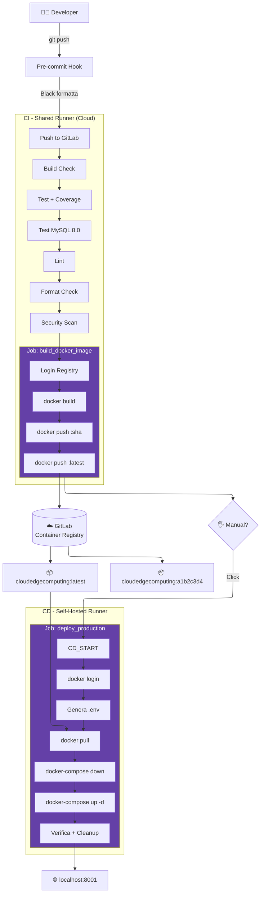

# Relazione di Progetto: Cloud and Edge Computing - Django Newspaper

**Studente:** Luca Di Leo
**Progetto:** Django Newspaper (Fork)

## 1. Introduzione e Obiettivi

Il presente progetto si colloca nell'ambito del corso di Cloud and Edge Computing e ha come oggetto la modernizzazione e l'ingegnerizzazione del ciclo di vita del software per l'applicazione web "Django Newspaper".

Partendo da una codebase legacy esistente, l'attività si è focalizzata non sullo sviluppo di nuove funzionalità applicative, quanto sulla creazione di un'infrastruttura robusta, riproducibile e automatizzata.

Gli obiettivi principali perseguiti sono stati:

* **Containerizzazione dell'Ambiente:** Abbandonare la dipendenza dalle configurazioni della macchina locale per garantire la riproducibilità dell'ambiente di esecuzione su qualsiasi host, eliminando la problematica del "works on my machine".
* **Simulazione dell'Ambiente di Produzione:** Migrare dal database SQLite (tipico dello sviluppo) a MySQL 8.0, architettando un sistema multi-container che rispecchi una configurazione reale di produzione.
* **Automazione dei Processi (CI/CD):** Implementare pipeline di Continuous Integration e Continuous Deployment su GitLab per automatizzare la verifica del codice, i test, la build delle immagini Docker e il rilascio.

## 2. Stack Tecnologico e Architettura

Lo stack tecnologico dell'applicazione è il seguente:

### Componenti Applicativi

* **Backend Framework:** Django 4.0
* **Application Server:** uWSGI 2.0.21 - Utilizzato come interfaccia WSGI di produzione per servire l'applicazione Python, offrendo performance e gestione dei processi superiori rispetto al server di sviluppo integrato di Django.
* **Database:**
    * *Sviluppo Locale / CI:* SQLite (per rapidità e test in-memory).
    * *Produzione (Docker):* MySQL 8.0 - Per garantire persistenza, concorrenza e integrità dei dati in ambiente containerizzato.


### DevOps & Infrastruttura

* **Containerizzazione:** Docker e Docker Compose per l'orchestrazione multi-container.
* **CI/CD:** GitLab CI - Utilizzato per l'orchestrazione delle pipeline.
* *Shared Runners (Cloud):* Per i task di Continuous Integration (test, linting, build).
* *Self-Hosted Runner (Windows):* Per i task di Continuous Deployment sull'host locale.
* **Container Registry:** GitLab Container Registry - Per l'archiviazione sicura e il versionamento delle immagini Docker buildate.

### Architettura del Sistema

L'architettura finale prevede un ambiente containerizzato composto da due servizi principali isolati su una rete Docker privata:

1. **Servizio Web:** Container ospitante l'applicazione Django servita da uWSGI.
2. **Servizio DB:** Container ospitante MySQL 8.0.

La persistenza dei dati è garantita tramite *Named Volumes* Docker (`mysql_data`), mentre la comunicazione tra i servizi avviene tramite risoluzione DNS interna alla rete Docker, garantendo isolamento e sicurezza rispetto all'host ospitante.

---


## 3. Fase 1: Containerizzazione

La prima fase operativa del progetto ha riguardato la containerizzazione dell'applicazione Django e la definizione dell'infrastruttura locale tramite Docker. L'obiettivo era creare un ambiente di sviluppo che fosse il più possibile simile a quello di produzione, garantendo al contempo la flessibilità necessaria per il debugging e la scrittura del codice.

### 3.1 Scelte Implementative: Il Dockerfile

Per la costruzione dell'immagine applicativa (`web`), è stato elaborato un **Dockerfile** ottimizzato per ridurre le dimensioni finali e velocizzare i tempi di build.

* **Immagine Base:** È stata selezionata `python:3.10-slim` invece della variante completa. Questa scelta riduce drasticamente la dimensione dell'immagine, minimizzando la superficie di attacco e i tempi di trasferimento.
* **Gestione Dipendenze di Sistema:** Poiché l'immagine `slim` è priva di compilatori, è stato necessario installare manualmente pacchetti come `gcc` e `default-libmysqlclient-dev` per permettere la compilazione del driver `mysqlclient`, necessario per la comunicazione con il database MySQL.
* **Ottimizzazione della Cache (Layering):** Le istruzioni sono state ordinate strategicamente copiando il file `requirements.txt` ed eseguendo `pip install` *prima* della copia del codice sorgente. Questo permette a Docker di riutilizzare i layer della cache contenenti le librerie se il codice cambia ma le dipendenze rimangono invariate, accelerando significativamente le build successive.



### 3.2 Orchestrazione dei Servizi (Docker Compose)

L'orchestrazione multi-container è gestita tramite **Docker Compose**, che definisce due servizi principali:

1. **Database (`db`):** Basato sull'immagine ufficiale `mysql:8.0`. Per garantire la robustezza all'avvio, è stato configurato un **Healthcheck** (`mysqladmin ping`).
2. **Applicazione Web (`web`):** Configurato per dipendere dallo stato di salute del database (`depends_on: condition: service_healthy`). Questo previene il comune errore di avvio dell'applicazione prima che il database sia pronto ad accettare connessioni.

#### 3.2.1 Separazione Ambienti: docker-compose.yml vs docker-compose.prod.yml

Una scelta architetturale fondamentale è stata la creazione di **due file Docker Compose distinti** per gestire separatamente gli ambienti di sviluppo e produzione:

**docker-compose.yml (Sviluppo):**
- **Build locale**: `build: .` costruisce l'immagine dal Dockerfile ad ogni modifica
- **Bind Mount codice**: `- .:/app` permette modifiche real-time senza rebuild
- **Porte standard**: 3306 (MySQL), 8000 (web) per non confliggere
- **Secret hardcoded**: Password in chiaro solo per sviluppo locale
- **Named volume semplice**: `mysql_data` per dati persistenti
- **Network implicita**: Docker Compose crea automaticamente la rete di default

**docker-compose.prod.yml (Produzione):**
- **Immagine pre-compilata**: `image: ${IMAGE_NAME}` scarica dal GitLab Registry
- **NO Bind Mount**: Codice "congelato" nell'immagine immutabile
- **Porte differenziate**: 3307 (MySQL), 8001 (web) per coesistere con dev
- **Secret da variabili d'ambiente**: `${MYSQL_PASSWORD}` iniettate dalla CI/CD
- **Named volume dedicato**: `mysql_data_prod` isolato da ambiente sviluppo
- **Network esplicita**: `newspaper_prod` con configurazione bridge custom
- **Policy restart**: `restart: unless-stopped` per resilienza

**Tabella Comparativa:**

| Caratteristica | docker-compose.yml (Dev) | docker-compose.prod.yml (Prod) |
|----------------|--------------------------|--------------------------------|
| **Sorgente Immagine** | Build locale (`build: .`) | Registry (`image: $IMAGE`) |
| **Codice Sorgente** | Bind Mount (`.:/app`) | Embedded nell'immagine |
| **Porta MySQL** | 3306 | 3307 |
| **Porta Web** | 8000 | 8001 |
| **Volume DB** | `mysql_data` | `mysql_data_prod` |
| **Network** | Default auto-generata | `newspaper_prod` (esplicita) |
| **Auto-restart** | No | `unless-stopped` |
| **Secret Management** | Hardcoded | Variabili d'ambiente CI |
| **Obiettivo** | Sviluppo rapido, debug | Deployment automatizzato, stabilità |

### 3.3 Persistenza e Developer Experience

Per conciliare le esigenze di persistenza dei dati con quelle di sviluppo rapido, sono state adottate due strategie di storage distinte:

* **Named Volumes (`mysql_data`):** Utilizzati per il database MySQL. Questo assicura che i dati persistano anche qualora il container venga rimosso o ricreato, simulando un comportamento stateful tipico della produzione.
* **Bind Mounts (`.:/app`):** Utilizzati per il servizio web. Il Bind Mount crea un collegamento bidirezionale in tempo reale tra la directory locale del progetto e il filesystem del container montato in `/app`. Quando lo sviluppatore modifica un file nell'editor locale, il file viene istantaneamente aggiornato anche dentro al container senza alcuna operazione di copia. Django, operando in modalità `DEBUG=True` durante lo sviluppo, rilegge automaticamente i template HTML ad ogni richiesta, permettendo di vedere immediatamente le modifiche senza riavviare il container. Per le modifiche al codice Python (views, models), è necessario riavviare manualmente il servizio web (`docker-compose restart web`), operazione che richiede comunque solo pochi secondi rispetto ai ~2 minuti necessari per un rebuild completo dell'immagine.


### 3.4 Configurazione e Networking

Seguendo la metodologia *12-Factor App*, la configurazione è stata disaccoppiata dal codice. Il file `production_settings.py` è stato modificato per leggere le credenziali e i parametri di connessione (host, user, password) direttamente dalle variabili d'ambiente iniettate da Docker Compose.

Una sfida tecnica critica è stata risolvere il problema di connettività tra Django e MySQL. Il driver MySQL di Python (`mysqlclient`), quando rileva `HOST='localhost'`, tenta per default una connessione via **socket Unix**. Tuttavia, in ambiente Docker, ogni container ha un filesystem completamente isolato: il socket del database esiste fisicamente solo nel container `db`, ma è invisibile e inaccessibile dal container `web`.

La soluzione implementata è stata specificare `MYSQL_HOST=db` nella configurazione. Questo forza il driver a utilizzare il protocollo **TCP/IP** invece del socket locale. Il DNS interno di Docker risolve automaticamente il nome del servizio `db` nell'indirizzo IP dinamico assegnato al container MySQL sulla rete virtuale privata. Questa configurazione è completamente portabile: gli indirizzi IP dei container cambiano ad ogni ricreazione, ma i nomi dei servizi rimangono costanti, garantendo la stabilità della connessione.

Prima:
```python
DATABASES = {
    'default': {
        'ENGINE': 'django.db.backends.mysql', 
        'NAME': 'blog',
        'USER': 'django',
        'PASSWORD': 'password',
        'HOST': 'localhost',   # Or an IP Address that your DB is hosted on
        'PORT': '3306',
    }
}
```

Dopo:
```python
DATABASES = {
    "default": {
        "ENGINE": "django.db.backends.mysql",
        "NAME": os.environ.get("MYSQL_DATABASE"),
        "USER": os.environ.get("MYSQL_USER"),
        "PASSWORD": os.environ.get("MYSQL_PASSWORD"),
        "HOST": os.environ.get("MYSQL_HOST"), 
        "PORT": os.environ.get("MYSQL_PORT"),
        "OPTIONS": {
            "charset": "utf8mb4",
        },
    }
}
```

---

## 4. Fase 2: Continuous Integration (CI)

Una volta stabilizzato l'ambiente tramite Docker, la fase successiva si è concentrata sull'automazione del ciclo di vita del software. L'obiettivo era implementare un sistema di **Continuous Integration (CI)** che garantisse la qualità del codice e la stabilità delle build ad ogni modifica inviata al repository.


### 4.1 Pipeline GitLab CI

L'automazione server-side è stata implementata tramite **GitLab CI/CD**, definendo una pipeline nel file `.gitlab-ci.yml` strutturata in tre stadi sequenziali: `build`, `test` e `security`.

La pipeline è stata progettata seguendo il principio del *"fail fast"*:

1. **Stage Build (Sanity Check):**
Il job `build_check` verifica la correttezza sintattica del codice Python (tramite `py_compile` e `compileall`) prima ancora di avviare i test. Se il codice non è interpretabile, la pipeline si arresta immediatamente, risparmiando risorse computazionali.
2. **Stage Test (Quality Assurance):**
* **Test Unitari con SQLite (job `test_django`):**
  - **Velocità**: Esecuzione in ~5-10 secondi grazie al database in-memory
  - **Semplicità**: Zero configurazione, nessun service container necessario
  - **Scopo**: Verifica della logica applicativa, business logic, views, models
  - **Razionale**: Django ORM astrae le differenze SQL, rendendo i risultati equivalenti tra SQLite e MySQL per test unitari
  - **Coverage:** È stato integrato il tool `coverage` per misurare la percentuale di codice testato, con la generazione di report in formato Cobertura visualizzabili direttamente nell'interfaccia di GitLab.
* **Test di Integrazione con MySQL 8.0 (job `test_django_mysql_pymysql`):**
  - **Obiettivo**: Eseguire i test con lo stesso motore database utilizzato in produzione (MySQL 8.0) per garantire la **Parità Dev/Prod** ed evitare problemi di compatibilità.
  - **Architettura**: Utilizzo di servizi GitLab CI per avviare un container `mysql:8.0` affiancato al container di test. Il job installa il driver PyMySQL (Pure Python, evitando problematiche di compatibilità tra librerie C di sistema e MySQL 8.0) e si connette come utente `root` per avere i privilegi necessari alla creazione del database di test.
  - **Wait-for-it Pattern**: Implementato un meccanismo di attesa in Python che verifica la disponibilità di MySQL prima di eseguire le migrazioni, risolvendo i problemi di timing tipici degli ambienti containerizzati dove i servizi partono in parallelo.
* **Linting e Formatting:** Vengono eseguiti controlli di stile con:
    * **Black** per la formattazione automatica del codice secondo gli standard PEP8.
    * **Flake8** per l'analisi statica del codice, rilevando errori di sintassi, problemi di complessità e violazioni di stile.
    
    Entrambi i job sono configurati in modalità `allow_failure: true`, permettendo al team di migliorare gradualmente la qualità del codice senza bloccare la pipeline a causa di errori preesistenti. Questa strategia consente di mantenere un flusso di lavoro fluido, incentivando al contempo l'adozione di best practice di codifica. 


3. **Stage Security (Dependency Scanning):**
Il job `security_dependencies` utilizza il tool **Safety** per scansionare il file `requirements.txt` alla ricerca di dipendenze con vulnerabilità note (CVE). Questo step è fondamentale per prevenire il deploy di librerie compromesse o obsolete.




### 4.2 Automazione Locale: Pre-commit

Onde evitare di dover fare dei commit che falliscono la pipeline remota a causa di errori di formattazione o stile, è stato introdotto un sistema di automazione locale basato su **Pre-commit**.
Tale framework consente di definire degli hook git che vengono eseguiti automaticamente prima di ogni commit. Nel file `.pre-commit-config.yaml` è stato configurato un hook per eseguire **Black** su tutti i file Python modificati, garantendo che il codice committato sia sempre formattato correttamente secondo gli standard PEP8.
Questa scelta ha diversi vantaggi:
* **Feedback Immediato:** Gli sviluppatori ricevono un feedback istantaneo sulla formattazione del codice, evitando di dover attendere l'esecuzione della pipeline remota per scoprire errori banali.
* **Riduzione dei Falsi Positivi:** Eliminando le discrepanze di stile, si riducono le segnalazioni di errori da parte dei linter nella pipeline CI, permettendo al team di concentrarsi su problemi più significativi.

Tuttavia la parte relativa a **Flake8** non è stata automatizzata localmente con Pre-commit in quanto non c'è un modo "semplice" per correggere gli errori di complessità o di sintassi in modo automatico, e si è preferito mantenere questi check come parte della pipeline remota per incentivare una revisione manuale e consapevole degli errori segnalati.


### 4.3 Gestione dei Problemi e Ottimizzazioni

Durante l'implementazione della CI sono state affrontate specifiche sfide tecniche:

* **Gestione Errori Legacy:** Data la presenza di codice preesistente non conforme agli standard attuali, l'attivazione rigida dei linter avrebbe impedito qualsiasi merge. La strategia adottata è stata quella di rendere i check di **Flake8** non bloccanti (`allow_failure`), permettendo un miglioramento incrementale del codice senza paralizzare lo sviluppo.
* **Ottimizzazione dei Tempi di Build:** L'ordinamento strategico delle istruzioni nel Dockerfile ha permesso di sfruttare la cache di Docker, riducendo i tempi di build da ~3 minuti a ~30 secondi nelle iterazioni successive, migliorando significativamente la produttività degli sviluppatori.
* **Utilizzo di template YAML in GitLab CI:** Per evitare di dover ripetere gli stessi comandi per più job, è stato creato un template riutilizzabile (`.python_template`) nel file `.gitlab-ci.yml` che contiene le istruzioni comuni come l'installazione di dipendenze di sistema, upgrade di pip e installazione delle librerie Python. I job `build_job`, `test_django`, `lint_code` estendono questo template tramite l'operatore YAML `<<: *python_template`, ereditando tutte le istruzioni comuni e aggiungendo solo quelle specifiche per il loro scopo. Questo approccio DRY (Don't Repeat Yourself) riduce la duplicazione del codice, semplifica la manutenzione e garantisce coerenza tra i diversi job della pipeline. 

---

## 5. Fase 3: Continuous Deployment (CD)

L'ultima fase del progetto ha avuto l'obiettivo di chiudere il ciclo DevOps, implementando un meccanismo di **Continuous Deployment** che permettesse il rilascio automatico dell'applicazione in un ambiente di produzione simulato (la macchina locale) ogni volta che la pipeline di CI viene completata con successo.

### 5.1 Strategia di Release: Immutabilità e Registry

Per garantire che il codice testato in CI fosse esattamente lo stesso rilasciato in produzione, si è passati da un approccio basato sulla build locale a uno basato su **immagini immutabili**.

1. **GitLab Container Registry:** È stato configurato il registro privato di GitLab per archiviare le immagini Docker del progetto.
2. **Package Stage:** È stato aggiunto uno stage `package` alla pipeline CI. Utilizzando la tecnica **Docker-in-Docker (DinD)**, il job `build_docker_image` costruisce l'immagine dell'applicazione e la pubblica sul registry.
3. **Tagging Semantico:** Ogni immagine viene taggata con lo SHA del commit (`$CI_COMMIT_SHORT_SHA`) per garantire la tracciabilità puntuale tra codice e artefatto, oltre al tag `latest` per identificare l'ultima versione stabile.


### 5.2 Infrastruttura Ibrida: Il Self-Hosted Runner

**Il Dilemma Architetturale:**

I Shared Runner di GitLab eseguono i job su server cloud in datacenter remoti. Quando il job `deploy_production` tenta di eseguire `docker-compose up`, essa si connette al demone Docker del runner cloud, che non ha alcun accesso alla macchina locale dello sviluppatore. Questo rende impossibile il deployment diretto dall'ambiente CI cloud verso l'infrastruttura locale.

**La Soluzione: Self-Hosted Runner**

È stato necessario installare un **GitLab Runner** direttamente sulla macchina target Windows, configurato come segue:

* **Registrazione:** Runner registrato con il tag `windows` per permettere la selezione esplicita nei job.
* **Executor:** Configurato come `shell = "powershell"` (PowerShell), non `docker`. I comandi vengono eseguiti direttamente nella shell del sistema operativo host.
* **Funzione di "Ponte":** Il runner autentica con GitLab Cloud (riceve i job), ma esegue i comandi **localmente** in PowerShell. Ha quindi accesso diretto al Docker Engine locale e può gestire i container di produzione.

Questa architettura ibrida permette di sfruttare l'orchestrazione centralizzata di GitLab mantenendo il controllo totale sull'infrastruttura locale.




### 5.3 Workflow di Deployment

Il deploy vero e proprio è orchestrato dal job `deploy_production`, che viene eseguito esclusivamente sul runner locale (tramite tag selection). La procedura automatizzata esegue i seguenti passaggi critici:

1. **Generazione Dinamica della Configurazione:**
Per motivi di sicurezza, i file contenenti segreti non sono versionati nel repository. Il job genera dinamicamente un file `.env` iniettando le variabili protette configurate nella UI di GitLab (es. `MYSQL_PASSWORD`, `DJANGO_SECRET_KEY`).
2. **Differenziazione degli Ambienti:**
È stato creato un file `docker-compose.prod.yml` specifico per la produzione, che differisce da quello di sviluppo per:
    * Utilizzo dell'immagine pre-compilata scaricata dal registry (invece di `build: .`).
    * Assenza di *Bind Mounts* sul codice (il codice è "congelato" nell'immagine).
    * Policy di riavvio automatico (`restart: unless-stopped`).
    * Mappatura su porte diverse (8001/3307) per permettere la coesistenza con l'ambiente di sviluppo.


3. **Aggiornamento Zero-Downtime (simulato):**
Il comando `docker-compose up -d` scarica la nuova immagine (`docker pull`) e ricrea i container con la nuova configurazione, garantendo che l'applicazione in esecuzione sia sempre allineata all'ultimo commit validato. Al termine, il file `.env` viene rimosso per sicurezza (`cleanup`).

---

## 6. Problemi Riscontrati e Soluzioni

Durante il percorso di applicazione di DevOps, sono state affrontate diverse sfide tecniche. Di seguito si riportano le più significative e le soluzioni adottate.

### 6.1 Connettività Database: Socket Unix vs TCP/IP

**Il Problema:** Durante l'avvio dei container, l'applicazione Django falliva sistematicamente la connessione al database con l'errore `OperationalError: Can't connect to local server through socket`.

**Analisi:** Django, nella configurazione di default, tenta di connettersi a MySQL tramite socket Unix (file system locale) se l'host è impostato su `localhost`. In un ambiente containerizzato, tuttavia, i processi sono isolati e non condividono il file system in quel modo; la comunicazione deve avvenire via rete.

**Configurazione Problematica** (file `production_settings.py`, righe 7-14):
```python
DATABASES = {
    "default": {
        "ENGINE": "django.db.backends.mysql",
        "HOST": "localhost",  # ❌ Tenta socket Unix
        # ...
    }
}
```

**Soluzione Implementata:**
```python
"HOST": os.environ.get("MYSQL_HOST", "db"),  # ✅ Forza TCP/IP
```

Questa modifica, combinata con l'iniezione della variabile d'ambiente `MYSQL_HOST=db` nel file `docker-compose.yml`, forza la connessione via TCP/IP. Il DNS interno di Docker risolve `db` nell'indirizzo IP del container MySQL, risolvendo completamente il problema di connettività.

### 6.2 Gestione dei Segreti in CI/CD (Protected Variables)

**Il Problema:** Durante i primi test della pipeline di deploy, le variabili contenenti le password (`MYSQL_PASSWORD`) risultavano vuote o non definite, causando il fallimento dell'autenticazione al database, nonostante fossero state configurate nella UI di GitLab.
**Analisi:** Le variabili erano state configurate con il flag **"Protected"**. In GitLab, le variabili protette sono esposte solo ai branch protetti (come `main` o `master`). Eseguendo la pipeline su un branch di feature (`02-django-base-project`), GitLab bloccava l'iniezione di queste variabili per sicurezza.
**Soluzione:** È stato rimosso il flag "Protected" dalle variabili necessarie per l'ambiente di sviluppo/staging, permettendo così al Runner di accedervi anche dai branch di lavoro. Un'altra soluzione sarebbe stata quella di segnare il branch come protetto.

### 6.3 Persistenza dei Dati e Inizializzazione Volumi

**Il Problema:** Dopo aver modificato la password del database nel file `.env`, i container continuavano a rifiutare l'accesso (`Access denied`), ignorando la nuova configurazione.
**Analisi:** I Named Volumes di Docker (`mysql_data`) sono persistenti. MySQL inizializza il database e gli utenti solo al *primo* avvio, quando la directory dei dati è vuota. Modificare le variabili d'ambiente in seguito non ha effetto su un volume già popolato.
**Soluzione:** È stato necessario eseguire una pulizia profonda dei volumi con il comando `docker-compose down -v`. Questa operazione ha rimosso i volumi esistenti, forzando MySQL a rieseguire la procedura di inizializzazione con le nuove credenziali al riavvio successivo.

---

## 7. Workflow Completo




## 8. Conclusioni e Sviluppi Futuri

Il progetto ha raggiunto con successo l'obiettivo di modernizzare il ciclo di sviluppo dell'applicazione "Django Newspaper". Partendo da un'installazione legacy dipendente dalla configurazione locale, si è giunti a un'architettura **containerizzata, riproducibile e automatizzata**.

### 8.1 Obiettivi Raggiunti

1. **Indipendenza dall'infrastruttura:** Grazie a Docker, l'applicazione può essere avviata su qualsiasi macchina con un singolo comando (`docker-compose up`), eliminando le problematiche di configurazione ambientale.
2. **Parità Dev/Prod:** L'uso di MySQL in container durante lo sviluppo ha ridotto i rischi di incompatibilità al momento del rilascio, superando i limiti di SQLite.
3. **Qualità del Codice:** L'integrazione di strumenti come Black, Flake8 e Safety nella pipeline CI garantisce che ogni modifica rispetti standard qualitativi e di sicurezza prima del merge.
4. **Deployment Continuo:** L'implementazione del Runner Self-Hosted ha permesso di chiudere il ciclo DevOps, automatizzando il rilascio sull'infrastruttura target.

### 8.2 Sviluppi Futuri

Per un ulteriore perfezionamento verso un ambiente di produzione enterprise-grade, si identificano le seguenti aree di miglioramento, categorizzate per priorità:

#### 8.2.1 Ottimizzazioni Docker e Containerizzazione

**Multi-Stage Build nel Dockerfile:**
Implementare una build a più stadi per ridurre la dimensione dell'immagine finale. Attualmente l'immagine include strumenti di compilazione (`gcc`) necessari solo durante la build ma non a runtime. Un approccio multi-stage permetterebbe di:
- Stage 1 (builder): Compilare le dipendenze Python con tutti i tool necessari
- Stage 2 (runtime): Copiare solo i file compilati senza gcc/build-tools
- Riduzione stimata: ~20-30MB di dimensione finale


**User Non-Root nel Container:**
Per conformità alle best practice di sicurezza, il container dovrebbe eseguire l'applicazione con un utente non privilegiato:
```dockerfile
RUN useradd -m -u 1000 django && chown -R django:django /app
USER django
```
Motivo: Riduce la superficie di attacco in caso di compromissione del container.


#### 8.2.2 Miglioramenti Docker Compose

**Network Isolation Esplicita:**
Aggiungere network esplicita anche in `docker-compose.yml` (non solo in prod) per isolamento completo:
```yaml
networks:
  newspaper_net:
    driver: bridge
    ipam:
      config:
        - subnet: 172.28.0.0/16
```

**Resource Limits:**
Definire limiti di risorse per prevenire monopolizzazione sistema:
```yaml
web:
  deploy:
    resources:
      limits:
        cpus: '1.0'
        memory: 512M
      reservations:
        cpus: '0.5'
        memory: 256M
```

**Logging Driver Configuration:**
Prevenire riempimento disco con log rotation automatica:
```yaml
web:
  logging:
    driver: "json-file"
    options:
      max-size: "10m"
      max-file: "3"
```

**Healthcheck per Servizio Web:**
```yaml
web:
  healthcheck:
    test: ["CMD", "curl", "-f", "http://localhost:8000/"]
    interval: 30s
    timeout: 3s
    retries: 3
    start_period: 40s
```


#### 8.2.3 Ottimizzazioni Pipeline CI/CD

**Immagine Docker Custom per CI:**
Creare un'immagine base con tutte le dipendenze CI preinstallate:
```dockerfile
# Dockerfile.ci
FROM python:3.10-slim
RUN apt-get update && apt-get install -y gcc python3-dev git curl
RUN pip install black flake8 coverage safety pytest
```
Poi nel `.gitlab-ci.yml`:
```yaml
.python_template:
  image: registry.gitlab.com/luca_di_leo/cloudedgecomputing/ci-base:latest
```
Vantaggio: Risparmio stimato ~20-30 secondi per job.

**Layer Caching per Docker Build:**
Utilizzare l'immagine precedente come cache durante la build:
```yaml
build_docker_image:
  script:
    - docker pull $IMAGE_LATEST || true
    - docker build --cache-from $IMAGE_LATEST -t $IMAGE_TAG -t $IMAGE_LATEST .
    - docker push $IMAGE_TAG
    - docker push $IMAGE_LATEST
```

**Parallel Testing:**
Per progetti con test suite estese:
```yaml
test_django:
  parallel: 3
  script:
    - coverage run --source='.' manage.py test --parallel
```

**Environment-Specific Deployments:**
Separare staging e production con approvazione manuale:
```yaml
deploy_staging:
  environment:
    name: staging
    url: http://staging.example.com
  only:
    - develop

deploy_production:
  environment:
    name: production
    url: http://example.com
  only:
    - main
  when: manual  # Richiede click manuale
```
---

### 8.3 Conclusione Finale

Il progetto ha dimostrato come l'adozione di pratiche DevOps moderne possa trasformare un'applicazione legacy in un sistema moderno, automatizzato e pronto per il cloud. I miglioramenti proposti rappresentano un percorso di evoluzione continua verso standard enterprise, bilanciando complessità e benefici in base alle esigenze specifiche del progetto.

---