# Progetto Cloud and Edge Computing - Django Newspaper

**Autore**: Luca Di Leo  
**Data inizio**: 24 Gennaio 2026  
**Repository**: Fork da `gitlab.com/frfaenza/cloudedgecomputing`

---

## 📋 Indice
1. [Fondamenti Teorici](#fondamenti-teorici)
   - [1.1 Concetti Docker](#11-concetti-docker)
     - [Dal Dockerfile al Container: Il Workflow Fondamentale](#111-dal-dockerfile-al-container-il-workflow-fondamentale)
     - [La Struttura a Layer del Dockerfile](#112-la-struttura-a-layer-del-dockerfile)
     - [Docker Compose: Orchestrazione Multi-Container](#113-docker-compose-orchestrazione-multi-container)
     - [Networking: Come Comunicano i Container](#114-networking-come-comunicano-i-container)
     - [Volumi: Persistenza dei Dati](#115-volumi-persistenza-dei-dati)
     - [Variabili d'Ambiente: Configurazione Esterna](#116-variabili-dambiente-configurazione-esterna)
     - [I Tre Comandi Fondamentali: build, run, compose up](#117-i-tre-comandi-fondamentali-build-run-compose-up)
     - [Registry e Tag](#118-registry-e-tag)
   - [1.2 Concetti CI/CD](#12-concetti-cicd)
     - [Continuous Integration (CI)](#121-continuous-integration-ci)
     - [Continuous Delivery (CD)](#122-continuous-delivery-cd)
     - [GitLab CI/CD](#123-gitlab-cicd)
     - [Runner](#124-runner)
     - [Variabili d'Ambiente CI/CD](#125-variabili-dambiente-cicd)
     - [Keywords del File `.gitlab-ci.yml`](#126-keywords-del-file-gitlab-ciyml)
   - [1.3 Pre-commit: Automazione Locale](#13-pre-commit-automazione-locale)
     - [Cos'è e Perché Usarlo](#131-cosa-è-e-perché-usarlo)
     - [Come Funziona](#132-come-funziona)
     - [Configurazione nel Progetto](#133-configurazione-nel-progetto)
     - [Setup e Comandi](#134-setup-e-comandi)
   - [1.4 Glossario](#14-glossario)
2. [Contesto Progetto](#contesto-progetto)
   - [Obiettivo Generale](#obiettivo-generale)
   - [Stack Tecnologico](#stack-tecnologico)
3. [Containerizzazione Docker](#containerizzazione-docker)
   - [Obiettivo](#obiettivo)
   - [Cosa Abbiamo Fatto](#cosa-abbiamo-fatto)
   - [Problemi Riscontrati e Soluzioni](#problemi-riscontrati-e-soluzioni)
   - [Risultato](#risultato-fase-2)
4. [Continuous Integration](#continuous-integration)
   - [Obiettivo](#obiettivo-1)
   - [Cosa Abbiamo Fatto](#cosa-abbiamo-fatto-1)
   - [Problemi Riscontrati e Soluzioni](#problemi-riscontrati-e-soluzioni-1)
   - [Risultato](#risultato-fase-3)
5. [Continuous Deployment](#continuous-deployment)
   - [Obiettivo](#obiettivo-2)
    - [Cosa Abbiamo Fatto](#cosa-abbiamo-fatto-2)
   - [Problemi Riscontrati e Soluzioni](#problemi-riscontrati-e-soluzioni-2)
   - [Risultato](#risultato-fase-4-completa)
6. [Architettura Finale e Workflow](#architettura-finale-e-workflow)
   - [Architettura Sistema](#architettura-sistema)
   - [Workflow CI/CD](#workflow-completo-cicd)
   - [Workflow Development](#workflow-development)
7. [Guida Pratica al Testing](#guida-pratica-al-testing)
   - [Esecuzione in Locale con Docker](#esecuzione-in-locale-con-docker)
   - [Esecuzione in Locale senza Docker](#esecuzione-in-locale-senza-docker)
   - [Testare la Pipeline CI](#testare-la-pipeline-ci)
   - [Testare il Deploy](#testare-il-deploy)
   - [Riepilogo: Differenze tra i Tre Ambienti](#riepilogo-differenze-tra-i-tre-ambienti)
8. [Comandi Utili](#comandi-utili)
   - [Docker & Docker Compose](#docker--docker-compose)
   - [Debug e Ispezione](#debug-e-ispezione)
   - [Django in Container](#django-in-container)
   - [Git & Pre-commit](#git--pre-commit)
   - [Pulizia Sistema](#pulizia-sistema)
---

---

# Fondamenti Teorici

Prima di entrare nei dettagli pratici del progetto, è essenziale comprendere i concetti teorici che stanno alla base delle tecnologie utilizzate.

---

## 1.1 Concetti Docker

Docker è una piattaforma di containerizzazione che permette di "impacchettare" applicazioni con tutte le loro dipendenze in unità isolate chiamate **container**.

---

### 1.1.1 Dal Dockerfile al Container: Il Workflow Fondamentale

Il cuore di Docker ruota attorno a tre elementi principali: **Dockerfile**, **Immagine** e **Container**.

Il **Dockerfile** è un semplice file di testo che contiene una serie di istruzioni che descrivono come costruire l'ambiente per la nostra applicazione. È come una "ricetta" che elenca tutti gli ingredienti (sistema operativo base, librerie, dipendenze) e i passaggi (copia file, installa pacchetti, configura) necessari per preparare il "piatto" finale.

Quando eseguiamo il comando `docker build`, Docker legge il Dockerfile e crea un'**Immagine**. L'immagine è un artefatto statico, immutabile, che contiene tutto il necessario per eseguire l'applicazione. Puoi pensarla come un file `.exe` o un'istantanea (snapshot) del sistema in un momento preciso. L'immagine viene salvata localmente e può essere condivisa tramite registry come Docker Hub.

Infine, quando eseguiamo `docker run`, Docker prende l'immagine e crea un **Container**. Il container è un processo in esecuzione, un'istanza "viva" dell'immagine. La differenza fondamentale è che l'immagine è statica (non cambia), mentre il container è dinamico (gira, consuma CPU, memoria, può essere fermato e riavviato).

Un concetto cruciale: **da una singola immagine possono nascere multipli container indipendenti**. È come avere un unico stampo (l'immagine) da cui puoi creare quante copie vuoi (i container), ognuna che gira in modo isolato dalle altre.

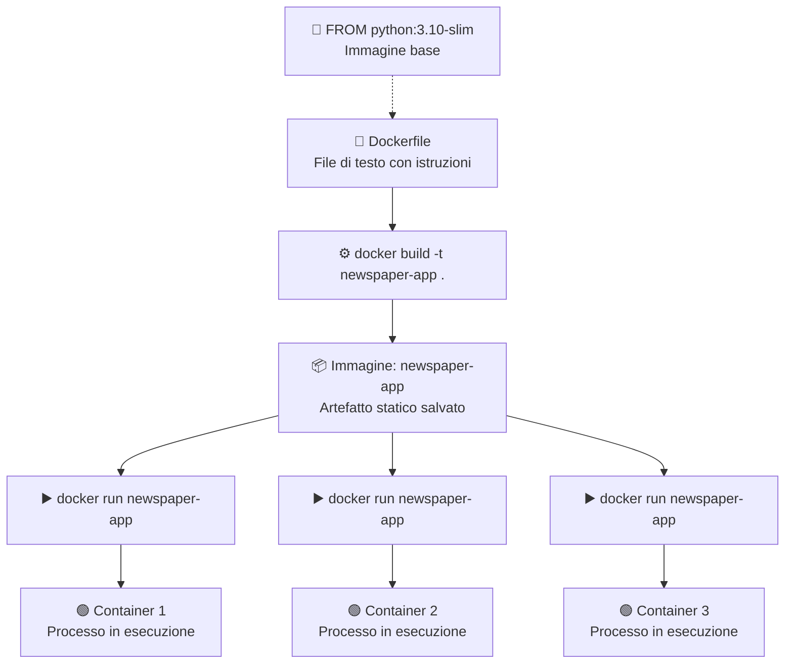

---

### 1.1.2 La Struttura a Layer del Dockerfile

Un aspetto fondamentale per capire l'efficienza di Docker è il sistema a **layer** (strati). Ogni istruzione nel Dockerfile crea un nuovo layer che viene impilato sopra il precedente, formando l'immagine finale come una "torta" a più strati.

Il vantaggio di questa architettura è il **caching**: quando ricostruisci un'immagine, Docker controlla se ogni layer è cambiato rispetto alla build precedente. Se un layer non è stato modificato, Docker lo riutilizza dalla cache invece di ricostruirlo da zero. Questo accelera enormemente i tempi di build.

Tuttavia, c'è una regola importante: **quando un layer cambia, tutti i layer successivi vengono invalidati e ricostruiti**. Ecco perché l'ordine delle istruzioni nel Dockerfile è cruciale per l'ottimizzazione.

La best practice è organizzare le istruzioni dalla più stabile alla più volatile:
1. **Prima**: istruzioni che cambiano raramente (immagine base, installazione tool di sistema)
2. **Poi**: dipendenze del progetto (requirements.txt)
3. **Infine**: il codice sorgente (che cambia spesso durante lo sviluppo)

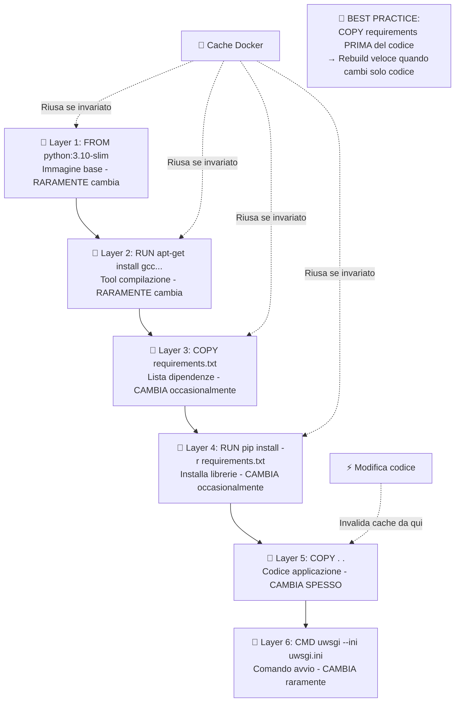

---

### 1.1.3 Docker Compose: Orchestrazione Multi-Container

Nella realtà, le applicazioni moderne raramente girano in isolamento. Un'applicazione web tipica ha bisogno di un database, magari una cache Redis, un server di code, ecc. Gestire manualmente ogni container (crearli, collegarli, avviarli nell'ordine giusto) sarebbe un incubo.

**Docker Compose** risolve questo problema. È uno strumento che permette di definire e gestire applicazioni multi-container attraverso un singolo file YAML (`docker-compose.yml`). In questo file descrivi tutti i servizi che compongono la tua applicazione, le loro configurazioni, come comunicano tra loro, e i volumi per i dati.

Con un solo comando (`docker-compose up`), Docker Compose:
1. Crea automaticamente una **rete privata** dove i container possono comunicare
2. Crea i **volumi** necessari per la persistenza dei dati
3. Costruisce le immagini se necessario (esegue `docker build`)
4. Avvia i container nell'**ordine corretto** rispettando le dipendenze

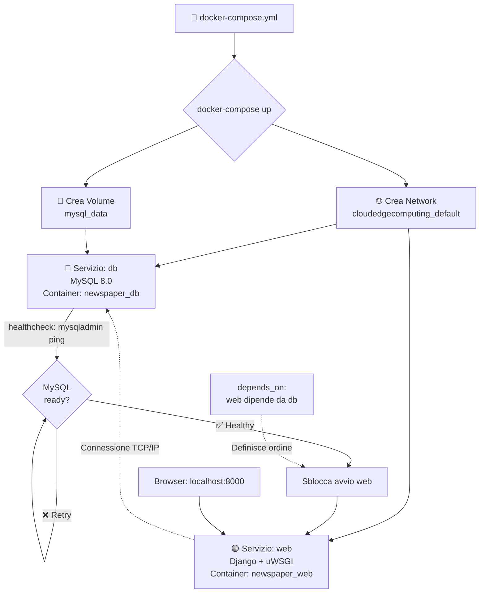

---

### 1.1.4 Networking: Come Comunicano i Container

Quando Docker Compose avvia i container, li collega tutti a una **rete virtuale privata**. Questa rete è isolata dal mondo esterno e permette ai container di comunicare tra loro in modo sicuro.

La magia sta nel **Docker DNS**: all'interno della rete Docker, ogni container può riferirsi agli altri usando il **nome del servizio** invece dell'indirizzo IP. Nel nostro caso, il container Django può connettersi a MySQL semplicemente usando `db:3306` come indirizzo. Docker intercetta questa richiesta e la traduce automaticamente nell'IP interno del container MySQL.

Perché è importante? Gli IP dei container sono **dinamici**: cambiano ogni volta che ricrei i container. Se hardcodassimo l'IP nel codice, smetterebbe di funzionare al prossimo restart. Usando i nomi di servizio, il codice rimane stabile e Docker si occupa della risoluzione.

Per il mondo esterno (il tuo browser), i container non sono direttamente accessibili. Il **port mapping** (`-p 8000:8000`) crea un "ponte" che collega una porta del tuo computer (localhost:8000) a una porta del container.

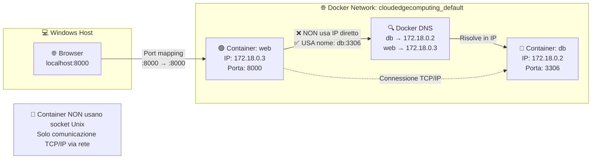

---

### 1.1.5 Volumi: Persistenza dei Dati

I container sono **effimeri** per natura: quando un container viene distrutto, tutto ciò che contiene (inclusi i dati) viene perso. Per un database questo sarebbe disastroso! I **volumi** risolvono questo problema permettendo ai dati di sopravvivere alla distruzione del container.

Esistono due tipi principali di volumi:

**Bind Mount**: collega una directory del tuo computer host direttamente dentro il container. Qualsiasi modifica fatta da una parte è immediatamente visibile dall'altra. Perfetto per lo sviluppo!

**Named Volume**: è uno spazio di storage gestito interamente da Docker, "nascosto" nel filesystem dell'host. I dati sono conservati in modo persistente da Docker anche se il container viene distrutto.


---

### 1.1.6 Variabili d'Ambiente: Configurazione Esterna

Una delle best practice fondamentali nello sviluppo software è la **separazione tra codice e configurazione**. Non vuoi hardcodare password, hostname o altre impostazioni nel codice sorgente.

Docker risolve questo problema attraverso le **variabili d'ambiente**. Nel `docker-compose.yml`, sotto la sezione `environment`, definiamo coppie chiave-valore che vengono "iniettate" nel container al momento dell'avvio.

Il punto cruciale è che **docker-compose non modifica mai il codice Python**. Il codice rimane generico (`os.environ.get('MYSQL_HOST')`), ed è l'ambiente di esecuzione che fornisce i valori concreti.

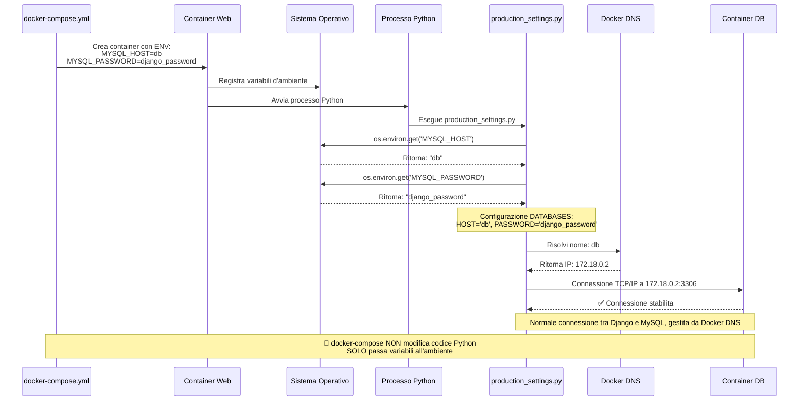

---

### 1.1.7 I Tre Comandi Fondamentali: build, run, compose up

Per lavorare con Docker, devi padroneggiare tre comandi principali, ognuno con uno scopo diverso:

**`docker build`** serve esclusivamente a creare immagini. Non avvia nessun container: è pura "compilazione".

**`docker run`** prende un'immagine esistente e crea un singolo container da essa. Utile per test rapidi ma richiede gestione manuale di network e volumi.

**`docker-compose up`** è il comando più potente per applicazioni reali. Automatizza tutto: costruisce le immagini, crea network e volumi, avvia tutti i container nell'ordine corretto.

---

### 1.1.8 Registry e Tag

Oltre ai concetti base (build, run, compose), per progetti professionali è fondamentale comprendere come **distribuire** e **versionare** le immagini Docker.

#### Container Registry

Un **Container Registry** è un repository centralizzato dove vengono archiviate e distribuite le immagini Docker. Funziona come un "magazzino" di immagini, permettendo di:
- **Archiviare** immagini in modo sicuro e organizzato
- **Condividere** immagini tra diversi ambienti (sviluppo, CI, produzione)
- **Versionare** le immagini con tag diversi
- **Distribuire** immagini a server di deployment

**Esempi di Registry**:
- **Docker Hub**: Registry pubblico di default (`docker pull python:3.10`)
- **GitLab Container Registry**: Registry privato integrato in GitLab
- **AWS ECR**, **Google GCR**, **Azure ACR**: Registry cloud dei principali provider

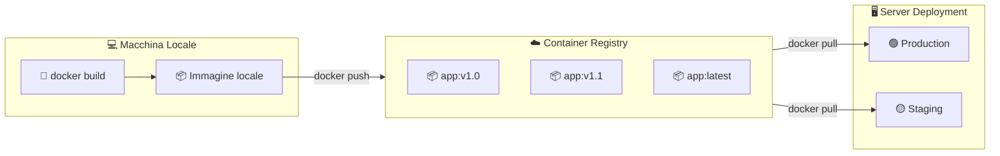

**Nel nostro progetto**: Utilizziamo **GitLab Container Registry** (`registry.gitlab.com/luca_di_leo/cloudedgecomputing`) per archiviare le immagini buildate dalla pipeline CI.

---

#### Tag delle Immagini

Un **Tag** è un'etichetta che identifica una specifica versione di un'immagine Docker. Il formato completo di un'immagine è:

```
[registry]/[repository]:[tag]
```

**Esempi**:
- `python:3.10` → Registry: Docker Hub (implicito), Repository: python, Tag: 3.10
- `registry.gitlab.com/luca_di_leo/cloudedgecomputing:a1b2c3d4` → Tag: commit SHA
- `registry.gitlab.com/luca_di_leo/cloudedgecomputing:latest` → Tag: latest

**Strategie di tagging comuni**:

| Tag | Descrizione | Esempio |
|-----|-------------|----------|
| `latest` | Ultima versione stabile. Sovrascritta ad ogni build. | `app:latest` |
| Commit SHA | Identificatore univoco del commit. Permette tracciabilità esatta. | `app:a1b2c3d4` |
| Semantic Version | Versioning semantico (major.minor.patch). | `app:v1.2.3` |
| Branch name | Nome del branch da cui è stata buildata. | `app:feature-login` |
| Timestamp | Data/ora del build. | `app:20260125-1430` |

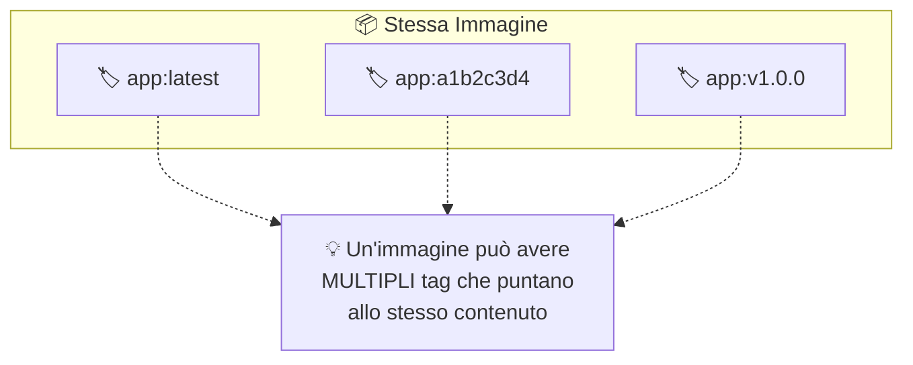

**Nel nostro progetto**: Ogni build crea due tag:
- `$CI_COMMIT_SHORT_SHA` (es. `a1b2c3d4`) → Tracciabilità del commit
- `latest` → Sempre l'ultima versione

---

## 1.2 Concetti CI/CD

**CI/CD** (Continuous Integration / Continuous Delivery) è una pratica fondamentale nello sviluppo software moderno che automatizza il processo di verifica, test e deployment del codice.

---

### 1.2.1 Continuous Integration (CI)

**Continuous Integration** significa che ogni volta che un sviluppatore fa push del codice, viene automaticamente eseguita una serie di controlli: il codice viene compilato, i test vengono eseguiti, la qualità viene verificata. Se qualcosa fallisce, lo sviluppatore viene notificato immediatamente, permettendo di correggere gli errori quando sono ancora "freschi" e facili da risolvere.

---

### 1.2.2 Continuous Delivery (CD)

**Continuous Delivery** estende questo concetto: dopo che il codice passa tutti i controlli CI, viene automaticamente preparato (e opzionalmente deployato) in un ambiente di staging o production. L'obiettivo è avere sempre codice "pronto per il rilascio".

---

### 1.2.3 GitLab CI/CD

Nel nostro progetto utilizziamo **GitLab CI/CD**, che offre:
- Runner gratuiti nel cloud per eseguire le pipeline
- Integrazione nativa con il repository Git
- Configurazione tramite un semplice file YAML (`.gitlab-ci.yml`)
- Badge, report e artifacts integrati nell'interfaccia

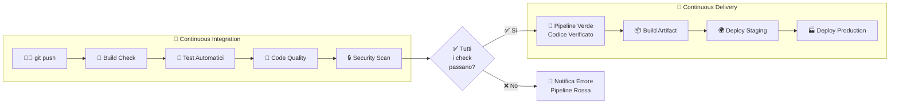

---

### 1.2.4 Runner

Un **GitLab Runner** è un'applicazione che esegue i job definiti nella pipeline CI/CD. Quando fai `git push`, GitLab non esegue direttamente i comandi: li delega a un Runner.

**Come funziona**:
1. Fai `git push` → GitLab crea una pipeline
2. GitLab cerca un Runner disponibile
3. Runner scarica il codice dal repository
4. Runner esegue i comandi definiti in `script`
5. Runner riporta risultati (log, exit code, artifacts) a GitLab

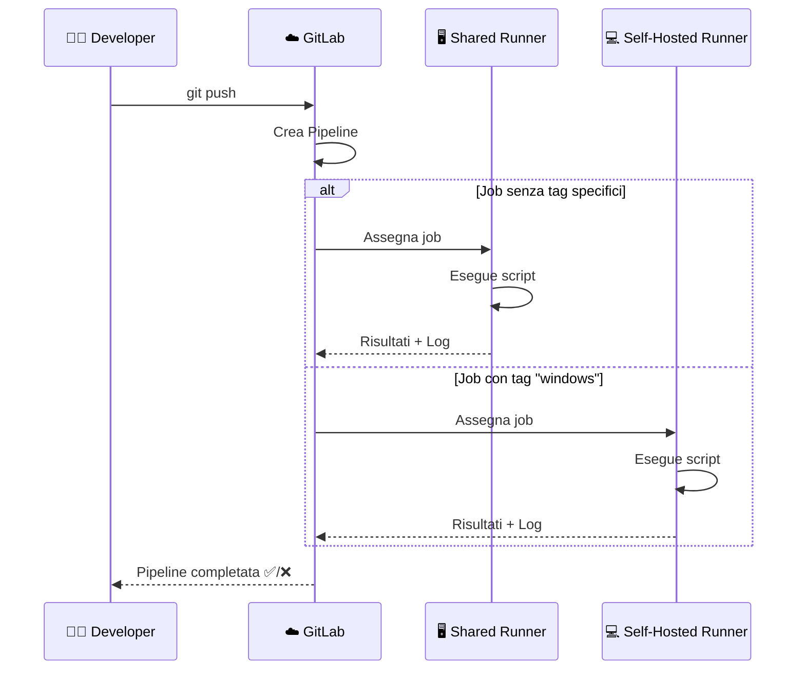

**Tipi di Runner**:

| Tipo | Descrizione | Quando Usarlo |
|------|-------------|---------------|
| **Shared Runner** | Fornito gratuitamente da GitLab. Gira su server cloud GitLab. | CI: test, lint, build immagini |
| **Self-Hosted Runner** | Installato sulla TUA macchina. Ha accesso a risorse locali. | CD: deployment su macchina locale |
| **Group Runner** | Condiviso tra progetti dello stesso gruppo GitLab. | Team con più progetti |

**Executor**: Definisce COME il Runner esegue i job:
- `docker`: Ogni job gira in un container Docker isolato
- `shell`: Job eseguiti direttamente nella shell del sistema (PowerShell, Bash)
- `kubernetes`: Job eseguiti come pod Kubernetes

**Nel nostro progetto**:
- **Shared Runner** (cloud): Per CI → test, lint, build immagini Docker
- **Self-Hosted Runner** (Windows locale): Per CD → deployment con `docker-compose`

---

### 1.2.5 Variabili d'Ambiente CI/CD

Le **variabili d'ambiente** sono fondamentali nelle pipeline CI/CD per:
- **Configurare** il comportamento dei job senza modificare il codice
- **Gestire secrets** (password, API keys) in modo sicuro
- **Parametrizzare** build e deployment per ambienti diversi

#### Tipi di Variabili

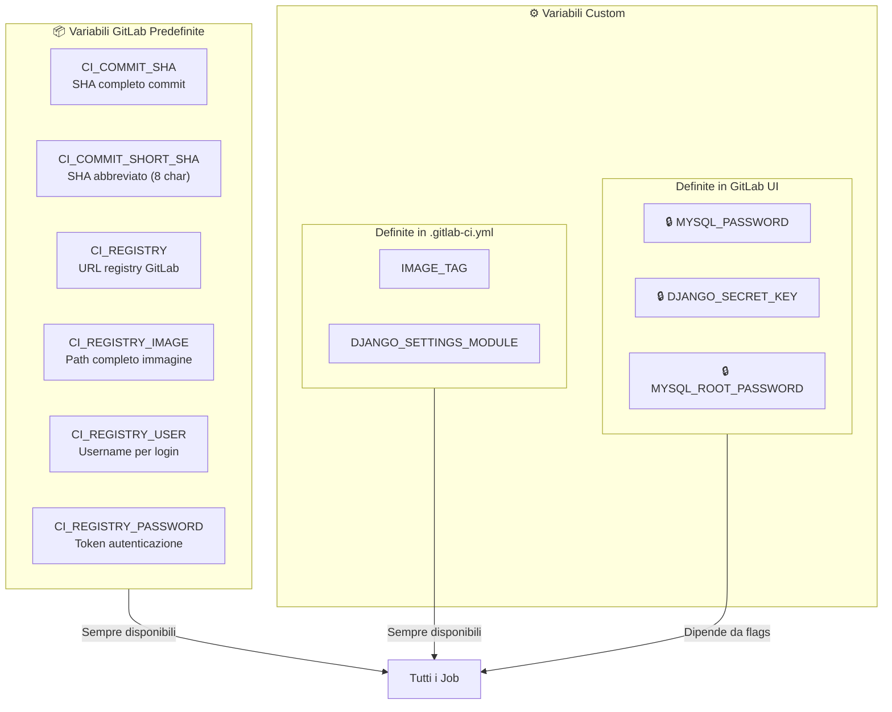

#### Variabili GitLab Predefinite (CI_*)

GitLab fornisce automaticamente variabili che iniziano con `CI_`. Le più importanti:

| Variabile | Valore Esempio | Descrizione | Uso Tipico |
|-----------|----------------|-------------|------------|
| `CI_COMMIT_SHA` | `a1b2c3d4e5f6...` | SHA completo del commit (40 char) | Tracciabilità precisa |
| `CI_COMMIT_SHORT_SHA` | `a1b2c3d4` | SHA abbreviato (8 char) | Tag immagini Docker |
| `CI_COMMIT_BRANCH` | `02-django-base-project` | Nome del branch corrente | Condizioni `rules` |
| `CI_REGISTRY` | `registry.gitlab.com` | URL del Container Registry | Login Docker |
| `CI_REGISTRY_IMAGE` | `registry.gitlab.com/user/project` | Path completo immagine | Tag immagini |
| `CI_REGISTRY_USER` | `gitlab-ci-token` | Username per autenticazione registry | `docker login` |
| `CI_REGISTRY_PASSWORD` | (token auto) | Token per autenticazione registry | `docker login` |
| `CI_PIPELINE_ID` | `123456789` | ID univoco della pipeline | Debugging |
| `CI_JOB_ID` | `987654321` | ID univoco del job | Artifacts naming |

#### Variabili Custom nel YAML

Definite nella sezione `variables:` del file `.gitlab-ci.yml`:

```yaml
variables:
  # Variabili semplici
  DJANGO_SETTINGS_MODULE: "django_project.settings"
  DEBIAN_FRONTEND: "noninteractive"
  
  # Variabili calcolate (usano altre variabili)
  IMAGE_TAG: $CI_REGISTRY_IMAGE:$CI_COMMIT_SHORT_SHA
  IMAGE_LATEST: $CI_REGISTRY_IMAGE:latest
```

**Scope**: Disponibili in **tutti i job** della pipeline.

#### Variabili Segrete (GitLab UI)

Per **secrets** come password e API keys, si definiscono in GitLab UI:

```
GitLab → Settings → CI/CD → Variables → Add variable
```

| Flag | Descrizione | Quando Usare |
|------|-------------|---------------|
| **Protected** | Variabile disponibile SOLO su branch protetti | Secrets di produzione |
| **Masked** | Valore nascosto nei log (mostra `[MASKED]`) | Password, tokens |
| **Expand variable** | Permette riferimenti `$VAR` nel valore | Variabili composte |

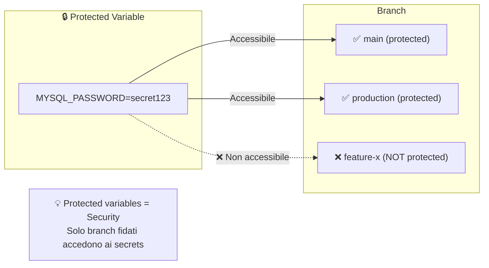

#### Variabili nel Nostro Progetto

**1. Variabili Globali (`.gitlab-ci.yml`)**:

| Variabile | Valore | Scopo |
|-----------|--------|-------|
| `DJANGO_SETTINGS_MODULE` | `django_project.settings` | Settings Django per test (usa SQLite) |
| `DEBIAN_FRONTEND` | `noninteractive` | Evita prompt apt-get durante install |
| `DOCKER_DRIVER` | `overlay2` | Driver storage ottimale per Docker |
| `DOCKER_TLS_CERTDIR` | `/certs` | Path certificati TLS per Docker-in-Docker |
| `IMAGE_TAG` | `$CI_REGISTRY_IMAGE:$CI_COMMIT_SHORT_SHA` | Tag immagine con SHA commit |
| `IMAGE_LATEST` | `$CI_REGISTRY_IMAGE:latest` | Tag "latest" sempre aggiornato |

**2. Variabili Segrete (GitLab UI)**:

| Variabile | Protected | Masked | Scopo |
|-----------|-----------|--------|-------|
| `DJANGO_SECRET_KEY` | ☑️ | ☑️ | Chiave segreta Django per produzione |
| `MYSQL_PASSWORD` | ☑️ | ☑️ | Password utente MySQL `django` |
| `MYSQL_ROOT_PASSWORD` | ☑️ | ☑️ | Password root MySQL |
| `DEPLOY_IMAGE_NAME` | ☑️ | ☐ | Nome completo immagine da deployare |

N.B.: in un secondo momento ho dovuto passare a non protected perché altrimenti non venivano iniettate, tuttavia una soluzione alternativa sarebbe stata segnare i branch come protected.

#### Accesso alle Variabili negli Script

**Linux/Bash** (Shared Runner):
```bash
echo "Commit: $CI_COMMIT_SHORT_SHA"
echo "Registry: $CI_REGISTRY"
docker login -u $CI_REGISTRY_USER -p $CI_REGISTRY_PASSWORD $CI_REGISTRY
```

**Windows/PowerShell** (Self-Hosted Runner):
```powershell
echo "Commit: $env:CI_COMMIT_SHORT_SHA"
echo "Registry: $env:CI_REGISTRY"
docker login -u $env:CI_REGISTRY_USER -p $env:CI_REGISTRY_PASSWORD $env:CI_REGISTRY
```

**Nota importante**: Su PowerShell le variabili d'ambiente si accedono con `$env:NOME_VARIABILE`, non `$NOME_VARIABILE`.

---

### 1.2.6 Keywords del File `.gitlab-ci.yml`

Il file `.gitlab-ci.yml` utilizza una serie di **parole chiave** (keywords) che definiscono il comportamento della pipeline. Comprendere queste keywords è fondamentale per configurare correttamente la CI/CD.

#### Keywords Globali

| Keyword | Descrizione | Esempio |
|---------|-------------|----------|
| `stages` | Definisce l'ordine di esecuzione degli stage. I job dello stesso stage vengono eseguiti in parallelo, gli stage in sequenza. | `stages: [build, test, deploy]` |
| `image` | Immagine Docker da usare per tutti i job (può essere sovrascritta per singolo job). | `image: python:3.10` |
| `variables` | Variabili d'ambiente globali disponibili in tutti i job. | `variables: DEBUG: "false"` |
| `default` | Configurazioni di default per tutti i job (image, before_script, ecc.). | `default: image: python:3.10` |

#### Keywords dei Job

| Keyword | Descrizione | Esempio |
|---------|-------------|----------|
| `stage` | A quale stage appartiene il job. Determina quando viene eseguito. | `stage: test` |
| `script` | **OBBLIGATORIO**. Lista di comandi shell da eseguire. È il cuore del job. | `script: - pip install -r requirements.txt` |
| `before_script` | Comandi eseguiti PRIMA di `script`. Utile per setup comune. | `before_script: - pip install --upgrade pip` |
| `after_script` | Comandi eseguiti DOPO `script`, anche se fallisce. Utile per cleanup. | `after_script: - rm -rf temp/` |
| `allow_failure` | Se `true`, il job può fallire senza far fallire la pipeline. Utile per check non bloccanti. | `allow_failure: true` |
| `artifacts` | File/cartelle da salvare e rendere disponibili per job successivi o download. | `artifacts: paths: - coverage.xml` |
| `coverage` | Regex per estrarre la percentuale di coverage dai log e mostrarla in GitLab. | `coverage: '/TOTAL.*\s+(\d+%)$/'` |
| `only` / `except` | Condizioni per eseguire o saltare il job (branch, tag, ecc.). Deprecato in favore di `rules`. | `only: - main` |
| `rules` | Condizioni avanzate per eseguire il job (più flessibile di only/except). | `rules: - if: $CI_COMMIT_BRANCH == "main"` |
| `needs` | Definisce dipendenze tra job, permettendo esecuzione parallela ottimizzata (DAG). | `needs: ["build_check"]` |
| `dependencies` | Specifica da quali job scaricare gli artifacts. | `dependencies: - build` |
| `cache` | File da cacheare tra esecuzioni per velocizzare (es. dipendenze pip). | `cache: paths: - .pip-cache/` |
| `timeout` | Tempo massimo di esecuzione del job prima del kill automatico. | `timeout: 10 minutes` |
| `retry` | Numero di tentativi in caso di fallimento (utile per test flaky). | `retry: 2` |

#### Esempio Commentato Completo

```yaml
# Keywords globali
stages:          # Ordine degli stage
  - build
  - test  
  - security

image: python:3.10-slim   # Immagine di default per tutti i job

variables:                # Variabili globali
  PIP_CACHE_DIR: "$CI_PROJECT_DIR/.pip-cache"

default:                  # Configurazioni di default
  before_script:          # Eseguito prima di ogni job
    - pip install --upgrade pip

# Definizione di un job
build_check:              # Nome del job (arbitrario)
  stage: build            # Appartiene allo stage "build"
  script:                 # Comandi da eseguire
    - python -m py_compile manage.py
    - python -m compileall .
  cache:                  # Cache delle dipendenze
    paths:
      - .pip-cache/

test_django:
  stage: test
  script:
    - pip install coverage
    - coverage run manage.py test
    - coverage report
    - coverage xml
  coverage: '/TOTAL.*\s+(\d+%)$/'  # Estrae coverage dai log
  artifacts:                        # Salva file per dopo
    reports:
      coverage_report:
        coverage_format: cobertura
        path: coverage.xml
    expire_in: 1 week               # Artifacts scadono dopo 1 settimana

lint_flake8:
  stage: test
  script:
    - pip install flake8
    - flake8 --max-line-length=120 .
  allow_failure: true     # Non blocca la pipeline se fallisce
  rules:                  # Condizioni di esecuzione
    - if: $CI_PIPELINE_SOURCE == "merge_request_event"
    - if: $CI_COMMIT_BRANCH == "main"
```

---

## 1.3 Pre-commit: Automazione Locale

**Pre-commit** è un framework per gestire **git hooks** in modo semplice e condivisibile. I git hooks sono script che Git esegue automaticamente in determinati momenti del workflow (prima di un commit, prima di un push, ecc.).

---

### 1.3.1 Cosa è e Perché Usarlo

Il problema che pre-commit risolve è semplice: **come garantire che il codice rispetti determinati standard PRIMA che venga committato?**

Senza pre-commit, lo sviluppatore potrebbe:
1. Scrivere codice mal formattato
2. Fare commit e push
3. La CI fallisce per problemi di formatting
4. Deve fixare e ri-pushare → Tempo perso!

Con pre-commit:
1. Lo sviluppatore prova a committare
2. Pre-commit intercetta e formatta automaticamente
3. Il commit contiene già codice corretto
4. La CI passa al primo colpo → Efficienza!

---

### 1.3.2 Come Funziona

Pre-commit si basa su un file di configurazione `.pre-commit-config.yaml` che definisce quali **hooks** eseguire. Ogni hook è un controllo o una trasformazione applicata ai file staged.

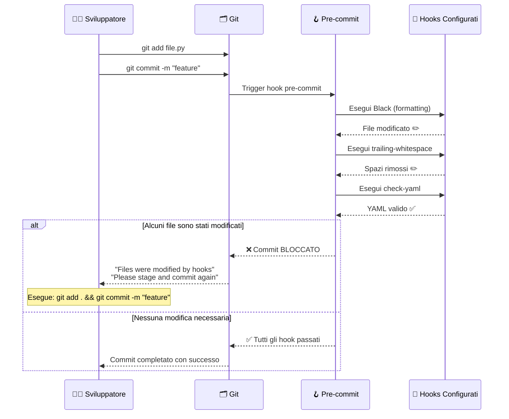

---

### 1.3.3 Configurazione nel Progetto

Il nostro file `.pre-commit-config.yaml`:

```yaml
repos:
  # Hook per Black - Formattatore Python
  - repo: https://github.com/psf/black
    rev: 23.3.0
    hooks:
      - id: black
        args: ['--line-length=120']  # Stessa config della CI
  
  # Hook generici di pre-commit
  - repo: https://github.com/pre-commit/pre-commit-hooks
    rev: v4.4.0
    hooks:
      - id: trailing-whitespace      # Rimuove spazi a fine riga
      - id: end-of-file-fixer        # Aggiunge newline finale
      - id: check-yaml               # Valida sintassi YAML
      - id: check-merge-conflict     # Blocca se ci sono marker di merge
```

**Spiegazione degli hooks**:

| Hook | Cosa Fa | Perché È Utile |
|------|---------|----------------|
| `black` | Riformatta codice Python secondo standard PEP8+ | Codice consistente, niente discussioni su stile |
| `trailing-whitespace` | Rimuove spazi bianchi a fine riga | Evita diff "sporchi" con solo whitespace |
| `end-of-file-fixer` | Assicura che i file terminino con newline | Standard POSIX, evita warning in alcuni tool |
| `check-yaml` | Valida sintassi dei file YAML | Previene errori in docker-compose.yml, CI config |
| `check-merge-conflict` | Blocca commit con marker `<<<<<<<` | Previene commit accidentali di conflitti |

N.B.: per comodità nel progetto ho incluso solo black.

---

### 1.3.4 Setup e Comandi

```bash
# Installazione (una volta)
pip install pre-commit

# Attivazione nel repository (una volta per repo)
pre-commit install

# Esecuzione manuale su tutti i file
pre-commit run --all-files

# Esecuzione su file specifici
pre-commit run --files accounts/views.py

# Aggiornamento hooks alle ultime versioni
pre-commit autoupdate

# Bypass temporaneo (emergenze!)
git commit --no-verify -m "hotfix urgente"
```

---

## 1.4 Glossario

Riferimento rapido dei termini tecnici utilizzati in questa documentazione.

### Docker

| Termine | Definizione |
|---------|-------------|
| **Container** | Unità isolata di esecuzione che contiene applicazione + dipendenze. Leggero, portabile, effimero. |
| **Immagine** | Template immutabile (snapshot) da cui si creano i container. Costruita da un Dockerfile. |
| **Dockerfile** | File di testo con istruzioni per costruire un'immagine Docker. |
| **Layer** | Singolo strato di un'immagine Docker. Ogni istruzione crea un layer. I layer sono cachati. |
| **Registry** | Repository remoto per immagini Docker (es. Docker Hub, GitLab Container Registry). |
| **Volume** | Meccanismo per persistere dati oltre la vita del container. |
| **Bind Mount** | Tipo di volume che mappa una cartella host dentro il container. |
| **Named Volume** | Tipo di volume gestito da Docker, indipendente dal filesystem host. |
| **Network** | Rete virtuale che permette comunicazione tra container. |
| **Port Mapping** | Collegamento tra porta host e porta container (`-p 8000:8000`). |
| **Healthcheck** | Controllo periodico per verificare che un servizio sia funzionante. |
| **Docker Compose** | Tool per definire e gestire applicazioni multi-container via YAML. |

### CI/CD

| Termine | Definizione |
|---------|-------------|
| **CI (Continuous Integration)** | Pratica di integrare frequentemente il codice ed eseguire test automatici ad ogni push. |
| **CD (Continuous Delivery)** | Estensione della CI: il codice è sempre pronto per il deploy in produzione. |
| **Pipeline** | Sequenza automatizzata di stage e job che processano il codice. |
| **Stage** | Fase della pipeline (es. build, test, deploy). Gli stage sono sequenziali. |
| **Job** | Singola unità di lavoro nella pipeline. Job nello stesso stage girano in parallelo. |
| **Runner** | Macchina (fisica o virtuale) che esegue i job della pipeline. |
| **Artifact** | File prodotto da un job e salvato per job successivi o download. |
| **Coverage** | Percentuale di codice coperta dai test automatici. |
| **Linting** | Analisi statica del codice per trovare errori e problemi di stile. |
| **Hook** | Script eseguito automaticamente in risposta a eventi (es. pre-commit). |

### Python/Django

| Termine | Definizione |
|---------|-------------|
| **Django** | Framework web Python ad alto livello per sviluppo rapido. |
| **uWSGI** | Application server che serve applicazioni Python in produzione. |
| **WSGI** | Standard Python per comunicazione tra web server e applicazione. |
| **Migration** | File che descrive modifiche allo schema del database. |
| **Virtual Environment (venv)** | Ambiente Python isolato con proprie dipendenze. |
| **requirements.txt** | File che elenca le dipendenze Python del progetto. |

### Tool di Qualità

| Termine | Definizione |
|---------|-------------|
| **Black** | Formattatore Python "opinionated" - formatta il codice in modo deterministico. |
| **Flake8** | Linter Python che controlla errori, stile (PEP8), complessità. |
| **Safety** | Tool che controlla le dipendenze Python per vulnerabilità note (CVE). |
| **Coverage** | Tool che misura quale percentuale del codice viene eseguita dai test. |
| **Pre-commit** | Framework per gestire git hooks e automazione pre-commit. |

---

# Contesto Progetto

## Obiettivo Generale

Creare un ambiente containerizzato riproducibile per un'applicazione Django che simula un ambiente production con MySQL, implementando pipeline CI/CD per garantire qualità del codice.

---

## Stack Tecnologico

| Componente | Tecnologia | Versione |
|------------|------------|----------|
| Framework Web | Django | 4.0 |
| Database Production | MySQL | 8.0 |
| Database Development | SQLite | Built-in |
| Application Server | uWSGI | 2.0.21 |
| Containerizzazione | Docker + Compose | Latest |
| CI/CD | GitLab CI | Cloud Runner |

---

# Containerizzazione Docker

## Obiettivo

Containerizzare l'applicazione Django Newspaper con MySQL, creando un ambiente di sviluppo riproducibile che simula la production.

---

## Cosa Abbiamo Fatto

### File Creati

#### 1. Dockerfile

Ricetta per costruire l'immagine Django:

```dockerfile
# Immagine base Python 3.10 slim (leggera, ottimizzata per produzione)
# "slim" significa che contiene solo l'essenziale (100MB invece di 900MB)
FROM python:3.10-slim

# Variabili d'ambiente Python per migliorare il comportamento in container
ENV PYTHONUNBUFFERED=1 \
    # Non bufferizza l'output Python → Log immediati (importante per container)
    PYTHONDONTWRITEBYTECODE=1
    # Non crea file .pyc → Risparmia spazio nell'immagine

# Crea e imposta la directory di lavoro del container
WORKDIR /app

# Installa dipendenze di sistema necessarie per compilare mysqlclient
# "slim" non include compilatori e header files di default
RUN apt-get update && apt-get install -y \
    gcc \
    # Compilatore C: necessario per mysqlclient (ha componenti C)
    default-libmysqlclient-dev \
    # Header e librerie MySQL: necesarie per connessione al DB
    pkg-config \
    # Tool per gestire le librerie di sistema durante compilazione
    && rm -rf /var/lib/apt/lists/*
    # Pulizia cache apt: riduce dimensione immagine

# PRIMO COPY: requirements.txt PRIMA del codice (sfruttamento cache Docker)
# Se cambi solo codice Python, Docker riusa questo layer dalla cache
COPY requirements.txt .
RUN pip install --no-cache-dir -r requirements.txt

# SECONDO COPY: il resto del codice applicativo
COPY . .

# Crea directory per log (necessaria per uWSGI)
RUN mkdir -p /app/logs

# Documenta quale porta l'applicazione espone (non fa mapping, è informativo)
# Il mapping reale avviene in docker-compose.yml con "ports"
EXPOSE 8000

# Comando di default: avvia uWSGI con la configurazione specificata
CMD ["uwsgi", "--ini", "uwsgi.ini"]
```

---

#### 2. docker-compose.yml

Orchestrazione Django + MySQL:

```yaml
version: '3.8'
# Versione del formato docker-compose (3.8 supporta healthcheck e altre feature moderne)

services:
  # ============================================
  # SERVIZIO 1: DATABASE MySQL
  # ============================================
  db:  # Nome del servizio (usato per networking tra container)
    image: mysql:8.0  # Immagine ufficiale da Docker Hub
    container_name: newspaper_db  # Nome del container attuale (visibile in docker ps)
    restart: unless-stopped  # Riavvia automaticamente se crash, ma non se fermato manualmente
    
    environment:  # Variabili d'ambiente per configurare MySQL
      MYSQL_DATABASE: blog  # Database creato al primo avvio
      MYSQL_USER: django  # Utente creato per Django (password sotto)
      MYSQL_PASSWORD: django_password  # Password dell'utente Django
      MYSQL_ROOT_PASSWORD: root_password  # Password dell'utente root
    
    volumes:  # Persistenza dati
      - mysql_data:/var/lib/mysql  # Named volume: dati persistono anche se container muore
      # Named volume = Gestito da Docker, indipendente dal filesystem host
      # Se cancelli il volume (docker volume rm), i dati sono persi
    
    ports:  # Port mapping: esterno:interno
      - "3306:3306"  # Espone MySQL al tuo computer sulla porta 3306
      # Utile per connessioni da MySQL Workbench, DataGrip, ecc.
    
    healthcheck:  # Controllo periodico della "salute" del servizio
      test: ["CMD", "mysqladmin", "ping", "-h", "localhost"]  # Comando per verificare se MySQL è attivo
      # mysqladmin ping ritorna 0 se OK, non-zero se DB giù
      timeout: 5s  # Tempo massimo di attesa per il risultato del comando
      retries: 10  # Numero di tentativi falliti prima di marcare come unhealthy
      # Quindi: 10 tentativi × 5s = max 50s prima che docker-compose consideri DB down

  # ============================================
  # SERVIZIO 2: APPLICAZIONE DJANGO + uWSGI
  # ============================================
  web:  # Nome del servizio (usato in MYSQL_HOST=db per connettersi)
    build: .  # Costruisci immagine da Dockerfile nella directory corrente
    # Diverso da "image: python:3.10-slim" che scarica da Docker Hub
    # "build: ." significa: esegui docker build con il Dockerfile qui
    
    container_name: newspaper_web  # Nome container in docker ps
    
    command: >  # Comando di avvio (sovrascrive CMD del Dockerfile)
      sh -c "python manage.py migrate && 
             uwsgi --ini uwsgi.ini"
      # sh -c = esegui il resto come script shell
      # migrate: applica migrazioni Django al database (crea tabelle)
      # uwsgi: avvia il server applicativo
      # Motivo dell'override: nel Dockerfile CMD = "uwsgi", ma qui vogliamo migrate PRIMA
    
    volumes:  # Sincronizzazione codice
      - .:/app  # Bind mount: directory host corrente (.) sincronizzata con /app nel container
      # Effect: modifichi file sul Windows host → cambiano IMMEDIATO nel container
      # Perfetto per development iterativo (no rebuild necessario)
      # ATTENZIONE: non è persistente se container cancellato (solo sincronizzazione runtime)
    
    ports:  # Port mapping per accesso dal browser
      - "8000:8000"  # Browser: localhost:8000 → container:8000
    
    environment:  # Configurazione Django e connessione DB
      - DJANGO_SETTINGS_MODULE=django_project.production_settings
      # Dice a Django di caricare le impostazioni production (non il settings.py standard)
      # production_settings.py legge il resto dalle variabili d'ambiente sotto
      
      - MYSQL_DATABASE=blog
      - MYSQL_USER=django
      - MYSQL_PASSWORD=django_password
      - MYSQL_HOST=db  # ← CRUCIALE: "db" è il nome del servizio Docker, non localhost!
      # Docker DNS risolve "db" all'IP interno del container MySQL
      - MYSQL_PORT=3306
      
      - DJANGO_SECRET_KEY=development-secret-key-change-in-production
      # Secret key per Django (CSRF, session signing, ecc.)
      # In production va in variabili d'ambiente protette (GitLab CI/CD), poi chiarito nella sezione deployment
    
    depends_on:  # Dependency management
      db:
        condition: service_healthy  # Web avvia SOLO quando db è healthcheck ok
        # Senza questa condition, web potrebbe avviarsi prima che MySQL sia pronto
        # → django.db.utils.OperationalError: Can't connect
        # Con condition=service_healthy, Docker aspetta healthcheck PASSED

# Volume persistente per dati MySQL
volumes:
  mysql_data:  # Definizione del named volume
  # Quando usi una definizione qui, Docker gestisce il volume automaticamente
  # Location reale: /var/lib/docker/volumes/cloudedgecomputing_mysql_data/_data/
  # (visibile con: docker volume inspect)
```

**Flow di avvio**:

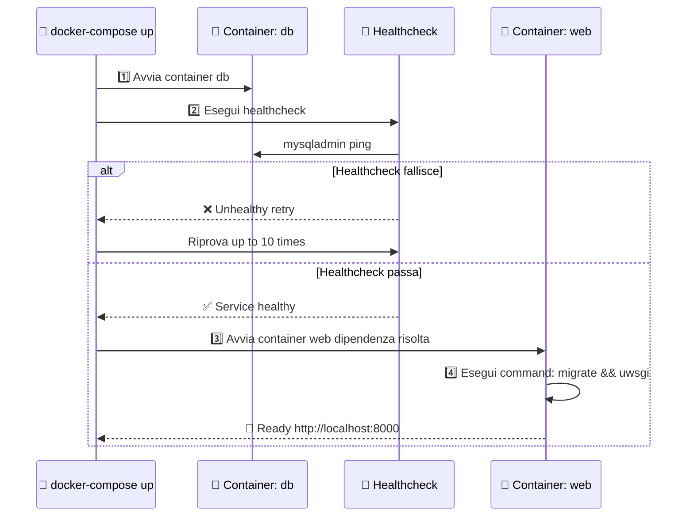

**Punti critici**:

| Elemento | Perché è importante | Errore se manca |
|----------|--------------------|-----------------| 
| `healthcheck` | Sincronizza avvio: web aspetta db pronto | Web parte prima che MySQL sia pronto → Connection error |
| `depends_on: condition: service_healthy` | Forza Docker ad aspettare healthcheck | Same as above |
| `MYSQL_HOST=db` (non localhost) | Docker networking: db = DNS name interno | ConnectionRefused: localhost non ha MySQL |
| `volumes: - .:/app` | Sync codice host ↔ container | Modifiche file non si riflettono in container |
| `mysql_data` named volume | Persist dati oltre lifecycle container | Database perso se `docker-compose down -v` |
| `command: sh -c migrate` | Esegui migrate prima di uwsgi | Tabelle non create → Schema mismatch error |
| `environment` | Configura app senza hardcode | App non legge password, credenziali |

---

#### 3. uwsgi.ini

Configurazione application server:

```ini
[uwsgi]
# ========================================
# CONFIGURAZIONE BASICA
# ========================================
chdir = /app
# Directory di lavoro dove Django legge settings e moduli
# DEVE corrispondere a WORKDIR nel Dockerfile (/app)

module = django_project.wsgi:application
# Modulo Python da eseguire: django_project/wsgi.py, funzione: application
# Questo è il WSGI application (interfaccia Web Server Gateway Interface)
# Django crea automaticamente questo file durante startproject

# ========================================
# PROCESSO MASTER E WORKER POOL
# ========================================
master = True
# Attiva processo master: gestisce avvio/stop/reload dei worker
# IMPORTANTE: fa sì che uWSGI risponda ai segnali (reload, stop)

processes = 4
# Numero di processi worker (concorrenza)
# Regola generale: (CPU cores × 2) + 1
# In Docker: 4 è un buon compromesso, scalabile se necessario

threads = 2  
# Thread per worker (concorrenza all'interno di ogni processo)
# Attenzione: Django (con SQLAlchemy) ha limitazioni con multithreading
# Consiglio: mantenere basso (1-2), aumentare processes se serve più concorrenza

# Total concurrency = processes × threads = 4 × 2 = 8 richieste simultanee

# ========================================
# NETWORK E PORT
# ========================================
http = 0.0.0.0:8000
# Bind su 0.0.0.0:8000 (tutte le interfacce, port 8000)
# 0.0.0.0 = ascolta su qualsiasi IP (localhost, 127.0.0.1, IP rete, ecc.)
# Port 8000 = standard Django development port (esposto via docker-compose ports)
# Nota: uWSGI parla direttamente HTTP (ok per dev/test, in prod reverse proxy)

# ========================================
# LOGGING
# ========================================
logto = /app/logs/uwsgi.log
# File dove uWSGI scrive i log (creato dal Dockerfile: mkdir -p /app/logs)
# Utile per debugging: docker logs + questo file per dettagli processo worker

log-maxsize = 50000000
# Dimensione massima file log prima di rotazione: 50 MB
# Previene log file che crescono infinitamente

# ========================================
# COMPORTAMENTO RUNTIME
# ========================================
py-autoreload = 1
# Ricarica automaticamente moduli Python se cambiano
# ATTENZIONE: disabilitare in production (risorse + instabilità)
# Perfetto per development (bind mount + autoreload = live editing)

pidfile = /app/uwsgi.pid
# File dove uWSGI salva il suo Process ID
# Usato per kill/reload graceful del processo
# Must match docker-compose per vacuum = true funzionare bene

vacuum = True
# Rimuove automaticamente pidfile e socket all'uscita pulita
# Evita "Address already in use" se riavvii rapidamente
# IMPORTANTE per container Docker (frecuenti start/stop)

die-on-term = True
# Se ricevi SIGTERM (kill), uWSGI esce gracefully (non wait)
# IMPORTANTE per Docker: container invia SIGTERM, uWSGI deve uscire velocemente
# Senza questo, Docker timeout (default 10s) e force kill
```

**Workflow autoreload (development)**:

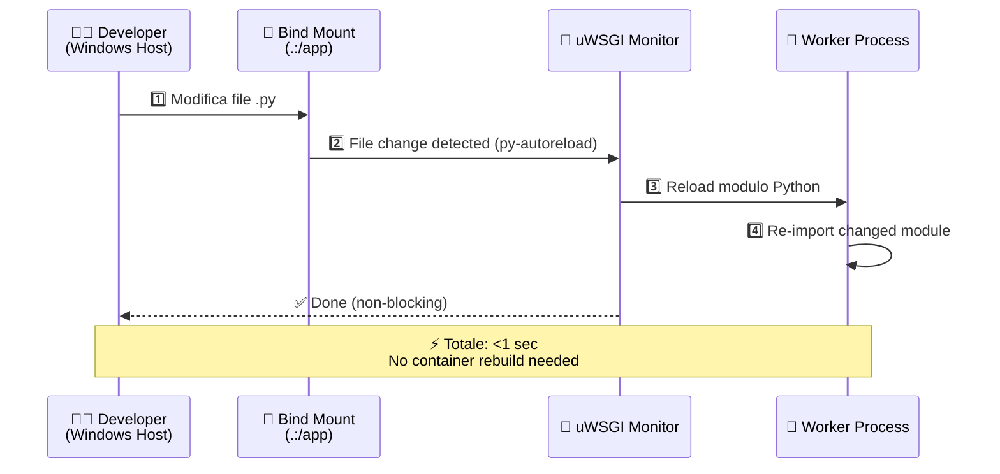

---

### File Modificati

#### 1. requirements.txt

Aggiunte dipendenze mancanti:

```txt
asgiref==3.4.1
crispy-bootstrap5==0.6
dj-database-url==0.5.0
dj-email-url==1.0.2
Django==4.0
django-cache-url==3.2.3
django-crispy-forms==1.13.0
environs==9.3.5
marshmallow==3.14.1
mysqlclient==2.1.1    # ← Per Docker/MySQL
python-dotenv==0.19.2
sqlparse==0.4.2
whitenoise==5.3.0
uWSGI==2.0.21         # ← Aggiunto (mancava!)
```

---

#### 2. django_project/production_settings.py

Configurazione per leggere da variabili d'ambiente:

```python
import os

DATABASES = {
    'default': {
        'ENGINE': 'django.db.backends.mysql',
        'NAME': os.environ.get('MYSQL_DATABASE', 'blog'),
        'USER': os.environ.get('MYSQL_USER', 'django'),
        'PASSWORD': os.environ.get('MYSQL_PASSWORD'),
        'HOST': os.environ.get('MYSQL_HOST', 'db'),  # ← CRITICO
        'PORT': os.environ.get('MYSQL_PORT', '3306'),
        'OPTIONS': {
            'charset': 'utf8mb4',
        },
    }
}

SECRET_KEY = os.environ.get('DJANGO_SECRET_KEY', 'temp-secret')
DEBUG = False
ALLOWED_HOSTS = ['localhost', '127.0.0.1', 'web', '*']
```

---

## Problemi Riscontrati e Soluzioni

### 🔴 Problema 1: mysqlclient Non Compila su Windows

**Sintomo**:
```
fatal error C1083: Non è possibile aprire il file inclusione: 'mysql.h'
```

**Causa**: `mysqlclient` è una libreria Python con componenti C che richiedono compilazione. Su Windows serve Visual Studio Build Tools + MySQL header files.

**Soluzione**: Strategia duale basata su ambiente:

| Ambiente | Database | mysqlclient | Come Lavori |
|----------|----------|-------------|-------------|
| **Locale Windows** | SQLite | Commentato | `python manage.py runserver` |
| **Docker** | MySQL | Compila in Linux | `docker-compose up` |

---

### 🔴 Problema 2: Configurazione uWSGI Mancante

**Sintomo**: README menziona `uwsgi.ini.example` ma file non presente nel repository.

**Soluzione**: Creato `uwsgi.ini` manualmente con configurazione production-ready (vedi sopra).

---

### 🔴 Problema 3: Django Usa Socket invece di TCP/IP

**Sintomo**:
```
django.db.utils.OperationalError: (2002, "Can't connect to local server through socket '/run/mysqld/mysqld.sock' (2)")
```

**Causa**: Django cercava connessione via socket Unix invece che rete TCP/IP. In Docker, container comunicano **solo** via rete.

**Soluzione**: Specificare `HOST` esplicito in `production_settings.py`:
```python
'HOST': os.environ.get('MYSQL_HOST', 'db'),  # Forza TCP/IP
```

---

### 🔴 Problema 4: uWSGI Mancante in requirements.txt

**Sintomo**:
```
sh: 2: uwsgi: not found
newspaper_web exited with code 127
```

**Causa**: `uWSGI` non era elencato in `requirements.txt`.

**Soluzione**: Aggiunto `uWSGI==2.0.21` e rebuild:
```bash
docker-compose build --no-cache
docker-compose up
```

---

## Risultato Fase 2

✅ **Ambiente Docker funzionante** con:
- Container Django + uWSGI
- Container MySQL 8.0 con healthcheck
- Rete Docker per comunicazione
- Volumi per persistenza dati e sync codice

✅ **Workflow duale**:
- Development veloce su Windows con SQLite
- Test production-like con Docker + MySQL

---

# Continuous Integration

## Obiettivo

Implementare pipeline CI automatizzata con GitLab CI per garantire qualità codice, test automatici e security scanning.

---

## Cosa Abbiamo Fatto

### Struttura Pipeline (`.gitlab-ci.yml`)

```yaml
stages:
  - build      # Verifica che il codice sia valido
  - test       # Esegue test e controlli qualità
  - security   # Scansione vulnerabilità
```

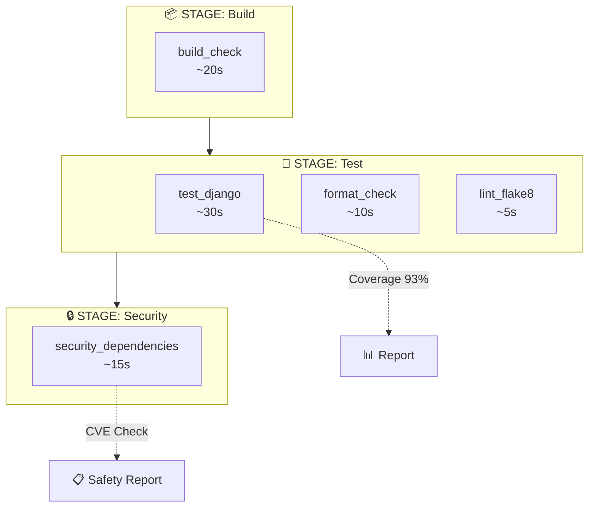

---

### Job Implementati

Ogni job della pipeline ha uno scopo specifico. Analizziamoli nel dettaglio, sia a livello concettuale che di singoli comandi.

---

#### 🔨 Build Check

**Scopo**: Verificare che il codice Python sia sintatticamente corretto PRIMA di eseguire test. Se il codice non compila, non ha senso perdere tempo con i test.

```yaml
build_check:
  stage: build
  script:
    - python -m py_compile manage.py
    - python -m compileall .
```

**Analisi script**:

| Comando | Cosa Fa |
|---------|----------|
| `python -m py_compile manage.py` | Compila `manage.py` in bytecode. Se ci sono errori di sintassi (parentesi mancanti, indentazione errata), fallisce immediatamente. È un controllo rapido sul file principale. |
| `python -m compileall .` | Compila TUTTI i file `.py` nella directory corrente e sottodirectory. Trova errori di sintassi in qualsiasi file del progetto. |

**Perché questo job è importante**: Fallisce velocemente (~20 secondi) se qualcuno ha pushato codice con errori di sintassi evidenti, evitando di sprecare tempo nei job successivi.

---

#### 🧪 Test Django + Coverage

**Scopo**: Eseguire la suite di test automatici e misurare quanta parte del codice viene effettivamente testata (coverage). Questo è il job più importante per garantire che il codice funzioni.

```yaml
test_django:
  stage: test
  script:
    - pip install coverage
    - coverage run --source='.' manage.py test
    - coverage report
    - coverage xml
  coverage: '/TOTAL.*\s+(\d+%)$/'
  artifacts:
    reports:
      coverage_report:
        coverage_format: cobertura
        path: coverage.xml
```

**Analisi script**:

| Comando | Cosa Fa |
|---------|----------|
| `pip install coverage` | Installa il tool `coverage` che traccia quali linee di codice vengono eseguite durante i test. |
| `coverage run --source='.' manage.py test` | Esegue `manage.py test` (che lancia tutti i test Django) mentre `coverage` traccia ogni linea eseguita. `--source='.'` limita il tracciamento ai file del progetto (non librerie esterne). |
| `coverage report` | Stampa a terminale un report tabellare con percentuali di copertura per ogni file. Utile per debug. |
| `coverage xml` | Genera `coverage.xml` in formato Cobertura, leggibile da GitLab per mostrare coverage nella UI. |

**Analisi keywords**:

| Keyword | Cosa Fa |
|---------|----------|
| `coverage: '/TOTAL.*\s+(\d+%)$/'` | Regex che GitLab usa per estrarre la percentuale totale dal log. Cerca una riga tipo `TOTAL ... 93%` e cattura "93%". Questo valore appare nei badge e nella UI. |
| `artifacts.reports.coverage_report` | Dice a GitLab che `coverage.xml` è un report di coverage in formato Cobertura. GitLab lo processa per mostrare coverage inline nelle Merge Request. |

---

#### ⬛ Format Check (Black)

**Scopo**: Verificare che TUTTO il codice Python sia formattato secondo lo standard Black. Garantisce consistenza stilistica nel progetto.

```yaml
format_check:
  stage: test
  script:
    - pip install black
    - black --check --line-length=120 .
```

**Analisi script**:

| Comando | Cosa Fa |
|---------|----------|
| `pip install black` | Installa Black, il formattatore Python "opinionated" che impone uno stile univoco. |
| `black --check --line-length=120 .` | Controlla tutti i file Python. `--check` significa "non modificare, solo verificare". Se un file non è formattato correttamente, il comando fallisce con exit code 1. `--line-length=120` imposta la lunghezza massima delle righe. |

**Perché `--check`?**: In CI non vogliamo modificare file, solo verificare. Le modifiche vengono fatte localmente da pre-commit.

**Perché questo job blocca la pipeline?**: Se il codice non è formattato, significa che lo sviluppatore non ha usato pre-commit. Bloccando, forziamo l'adozione di standard consistenti.

---

#### 📏 Linting (Flake8)

**Scopo**: Analisi statica del codice per trovare problemi come import inutilizzati, variabili non usate, errori logici comuni, violazioni PEP8.

```yaml
lint_flake8:
  stage: test
  script:
    - pip install flake8
    - flake8 --max-line-length=120 --exclude=migrations,venv
  allow_failure: true  # Warning only
```

**Analisi script**:

| Comando | Cosa Fa |
|---------|----------|
| `pip install flake8` | Installa Flake8, un linter che combina pyflakes (errori logici), pycodestyle (stile PEP8), mccabe (complessità). |
| `flake8 --max-line-length=120 --exclude=migrations,venv` | Analizza tutti i file Python. `--max-line-length=120` per consistenza con Black. `--exclude=migrations,venv` esclude file generati automaticamente (migrazioni Django) e virtual environment. |

**Analisi keywords**:

| Keyword | Cosa Fa |
|---------|----------|
| `allow_failure: true` | Se Flake8 trova errori, il job risulta "warning" (arancione) ma la pipeline continua. Utile perché il codebase legacy ha molti warning che richiederebbero troppo tempo per fixare. |

**Tipici errori trovati da Flake8**:
- `F401`: Import non utilizzato
- `F841`: Variabile assegnata ma mai usata
- `E501`: Riga troppo lunga
- `E302`: Due righe vuote richieste tra funzioni

---

#### 🔒 Security Scan (Safety)

**Scopo**: Controllare se le dipendenze Python hanno vulnerabilità di sicurezza note (CVE). Importante per non deployare codice con falle conosciute.

```yaml
security_dependencies:
  stage: security
  script:
    - pip install safety
    - safety check --file requirements.txt --full-report
  allow_failure: true  # Warning only
```

**Analisi script**:

| Comando | Cosa Fa |
|---------|----------|
| `pip install safety` | Installa Safety, tool che confronta le versioni delle dipendenze con un database di vulnerabilità note. |
| `safety check --file requirements.txt --full-report` | Legge `requirements.txt`, estrae nome e versione di ogni pacchetto, e cerca nel database CVE. `--full-report` mostra dettagli completi di ogni vulnerabilità trovata (descrizione, severity, fix suggerito). |

**Analisi keywords**:

| Keyword | Cosa Fa |
|---------|----------|
| `allow_failure: true` | Le vulnerabilità potrebbero non avere fix disponibili, o potremmo non poter aggiornare subito. Il job avvisa ma non blocca. |

**Output tipico di Safety**:
```
+==============================================================================+
| REPORT                                                                        |
+==============================================================================+
| package: django                                                               |
| installed: 4.0                                                                |
| affected: <4.0.6                                                              |
| CVE: CVE-2022-34265                                                           |
| severity: high                                                                |
| description: SQL injection in Trunc and Extract database functions            |
+==============================================================================+
```

---

## Problemi Riscontrati e Soluzioni

### 🔴 Problema 1: MySQL in CI Troppo Complesso

**Causa**: Usare MySQL richiederebbe un container separato, aumentando complessità e tempo.

**Soluzione**: SQLite in-memory per test CI:
```python
# settings.py
import sys
if 'test' in sys.argv:
    DATABASES['default'] = {
        'ENGINE': 'django.db.backends.sqlite3',
        'NAME': ':memory:',
    }
```

---

### 🔴 Problema 2: Black Fallisce su File Non Formattati

**Causa**: ~30 file nel codebase non erano formattati secondo Black.

**Soluzione**: Pre-commit hooks che formattano automaticamente prima del commit. La CI verifica ma trova sempre codice già formattato.

---

### 🔴 Problema 3: Flake8 Troppi Warning

**Causa**: ~20-30 warning per import inutilizzati, variabili non usate, ecc.

**Decisione**: `allow_failure: true` - Pipeline verde per progredire, warning visibili per future ottimizzazioni.

---

### 🔴 Problema 4: Type Checking (Mypy) Non Praticabile

**Causa**: Codebase senza type hints, richiederebbe tipizzare ~50+ funzioni.

**Decisione**: SCARTATO - Effort/ROI non giustificato per progetto didattico. Type hints aggiunti gradualmente in codice nuovo.

---

## Risultato Fase 3

✅ **Pipeline CI funzionante** con:
- Build verification
- Test automatici + coverage 93%
- Format check (Black)
- Linting (Flake8) - warning only
- Security scanning (Safety) - warning only

✅ **Developer Experience migliorata**:
- Pre-commit formatta codice automaticamente
- Badge README mostrano stato real-time
- Report scaricabili dagli artifacts

| Stage | Job | Durata | Comportamento |
|-------|-----|--------|---------------|
| Build | `build_check` | ~20s | ❌ Blocca |
| Test | `test_django` | ~30s | ❌ Blocca |
| Test | `format_check` | ~10s | ❌ Blocca |
| Test | `lint_flake8` | ~5s | ⚠️ Warning |
| Security | `security_dependencies` | ~15s | ⚠️ Warning |

**Tempo totale pipeline**: ~1m 20s

# Continuous Deployment

## Obiettivo

Implementare Continuous Deployment (CD) automatizzato per deployare l'applicazione Django su ambiente locale ogni volta che il codice passa i test della pipeline CI. Questo completa il ciclo DevOps: dal commit al deployment automatico.

---

## Panoramica Step

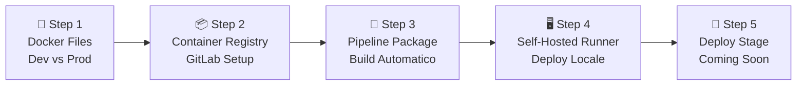

---

## Cosa Abbiamo Fatto

### Step 1: Preparazione Docker Files

**Obiettivo**: Separare configurazione **development** (con hot-reload) da **production** (con immagini immutabili).

#### File Creati

**1. `docker-compose.prod.yml`** (versione production):

Uguale a docker-compose.yml di development **ma con queste differenze**:

```yaml
version: '3.8'

services:
  db:
    image: mysql:8.0
    container_name: newspaper_db_prod
    environment:
      MYSQL_DATABASE: ${MYSQL_DATABASE:-blog}  # ← DIFF: Variabile da .env, non hardcoded
      MYSQL_USER: ${MYSQL_USER:-django}        # ← DIFF
      MYSQL_PASSWORD: ${MYSQL_PASSWORD:-django_password}       # ← DIFF
      MYSQL_ROOT_PASSWORD: ${MYSQL_ROOT_PASSWORD:-root_password} # ← DIFF
    volumes:
      - mysql_data_prod:/var/lib/mysql
    ports:
      - "3307:3306"  # ← DIFF: Porta 3307 (dev usa 3306) per evitare conflitti
    networks:
      - newspaper_prod  # ← DIFF: Network isolato (development senza networks)

  web:
    image: ${IMAGE_NAME:-registry.gitlab.com/luca_di_leo/cloudedgecomputing:latest}
    # ↑ CRUCIALE: image (pre-buildata) NON build: .
    # Development: build: . rebuilda localmente ogni volta (veloce)
    # Production: usa immagine dal registry (testata, immutabile)
    
    container_name: newspaper_web_prod
    # ASSENTE: volumes: - .:/app
    # ↑ CRUCIALE: NO volume mount codice
    # Development: ha volumes per live editing
    # Production: codice è dentro l'immagine (immutabile)
    
    ports:
      - "8001:8000"  # ← DIFF: Porta 8001 (dev usa 8000) per evitare conflitti
    
    environment:
      - MYSQL_DATABASE=${MYSQL_DATABASE:-blog}  # ← DIFF: Variabile da .env
      - MYSQL_USER=${MYSQL_USER:-django}        # ← DIFF: Variabile da .env
      - MYSQL_PASSWORD=${MYSQL_PASSWORD:-django_password}  # ← DIFF: Variabile da .env
      - DJANGO_SECRET_KEY=${DJANGO_SECRET_KEY:-change-me-in-production}  # ← DIFF: Variabile da .env
    
    networks:
      - newspaper_prod  # ← DIFF: Network isolato

volumes:
  mysql_data_prod:  # ← DIFF: Nome diverso (mysql_data_prod vs mysql_data)

networks:
  newspaper_prod:  # ← DIFF: Network esplicito (development no networks)
    driver: bridge
```

**Riepilogo Differenze**:

| Aspetto | Development | Production |
|---------|-------------|-----------|
| Web Image | build: . (rebuild locale) | image: ${IMAGE_NAME} (pre-buildata) |
| Codice Volume | volumes: - .:/app | ASSENTE |
| DB Porta | 3306 | 3307 |
| Web Porta | 8000 | 8001 |
| Secrets | Hardcoded | Variabili .env |
| Network | Default bridge | Named network |
| Volume DB | mysql_data | mysql_data_prod |

**Perché queste differenze**:

1. **image vs build**: Dev rebuilda per velocità iterativa. Prod usa immagine testata da CI (reproducible, safe).
2. **NO volumes**: Dev sync live `.:/app`. Prod ha codice immutabile nell'immagine.
3. **Porte diverse**: Permette eseguire dev E prod insieme sulla stessa macchina.
4. **Variabili .env**: Dev hardcoda. Prod legge da .env (generato con secrets GitLab protetti).
5. **Network isolato**: Buona pratica production.

**2. `.env.example`** (template per secrets):

```env
IMAGE_NAME=registry.gitlab.com/luca_di_leo/cloudedgecomputing:latest
DJANGO_SECRET_KEY=your-production-secret-key
MYSQL_DATABASE=blog
MYSQL_USER=django
MYSQL_PASSWORD=your-secure-password
MYSQL_ROOT_PASSWORD=your-root-password
```

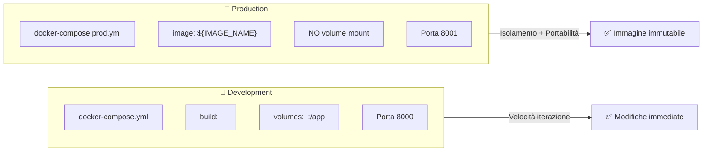

---

### Step 2: GitLab Container Registry

**Obiettivo**: Configurare registry Docker privato su GitLab per condividere immagini tra pipeline CI e server deployment.

#### Configurazione

**1. Abilitazione Registry**:
- GitLab → Deploy → Container Registry
- URL: `registry.gitlab.com/luca_di_leo/cloudedgecomputing`

**2. Autenticazione Docker**:
```powershell
# Login con Personal Access Token (scope: read_registry, write_registry)
docker login registry.gitlab.com
```

**3. Workflow manuale testato**:

```powershell
# Build in locale l'immagine che poi vogliamo pushare
docker build -t newspaper-web:test .

# Tag per registry. Ossia dobbiamo dire a Docker DOVE pushare, altrimenti cerca 
# di pushare su Docker Hub (default), quindi serve il nome completo del registry di gitlab
docker tag newspaper-web:test registry.gitlab.com/luca_di_leo/cloudedgecomputing:test

# Push a GitLab Container Registry
docker push registry.gitlab.com/luca_di_leo/cloudedgecomputing:test

# Verifica: pull da registry (simula macchina pulita)
docker pull registry.gitlab.com/luca_di_leo/cloudedgecomputing:test
```
N.B.: Un'alternativa potrebbe essere usare `docker build -t registry.gitlab.com/luca_di_leo/cloudedgecomputing:test .`, ossia buildare direttamente con il tag completo. Tuttavia, il workflow con `docker tag` è più flessibile e didattico.

---

### Step 3: Pipeline Package Stage

**Obiettivo**: Automatizzare build e push delle immagini Docker nella pipeline CI.

#### Modifiche a `.gitlab-ci.yml`

**Nuovo stage aggiunto**:

```yaml
stages:
  - build
  - test
  - security
  - package    # ← NUOVO STAGE
```

**Variabili Docker**:

```yaml
variables:
  DOCKER_DRIVER: overlay2
  DOCKER_TLS_CERTDIR: "/certs"
  IMAGE_TAG: $CI_REGISTRY_IMAGE:$CI_COMMIT_SHORT_SHA
  IMAGE_LATEST: $CI_REGISTRY_IMAGE:latest
```

| Variabile | Valore | Spiegazione |
|-----------|--------|-------------|
| `DOCKER_DRIVER` | `overlay2` | Driver storage Docker ottimale |
| `DOCKER_TLS_CERTDIR` | `/certs` | Certificati TLS per Docker-in-Docker |
| `IMAGE_TAG` | `$CI_REGISTRY_IMAGE:$CI_COMMIT_SHORT_SHA` | Tag con commit SHA (es. `a1b2c3d4`) |
| `IMAGE_LATEST` | `$CI_REGISTRY_IMAGE:latest` | Tag latest sempre aggiornato |

**Job `build_docker_image`**:

```yaml
build_docker_image:
  stage: package
  image: docker:24-dind
  services:
    - docker:24-dind
  before_script:
    - echo $CI_REGISTRY_PASSWORD | docker login -u $CI_REGISTRY_USER --password-stdin $CI_REGISTRY
  script:
    - docker build -t $IMAGE_TAG -t $IMAGE_LATEST .
    - docker push $IMAGE_TAG
    - docker push $IMAGE_LATEST
  only:
    - 02-django-base-project
  dependencies: []
```

Quello che stiamo facendo è buildare l'immagine Docker del progetto **dentro la pipeline CI**, per poi pusharla sul GitLab Container Registry.
Infatti come si vede nel job facciamo anche il login al registry usando le variabili automatiche `$CI_REGISTRY_USER` e `$CI_REGISTRY_PASSWORD` fornite da GitLab.

**Analisi job**:

| Elemento | Spiegazione |
|----------|-------------|
| `image: docker:24-dind` | Docker-in-Docker: container che può buildare immagini Docker |
| `services: docker:24-dind` | Servizio Docker daemon necessario per DinD |
| `$CI_REGISTRY_PASSWORD` | Variabile GitLab automatica per autenticazione |
| `docker build -t $IMAGE_TAG -t $IMAGE_LATEST .` | Build con 2 tag contemporaneamente |
| `dependencies: []` | Non serve scaricare artifacts da job precedenti |

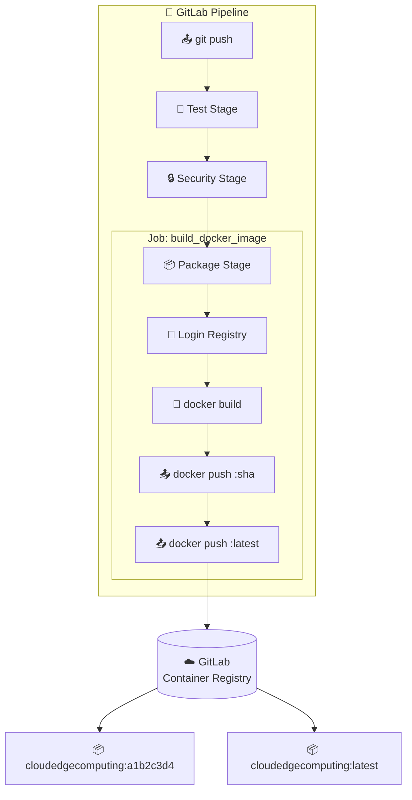

#### Approfondimento: Docker-in-Docker (DinD)

**Problema**: I job GitLab CI girano in container Docker. Ma noi dobbiamo **buildare immagini Docker** all'interno del job. Come si fa a eseguire Docker dentro Docker?

**Soluzione**: **Docker-in-Docker (DinD)** è una tecnica che permette di eseguire un daemon Docker all'interno di un container.


| Componente | Ruolo |
|------------|-------|
| `image: docker:24-dind` | Container con Docker CLI (comandi docker) |
| `services: docker:24-dind` | Container separato con Docker Daemon (dockerd) |
| `DOCKER_TLS_CERTDIR` | Certificati TLS per comunicazione sicura tra CLI e Daemon |

#### Job `test_runner` - Verifica Self-Hosted Runner

Prima di creare il job di deploy ovviamente ho dovuto prima configurare il Self-Hosted Runner (step successivo). Per assicurarmi che tutto funzionasse correttamente ho creato un job di test:

```yaml
test_runner:
  stage: package  
  tags:
    - windows  # ← Esegue SOLO su runner con tag "windows", aka.: il mio self-hosted runner
  script:
    - echo "🎯 Test GitLab Runner self-hosted"
    - echo "Hostname:"
    - hostname
    - echo "Docker version:"
    - docker --version
    - echo "Docker Compose version:"
    - docker-compose --version
    - echo "Working directory:"
    - pwd
    - echo "✅ Runner funzionante!"
  only:
    - 02-django-base-project
```

**Scopo**: Verificare che:
- Il runner Windows sia raggiungibile
- Docker e Docker Compose siano installati
- Il working directory sia corretto

---

### Step 4: GitLab Runner Self-Hosted

**Obiettivo**: Installare GitLab Runner sulla propria macchina Windows per deployment locale.

#### Perché Serve un Self-Hosted Runner?

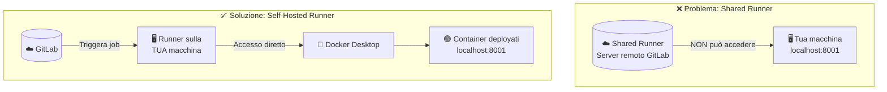

**Shared Runner**:
- Gira su server remoto GitLab
- NON può accedere a `localhost` della tua macchina
- Container temporanei (distrutti dopo job)

**Self-Hosted Runner**:
- Gira sulla TUA macchina
- Accesso diretto a Docker Desktop locale
- Può deployare container persistenti

#### Installazione

**1. Download**:
```powershell
New-Item -ItemType Directory -Path C:\GitLab-Runner # Creazione cartella dove installare
Invoke-WebRequest -Uri "https://gitlab-runner-downloads.s3.amazonaws.com/latest/binaries/gitlab-runner-windows-amd64.exe" -OutFile "C:\GitLab-Runner\gitlab-runner.exe"
```
N.B.: il download lo si può fare anche manualmente dal sito adatto, che non riporto per pigrizia.

**2. Registrazione**:
```powershell
cd C:\GitLab-Runner
.\gitlab-runner.exe register
```

| Parametro | Valore |
|-----------|--------|
| URL | `https://gitlab.com/` |
| Token | Da GitLab → Settings → CI/CD → Runners |
| Description | `windows-local-runner` |
| Tags | `windows,local,docker` |
| Executor | `shell` |

Quando lanci .\gitlab-runner.exe register, si avvia una procedura guidata che crea un file di configurazione (config.toml). Ecco il significato profondo di quei parametri:
- URL (https://gitlab.com/): Indica al runner a quale "capo" deve rispondere. Se usassi un'istanza aziendale privata, metteresti l'indirizzo della tua azienda.
- Token: È la chiave di sicurezza. Serve a GitLab per capire a quale progetto o gruppo appartiene questo runner. Senza questo, chiunque potrebbe collegarsi ai tuoi progetti.
- Description: Un nome mnemonico. Ti serve solo per riconoscerlo nella lista dei runner su GitLab (es. "PC-Casa-Luca").
- Tags (windows, local, docker): Fondamentali. Quando scriverai il file .gitlab-ci.yml, userai questi tag per dire: "Ehi, questo specifico lavoro deve girare solo su un runner che ha il tag 'windows'!".
- Executor (shell): Definisce il "motore" che eseguirà i comandi.

Scegliendo shell su Windows, il runner aprirà PowerShell (o CMD) ed eseguirà i comandi direttamente sul tuo sistema operativo.

**3. Installazione come servizio Windows**:
```powershell
.\gitlab-runner.exe install
.\gitlab-runner.exe start
.\gitlab-runner.exe status
# Output: Service is running ✅
```

**4. Verifica su GitLab**: Runner visibile con stato 🟢 verde.

#### Tag-Based Execution

```yaml
deploy_local:
  tags:
    - windows    # ← Esegue SOLO su runner con tag "windows"
  script:
    - docker-compose -f docker-compose.prod.yml up -d
```

- Job **con** tag `windows` → Self-hosted runner (tua macchina)
- Job **senza** tag → Shared runner (cloud GitLab)

#### Confronto Runner

| Aspetto | Shared Runner | Self-Hosted Runner |
|---------|--------------|-------------------|
| **Location** | Server remoto GitLab | Tua macchina Windows |
| **Accesso localhost** | ❌ No | ✅ Sì |
| **Accesso Docker locale** | ❌ No | ✅ Sì |
| **Deploy locale** | ❌ Impossibile | ✅ Possibile |
| **Costo** | Gratis (minuti limitati) | Gratis (usa tua CPU) |
| **Setup** | Zero | Richiede installazione |
| **Uso tipico** | CI (test, lint, build) | CD (deployment) |

---

---

## Step 5: Deploy Stage

**Obiettivo**: Creare job di deployment automatico che esegue sul Self-Hosted Runner per deployare l'applicazione in locale.

### Il Job `deploy_production`

Questo job rappresenta la **fase finale della pipeline**: prende l'immagine buildata nello stage `package` e la deploya sulla macchina locale tramite `docker-compose`.

#### Configurazione Completa

```yaml
deploy_production:
  stage: deploy
  tags:
    - windows  # ← Esegue su self-hosted runner
  
  before_script:
    # Login al GitLab Container Registry
    - echo $CI_REGISTRY_PASSWORD | docker login -u $CI_REGISTRY_USER --password-stdin $CI_REGISTRY
    
    # Creazione dinamica file .env, esso viene usato da docker-compose.prod.yml
    - |
      @"
      DJANGO_SECRET_KEY=$env:DJANGO_SECRET_KEY
      DJANGO_SETTINGS_MODULE=django_project.production_settings
      MYSQL_DATABASE=blog
      MYSQL_USER=django
      MYSQL_PASSWORD=$env:MYSQL_PASSWORD
      MYSQL_ROOT_PASSWORD=$env:MYSQL_ROOT_PASSWORD
      IMAGE_NAME=$env:DEPLOY_IMAGE_NAME
      "@ | Out-File -FilePath .env -Encoding UTF8
  
  script:
    # Pull immagine da registry
    - docker pull ${env:DEPLOY_IMAGE_NAME}
    
    # Deploy con docker-compose
    - docker-compose -f docker-compose.prod.yml down --remove-orphans
    - docker-compose -f docker-compose.prod.yml up -d
    
    # Attesa avvio container
    - Start-Sleep -Seconds 10
    
    # Verifica deployment
    - docker ps --filter "name=newspaper"
  
  after_script:
    # Cleanup file .env (sicurezza)
    - Remove-Item .env -ErrorAction SilentlyContinue
  
  only:
    - 02-django-base-project
  
  environment:
    name: production
    url: http://localhost:8001
  
  when: manual  # Richiede conferma manuale, giusto per avere maggiore controllo
```

### Analisi Dettagliata del Job

#### 1. Header e Tag

```yaml
deploy_production:
  stage: deploy
  tags:
    - windows
```

| Elemento | Spiegazione |
|----------|-------------|
| `stage: deploy` | Appartiene allo stage finale della pipeline |
| `tags: [windows]` | **Cruciale**: Esegue SOLO sul Self-Hosted Runner (non su Shared Runner) |

#### 2. Creazione Dinamica del File `.env`

Il `before_script` crea un file `.env` usando le variabili di GitLab:

```mermaid
flowchart LR
    subgraph GitLab["☁️ GitLab CI/CD Variables"]
        V1["🔐 DJANGO_SECRET_KEY"]
        V2["🔐 MYSQL_PASSWORD"]
        V3["🔐 MYSQL_ROOT_PASSWORD"]
        V4["📦 DEPLOY_IMAGE_NAME"]
    end
    
    subgraph Script["📜 PowerShell Script"]
        PS["Here-String <br/>Out-File .env"]
    end
    
    subgraph EnvFile["📄 .env (generato)"]
        E1["DJANGO_SECRET_KEY=xxx"]
        E2["MYSQL_PASSWORD=yyy"]
        E3["IMAGE_NAME=registry..."]
    end
    
    V1 --> PS
    V2 --> PS
    V3 --> PS
    V4 --> PS
    PS --> EnvFile
```

**Sintassi PowerShell Here-String**:
```powershell
@"
Linea 1
Linea 2 con $env:VARIABILE
"@ | Out-File -FilePath .env -Encoding UTF8
```

- `@"..."@` = Here-String (multilinea, espande variabili)
- `Out-File` = Scrive su file
- `-Encoding UTF8` = Encoding corretto per docker-compose

#### 3. Sequenza di Deploy

```mermaid
sequenceDiagram
    participant R as 🖥️ Runner
    participant Reg as ☁️ Registry
    participant DC as 🐳 Docker
    
    Note over R: 📥 docker pull
    R->>Reg: Richiesta immagine
    Reg-->>R: Download layers
    
    Note over R: 🛑 docker-compose down
    R->>DC: Stop container esistenti
    DC-->>R: Container fermati
    
    Note over R: 🚀 docker-compose up -d
    R->>DC: Avvia nuovi container
    DC->>DC: Legge .env
    DC->>DC: Avvia db (MySQL)
    DC->>DC: Healthcheck db
    DC->>DC: Avvia web (Django)
    DC-->>R: Container running
    
    Note over R: ⏳ Start-Sleep 10s
    R->>R: Attesa stabilizzazione
    
    Note over R: ✅ docker ps
    R->>DC: Verifica status
    DC-->>R: Container list
```

#### 4. Cleanup Post-Deploy

```yaml
after_script:
  - Remove-Item .env -ErrorAction SilentlyContinue
```

**Perché è importante**: Il file `.env` contiene **secrets** (password). Anche se il job fallisce, `after_script` viene eseguito per rimuovere il file.

#### 5. Keywords Speciali

| Keyword | Valore | Scopo |
|---------|--------|-------|
| `environment.name` | `production` | Crea "Environment" in GitLab per tracking |
| `environment.url` | `http://localhost:8001` | Link cliccabile in GitLab UI |
| `when: manual` | Richiede click | **Sicurezza**: Deployment non automatico |

### Flusso Completo Pipeline con Deploy

```mermaid
flowchart TD
    A["👨‍💻 git push"] --> B["📦 CI pipeline"]
    
    B --> F{"🖐️ Manual<br/>Approval?"}
    
    F -->|"Click Deploy"| G["🚀 Deploy Stage"]
    
    subgraph Deploy["Deploy (Self-Hosted Runner)"]
        G --> G1["docker login"]
        G1 --> G2["Genera .env"]
        G2 --> G3["docker pull"]
        G3 --> G4["docker-compose down"]
        G4 --> G5["docker-compose up -d"]
        G5 --> G6["Verifica + Cleanup"]
    end
    
    G6 --> H["🌐 localhost:8001"]
```

### Gestione File `.env` nel Progetto

#### Struttura File Ambiente

```
cloudedgecomputing/
├── .env                    # ❌ NON committato (secrets reali)
├── .env.template           # ✅ Committato (template senza valori)
├── docker-compose.yml      # Development
└── docker-compose.prod.yml # Production (usa .env)
```

#### `.env.template` - Il Template

```env
# Production Environment Variables
# Questo file viene popolato automaticamente dalla pipeline

DJANGO_SECRET_KEY=${DJANGO_SECRET_KEY}
DJANGO_SETTINGS_MODULE=django_project.production_settings

MYSQL_DATABASE=blog
MYSQL_USER=django
MYSQL_PASSWORD=${MYSQL_PASSWORD}
MYSQL_ROOT_PASSWORD=${MYSQL_ROOT_PASSWORD}

IMAGE_NAME=${DEPLOY_IMAGE_NAME}
```

### Tabella Riepilogativa Variabili Deploy

| Variabile | Origine | Valore Esempio | Usata In |
|-----------|---------|----------------|----------|
| `DJANGO_SECRET_KEY` | GitLab UI (Protected) | `abc123xyz...` | Django settings |
| `DJANGO_SETTINGS_MODULE` | Hardcoded | `django_project.production_settings` | Django startup |
| `MYSQL_DATABASE` | Hardcoded | `blog` | MySQL + Django |
| `MYSQL_USER` | Hardcoded | `django` | MySQL + Django |
| `MYSQL_PASSWORD` | GitLab UI (Protected) | `strong-pass-123` | MySQL + Django |
| `MYSQL_ROOT_PASSWORD` | GitLab UI (Protected) | `root-pass-456` | MySQL init |
| `IMAGE_NAME` / `DEPLOY_IMAGE_NAME` | GitLab UI | `registry.gitlab.com/.../cloudedgecomputing:latest` | docker-compose |

### Verifica Deployment

Dopo il deploy, verificare che tutto funzioni:

```powershell
# 1. Container in esecuzione
docker ps --filter "name=newspaper"
# Output atteso: newspaper_web_prod, newspaper_db_prod

# 2. Log container web
docker logs newspaper_web_prod
# Cercare: "spawned uWSGI worker"

# 3. Test connessione HTTP
curl http://localhost:8001
# Oppure aprire browser

# 4. Test database connection
docker exec -it newspaper_db_prod mysql -u django -p blog
# Password: quella configurata in MYSQL_PASSWORD
```

---

## Problemi Riscontrati e Soluzioni

### 🔴 Problema 1: Runner Executor PowerShell vs pwsh

**Sintomo**:
```
exec: "pwsh": executable file not found in %PATH%
```

**Causa**: Il file `config.toml` generato automaticamente usava `shell = "pwsh"` (PowerShell Core) invece di `shell = "powershell"` (Windows PowerShell).

**Soluzione**: Modificare `C:\GitLab-Runner\config.toml`:
```toml
[[runners]]
  name = "windows-local-runner"
  executor = "shell"
  shell = "powershell"   # ← Cambiato da "pwsh"
```

Poi riavviare:
```powershell
.\gitlab-runner.exe restart
```

---

### 🔴 Problema 2: uwsgi.ini Mancante nell'Immagine

**Errore**:
```
realpath() of uwsgi.ini failed: No such file or directory
```

**Causa**:
- File `uwsgi.ini` nel `.gitignore`
- NON committato su Git
- NON presente nell'immagine Docker buildata

**Workflow problema**:
```
1. Locale: uwsgi.ini esiste ✅
2. .gitignore: uwsgi.ini ← Ignorato
3. git push: uwsgi.ini NON committato ❌
4. Pipeline build: COPY . /app (senza uwsgi.ini) ❌
5. Container avvia: uwsgi --ini uwsgi.ini ❌ Not found
```

**Soluzione**:
Togliere `uwsgi.ini` da `.gitignore`, committare e pushare il file.

---

### 🔴 Problema 3: MySQL Access Denied (Password Errata)

**Errore**:
```
ERROR 1045 (28000): Access denied for user 'django'@'localhost'
```

**Causa Root**: Volume MySQL già inizializzato con password vecchie.

**Dettaglio problema**:
```
1. Prima run: MySQL inizializza volume con password vecchie
   └─ Volume mysql_data creato con password "old_password"

2. Cambi variabile GitLab: MYSQL_PASSWORD = "new_password"

3. Ricrei container (senza rimuovere volume)
   └─ MySQL vede volume esistente
   └─ SKIP inizializzazione (directory /var/lib/mysql già popolata)
   └─ Usa password VECCHIE dal volume ❌

4. Login con "new_password" → ❌ Access denied
```

**Soluzione**:
```powershell
# Rimuovi volume (ATTENZIONE: cancella dati DB!)
docker-compose -f docker-compose.prod.yml down -v

# Ricrea container (MySQL reinizializza con password nuove)
docker-compose -f docker-compose.prod.yml up -d

# Test login
docker exec -it newspaper_db_prod mysql -u django -p blog
# Password: strong-password-123 ✅ Funziona
```

---

### 🔴 Problema 4: Variabili GitLab NON Iniettate (Protected Variables)

**Sintomo**:
- Deploy manuale locale: Password `strong-password-123` ✅ Funziona
- Deploy pipeline: Password `django_password` (fallback) ❌ Sbagliata

**Causa**: Variabili GitLab con flag "Protected" ☑️ + Branch NON protetto.

**Dettaglio problema**:
```
GitLab Variables:
├─ MYSQL_PASSWORD
│   ├─ Value: strong-password-123
│   └─ Protected: ☑️ Yes  ← PROBLEMA!

Branch: 02-django-base-project
└─ NON protetto (solo main/production sono protetti default)

Job deploy_production esegue:
├─ Branch: 02-django-base-project (non protetto)
├─ Variabile MYSQL_PASSWORD: UNDEFINED ❌ (protected, branch no)
└─ $env:MYSQL_PASSWORD = null

File .env generato:
MYSQL_PASSWORD=   ← VUOTO! ❌

docker-compose legge:
${MYSQL_PASSWORD:-django_password}
└─ .env ha valore vuoto → Usa fallback "django_password" ❌
```

**Soluzione**:

**Opzione A** - Unprotect Variables (scelto):
```
GitLab → Settings → CI/CD → Variables
├─ MYSQL_PASSWORD → Edit
├─ Protected: ☐ UNCHECKED  ← Permette uso su tutti branch
└─ Save
```

**Opzione B** - Protect Branch:
```
GitLab → Settings → Repository → Protected Branches
├─ Branch: 02-django-base-project
├─ Allowed to push: Maintainers
└─ Protect

Ora branch protetto → Protected variables disponibili ✅
```

## Risultato Fase 4 Completa

✅ **Step 1**: Separazione Dev/Prod con docker-compose dedicati  
✅ **Step 2**: GitLab Container Registry configurato e funzionante  
✅ **Step 3**: Pipeline Package Stage automatizza build e push immagini  
✅ **Step 4**: Self-Hosted Runner installato per deployment locale  
✅ **Step 5**: Deploy Stage con gestione secrets e verifica automatica

---


# Architettura Finale e Workflow

## Architettura Sistema

```mermaid
flowchart TB
    subgraph Host["💻 WINDOWS HOST - Docker Desktop"]
        Browser["🌐 Browser<br/>localhost:8000"]
        Code["📁 Codice Sorgente<br/>C:\\Users\\...\\cloudedgecomputing"]
        
        subgraph DockerEnv["🐳 Docker Environment"]
            subgraph Network["🌐 Network: cloudedgecomputing_default"]
                subgraph WebContainer["🟢 Container: newspaper_web"]
                    Django["🐍 Django 4.0"]
                    uWSGI["⚙️ uWSGI"]
                    AppPort["📡 Port 8000"]
                end
                
                subgraph DBContainer["🔵 Container: newspaper_db"]
                    MySQL["🗄️ MySQL 8.0"]
                    DBPort["📡 Port 3306"]
                end
            end
            
            subgraph Storage["💾 Persistent Storage"]
                Volume[("📦 Volume<br/>mysql_data")]
                BindMount["🔗 Bind Mount<br/>.:/app"]
            end
        end
    end
    
    Browser -->|"HTTP Request<br/>:8000 → :8000"| AppPort
    AppPort --> uWSGI
    uWSGI --> Django
    Django -->|"TCP/IP<br/>db:3306"| DBPort
    DBPort --> MySQL
    
    MySQL ---|"Dati persistenti"| Volume
    Code ---|"Sync bidirezionale"| BindMount
    BindMount ---|"Montato in /app"| Django

```

**Legenda Architettura Locale**:
- 🟢 **Container web**: Applicazione Django servita da uWSGI
- 🔵 **Container db**: Database MySQL per persistenza dati
- 🌐 **Network**: Rete virtuale Docker per comunicazione inter-container
- 💾 **Volume**: Storage persistente per dati MySQL (sopravvive a restart)
- 🔗 **Bind Mount**: Sincronizzazione codice host ↔ container (sviluppo live)

---

## Workflow Completo CI/CD

```mermaid
flowchart TD
    DEV["👨‍💻 Developer"] -->|git push| PRE["Pre-commit Hook"]
    PRE -->|"Black formatta"| GL_PUSH["Push to GitLab"]
    
    subgraph CI["CI - Shared Runner (Cloud)"]
        GL_PUSH --> CI_BUILD["Build Check"]
        CI_BUILD --> CI_TEST["Test + Coverage"]
        CI_TEST --> CI_LINT["Lint"]
        CI_LINT --> CI_FORMAT["Format Check"]
        CI_FORMAT --> CI_SEC["Security Scan"]
        
        subgraph PackageJob["Job: build_docker_image"]
            CI_SEC --> REG_LOGIN[Login Registry]
            REG_LOGIN --> DK_BUILD[docker build]
            DK_BUILD --> DK_PUSH_SHA[docker push :sha]
            DK_PUSH_SHA --> DK_PUSH_LATEST[docker push :latest]
        end
    end
    
    DK_PUSH_LATEST --> REGISTRY[("☁️ GitLab<br/>Container Registry")]
    
    REGISTRY --> IMG_SHA["📦 cloudedgecomputing:a1b2c3d4"]
    REGISTRY --> IMG_LATEST["📦 cloudedgecomputing:latest"]    
    
    PackageJob --> MANUAL_TRIGGER{"🖐️ Manual?"}
    MANUAL_TRIGGER -->|"Click"| CD_START
    
    subgraph Deploy["CD - Self-Hosted Runner"]
      subgraph S["Job: deploy_production"]
        CD_START --> CD_LOGIN["docker login"]
        CD_LOGIN --> CD_ENV["Genera .env"]
        CD_ENV --> CD_PULL["docker pull"]
        CD_PULL --> CD_DOWN["docker-compose down"]
        CD_DOWN --> CD_UP["docker-compose up -d"]
        CD_UP --> CD_VERIFY["Verifica + Cleanup"]
        end
    end
    
    CD_VERIFY --> FINAL_URL["🌐 localhost:8001"]

    style S fill: #6440a7, color: #fff
    style PackageJob fill: #6440a7, color: #fff
```

---

# Guida Pratica al Testing

Questa sezione spiega **passo-passo** come testare l'intero progetto nelle diverse modalità: sviluppo locale, ambiente Docker e deploy in produzione.

---

## Esecuzione in Locale con Docker

### Cosa rappresenta
Questa modalità simula un **ambiente production-like** sulla tua macchina. Crea container isolati con:
- **MySQL** come database (non SQLite)
- **uWSGI** come application server (non il server di sviluppo Django)
- **Networking Docker** tra i container

**Scopo**: Verificare che l'applicazione funzioni correttamente in un ambiente simile alla produzione, testare le migrazioni su MySQL, verificare la configurazione Docker prima del deploy.

### Step-by-Step

```bash
# 1. Posizionati nella directory del progetto
cd C:\Users\lucad\Desktop\Cloud And Edge Computing\Faenza\cloudedgecomputing

# 2. Avvia i servizi (prima volta: builda anche l'immagine)
docker-compose up --build

# 3. Oppure, per le volte successive (immagine già buildata)
docker-compose up

# 4. Per eseguire in background (detached mode)
docker-compose up -d
```

### Cosa viene creato

| Elemento | Descrizione |
|----------|-------------|
| **Container `newspaper_db`** | MySQL 8.0 con database `blog`, user `django`, password `django_password` |
| **Container `newspaper_web`** | App Django con uWSGI, connessa a MySQL |
| **Volume `mysql_data`** | Persistenza dati MySQL (sopravvive al `down`) |
| **Network `cloudedgecomputing_default`** | Rete virtuale per comunicazione tra container |

### Cosa è successo?
- Docker Compose ha creato e avviato 2 container isolati:
  - `newspaper_db`: MySQL database
  - `newspaper_web`: Django app con uWSGI
- MySQL ha inizializzato il database `blog` con l'utente `django`
- Django è stato avviato tramite uWSGI, pronto a servire richieste HTTP

Per questa operazione è stato usato il file `docker-compose.yml` presente nella root del progetto, il quale appunto definisce i servizi, volumi e network necessari.

### Come controllare

```bash
# Verifica container attivi
docker ps
# Output atteso: 2 container (newspaper_db, newspaper_web) con status "Up"

# Verifica log dell'applicazione
docker logs newspaper_web
# Output atteso: log uWSGI con "spawned uWSGI worker"

# Verifica log database
docker logs newspaper_db
# Output atteso: "ready for connections"

# Test connessione al database dall'interno del container
docker exec -it newspaper_db mysql -u django -pdjango_password -e "SHOW DATABASES;"
# Output atteso: lista database con "blog"
```

### Uso dell'applicazione
- **URL**: http://localhost:8000
- Se volessimo accedere al database sia come django che come root dovremmo usare le seguenti password:
  - User `django`: password `django_password`
  - User `root`: password `root_password`
  Questo perché nel file `docker-compose.yml` abbiamo definito queste credenziali per MySQL. Mentre nel file `docker-compose.prod.yml` abbiamo usato variabili d'ambiente che vengono iniettate dinamicamente durante il deploy.
- Ho provato poi a creare due utenti: 
  - User `PROVA1`: password `oR5Jy4DFsss6`
  - User `PROVA2`: password `oR5Jy4DFsss6`
  E ho creato articoli e commenti con entrambi gli utenti, tutto funziona correttamente. Fermando e riavviando i container i dati persistono come previsto grazie al volume `mysql_data`.
  N.B.: per vedere tutti gli articoli non c'è un tasto dedicato, ma bisogna andare all'url diretto `http://localhost:8000/articles/`.


### Fermare l'ambiente

```bash
# Ferma i container (dati MySQL persistono nel volume)
docker-compose down

# Ferma i container E cancella i volumi (reset completo database)
docker-compose down -v
```

---

## Esecuzione in Locale senza Docker

### Cosa rappresenta
Questa è la modalità di **sviluppo tradizionale Django**: Python installato sulla macchina, server di sviluppo integrato, database SQLite locale.

**Scopo**: Sviluppo rapido, test immediati delle modifiche al codice, debug semplificato senza overhead di Docker.

### Step-by-Step

```bash
# 1. Posizionati nella directory del progetto
cd C:\Users\lucad\Desktop\Cloud And Edge Computing\Faenza\cloudedgecomputing

# 2. Crea ambiente virtuale Python
python -m venv venv

# 3. Attiva l'ambiente virtuale
venv\Scripts\activate  # Windows
# source venv/bin/activate  # Linux/Mac

# 4. Installa le dipendenze (senza mysqlclient per evitare problemi)
pip install Django==4.0 environs crispy-bootstrap5 django-crispy-forms whitenoise

# 5. Applica le migrazioni (crea/aggiorna db.sqlite3)
python manage.py migrate

# 6. (Opzionale) Crea un superuser per accedere all'admin
python manage.py createsuperuser

# 7. Avvia il server di sviluppo
python manage.py runserver
```

### Cosa è successo?
- Ambiente virtuale Python `venv/` creato e attivato
- Dipendenze installate (Django, environs, crispy-forms, whitenoise)
- Database SQLite `db.sqlite3` creato con le tabelle iniziali
- Server di sviluppo Django avviato sulla porta 8000

### Cosa viene creato

| Elemento | Descrizione |
|----------|-------------|
| **Cartella `venv/`** | Ambiente virtuale Python isolato |
| **File `db.sqlite3`** | Database SQLite locale (file singolo) |
| **Processo Python** | Server di sviluppo Django sulla porta 8000 |

### Come controllare

```bash
# Verifica che il server sia attivo
# Output atteso nel terminale:
# Starting development server at http://127.0.0.1:8000/
# Quit the server with CTRL-BREAK.

# Verifica database SQLite
python manage.py dbshell
# Apre shell SQLite, digita .tables per vedere le tabelle

# Esegui i test Django
python manage.py test accounts articles pages --verbosity=2
```

### Uso dell'applicazione
- **URL**: http://localhost:8000
- Per comodità ho creato un superuser con username `superuser` e password `superuser`, così da poter accedere all'admin di Django su `http://localhost:8000/admin/`.
- Ovviamente NON ci sono gli utenti precedentemente creati nel database MySQL, in quanto qui stiamo usando SQLite. Quindi il database è vuoto all'inizio.
- In locale ci sono due utenti creati:
  - User `LOCALE1`: password `oR5Jy4DFsss6`
  - User `Pollo`: la password non la ricordo, ma amen 

### Fermare l'ambiente

```bash
# Premi CTRL+C nel terminale dove gira runserver

# Per disattivare l'ambiente virtuale
deactivate
```

---

## Testare la Pipeline CI

### Cosa rappresenta
La pipeline CI (Continuous Integration) è un processo **automatico** che si attiva ad ogni push su GitLab. Esegue una serie di controlli per garantire la qualità del codice.

**Scopo**: Verificare automaticamente che il codice sia sintatticamente corretto, che i test passino, che non ci siano vulnerabilità di sicurezza, e che l'immagine Docker si costruisca correttamente.

### Step-by-Step

```bash
# 1. Fai le tue modifiche al codice

# 2. Aggiungi i file modificati
git add .

# 3. Crea un commit
git commit -m "feat: descrizione della modifica"

# 4. Pusha al branch (questo attiva la pipeline)
git push origin 02-django-base-project
```

### Cosa succede su GitLab

Dopo il push, vai su **GitLab → CI/CD → Pipelines** e vedrai:

| Stage | Job | Cosa fa | Risultato atteso |
|-------|-----|---------|------------------|
| **build** | `build_job` | Compila e verifica sintassi Python | ✅ Verde se nessun errore sintassi |
| **test** | `test_django` | Esegue test Django con coverage | ✅ Verde + percentuale coverage |
| **test** | `lint_code` | Controlla stile codice con flake8 | ⚠️ Può fallire (allow_failure) |
| **test** | `format_check` | Verifica formattazione con black | ⚠️ Può fallire (allow_failure) |
| **security** | `security_dependencies` | Scansiona vulnerabilità dipendenze | ⚠️ Può fallire (allow_failure) |
| **package** | `build_docker_image` | Builda e pusha immagine Docker | ✅ Verde se build OK |
| **package** | `test_runner` | Verifica che il runner Windows funzioni | ✅ Verde se runner OK |

### Come controllare

1. **Pipeline Overview**: Vai su GitLab → CI/CD → Pipelines
   - Vedi stato generale: 🟢 passed, 🔴 failed, 🟡 running

2. **Dettaglio Job**: Clicca su un job per vedere i log
   - Log completi dell'esecuzione
   - Tempo impiegato
   - Eventuali errori con stack trace

3. **Coverage Badge**: Nel README.md vedi la percentuale di coverage

4. **Artifacts**: Alcuni job producono file scaricabili
   - `coverage.xml` - Report coverage dettagliato
   - `safety-report.json` - Report vulnerabilità

---

## Testare il Deploy

### Cosa rappresenta
Il deploy è il processo che porta l'applicazione dall'immagine Docker costruita dalla pipeline al **server di produzione** (nel nostro caso, un runner self-hosted Windows).

**Scopo**: Rendere l'applicazione accessibile agli utenti finali, utilizzando un ambiente stabile e configurato per la produzione.

### Step-by-Step

#### Deploy Automatico via Pipeline (Metodo Principale)

```bash
# 1. Assicurati che la pipeline sia passata (tutti gli stage verdi fino a "package")

# 2. Vai su GitLab → CI/CD → Pipelines → [tua pipeline]

# 3. Lo stage "deploy" mostra il job "deploy_production" con un pulsante ▶️ Play
#    (è manuale per sicurezza)

# 4. Clicca su ▶️ per avviare il deploy

# 5. Monitora i log del job in tempo reale
```

### Cosa viene creato

| Elemento | Descrizione |
|----------|-------------|
| **Container `newspaper_db_prod`** | MySQL 8.0 su porta 3307 (diversa da dev) |
| **Container `newspaper_web_prod`** | App da immagine registry GitLab su porta 8001 |
| **Volume `mysql_data_prod`** | Dati MySQL produzione (separato da dev) |
| **Network `newspaper_prod`** | Rete isolata per produzione |

### Come controllare

```bash
# Verifica container attivi
docker ps --filter "name=newspaper"
# Output atteso: 2 container con "_prod" nel nome, status "Up"

# Verifica log applicazione
docker logs newspaper_web_prod
# Output atteso: "spawned uWSGI worker", nessun errore

# Verifica log database
docker logs newspaper_db_prod
# Output atteso: "ready for connections"

# Test HTTP
curl http://localhost:8001
# Oppure apri browser: http://localhost:8001
# Output atteso: HTML della homepage

# Verifica migrazioni applicate
docker exec newspaper_web_prod python manage.py showmigrations
# Output atteso: [X] per tutte le migrazioni
```

### Accesso all'applicazione
- **URL**: http://localhost:8001
- **Settings utilizzati**: `django_project.production_settings`
- **Database**: MySQL (container `newspaper_db_prod`)
- **Immagine**: Quella buildata dalla pipeline e pushata sul registry GitLab

### Fermare l'ambiente

```bash
# Ferma i container produzione
docker-compose -f docker-compose.prod.yml down

# Ferma E cancella volumi (ATTENZIONE: perdi tutti i dati!)
docker-compose -f docker-compose.prod.yml down -v

# Rimuovi file .env (sicurezza)
Remove-Item .env
```

---

## Riepilogo: Differenze tra i Tre Ambienti

### Tabella Comparativa

| Aspetto | Locale senza Docker | Locale con Docker | Produzione |
|---------|---------------------|-------------------|------------|
| **Database** | SQLite (`db.sqlite3`) | MySQL (container) | MySQL (container) |
| **Server** | Django runserver | uWSGI | uWSGI |
| **Settings** | `settings.py` | `production_settings.py` | `production_settings.py` |
| **Porta** | 8000 | 8000 | 8001 |
| **Codice** | File locali | Montato via volume | Dentro l'immagine Docker |
| **Hot Reload** | ✅ Sì (automatico) | ✅ Sì (volume mount) | ❌ No (rebuild richiesto) |
| **Scopo** | Sviluppo rapido | Test ambiente prod | Utenti finali |

### Diagramma Flusso Ambienti

```mermaid
flowchart LR
    subgraph LOCAL_NO_DOCKER["🐍 Locale senza Docker"]
        L1[Python + venv] --> L2[runserver]
        L2 --> L3[SQLite]
        L3 --> L4["localhost:8000"]
    end
    
    subgraph LOCAL_DOCKER["🐳 Locale con Docker"]
        D1[docker-compose.yml] --> D2[Container web]
        D1 --> D3[Container MySQL]
        D2 --> D4["localhost:8000"]
    end
    
    subgraph PRODUCTION["🚀 Produzione"]
        P1[docker-compose.prod.yml] --> P2[Container web]
        P1 --> P3[Container MySQL]
        P2 --> P4["localhost:8001"]
        P5[Immagine da Registry] --> P2
    end
    
    LOCAL_NO_DOCKER -->|"git push"| CI["⚙️ Pipeline CI"]
    LOCAL_DOCKER -->|"git push"| CI
    CI -->|"Build & Push"| REG[("📦 GitLab Registry")]
    REG -->|"docker pull"| PRODUCTION
```

---


# Comandi Utili

## Docker & Docker Compose

```bash
# Build immagini
docker-compose build

# Build forzando no cache
docker-compose build --no-cache

# Avvio (foreground, vedi log)
docker-compose up

# Avvio (background, detached)
docker-compose up -d

# Stop container (dati persistono)
docker-compose down

# Stop + cancella volumi (dati persi!)
docker-compose down -v

# Restart singolo servizio
docker-compose restart web

# Vedere log
docker-compose logs web
docker-compose logs -f web  # Follow mode
```

---

## Debug e Ispezione

```bash
# Lista container attivi
docker ps

# Entrare in container con shell
docker exec -it newspaper_web bash
docker exec -it newspaper_db bash

# Vedere variabili d'ambiente
docker exec newspaper_web env | grep MYSQL

# Verificare volumi
docker volume ls
docker volume inspect cloudedgecomputing_mysql_data

# Vedere network
docker network ls
docker network inspect cloudedgecomputing_default
```

---

## Django in Container

```bash
# Migrazioni
docker-compose exec web python manage.py makemigrations
docker-compose exec web python manage.py migrate

# Creare superuser
docker-compose exec web python manage.py createsuperuser

# Shell Django
docker-compose exec web python manage.py shell

# Test
docker-compose exec web python manage.py test accounts articles pages
```

---

## Git & Pre-commit

```bash
# Setup pre-commit
pip install pre-commit
pre-commit install

# Eseguire manualmente su tutti i file
pre-commit run --all-files

# Skip pre-commit per commit urgente
git commit --no-verify -m "hotfix"
```

---

## Pulizia Sistema

```bash
# Rimuovi container fermi
docker container prune

# Rimuovi immagini inutilizzate
docker image prune

# Rimuovi volumi non usati
docker volume prune

# Pulizia completa (ATTENZIONE!)
docker system prune -a --volumes
```

---

**Fine documentazione** - Ultimo aggiornamento: 03 Febbraio 2026
