# Progetto Cloud and Edge Computing - Django Newspaper

**Autore**: Luca Di Leo  
**Data inizio**: 24 Gennaio 2026  
**Repository**: Fork da `gitlab.com/frfaenza/cloudedgecomputing`

---

## 📋 Indice

1. [Fondamenti Teorici](#parte-1-fondamenti-teorici)
   - [1.1 Concetti Docker](#11-concetti-docker)
   - [1.2 Concetti CI/CD](#12-concetti-cicd)
2. [Contesto Progetto](#parte-2-contesto-progetto)
3. [Fase 2: Containerizzazione Docker](#parte-3-fase-2---containerizzazione-docker)
4. [Fase 3: CI/CD Pipeline](#parte-4-fase-3---cicd-pipeline)
5. [Architettura Finale e Workflow](#parte-5-architettura-finale-e-workflow)
6. [Comandi Utili](#parte-6-comandi-utili)

---

# PARTE 1: Fondamenti Teorici

Prima di entrare nei dettagli pratici del progetto, è essenziale comprendere i concetti teorici che stanno alla base delle tecnologie utilizzate.

---

## 1.1 Concetti Docker

Docker è una piattaforma di containerizzazione che permette di "impacchettare" applicazioni con tutte le loro dipendenze in unità isolate chiamate **container**.

---

### 1.1.1 Dal Dockerfile al Container: Il Workflow Fondamentale

Il cuore di Docker ruota attorno a tre elementi principali: **Dockerfile**, **Immagine** e **Container**.

Il **Dockerfile** è un semplice file di testo che contiene una serie di istruzioni che descrivono come costruire l'ambiente per la nostra applicazione. È come una "ricetta" che elenca tutti gli ingredienti (sistema operativo base, librerie, dipendenze) e i passaggi (copia file, installa pacchetti, configura) necessari per preparare il "piatto" finale.

Quando eseguiamo il comando `docker build`, Docker legge il Dockerfile e crea un'**Immagine**. L'immagine è un artefatto statico, immutabile, che contiene tutto il necessario per eseguire l'applicazione. Puoi pensarla come un file `.exe` o un'istantanea (snapshot) del sistema in un momento preciso. L'immagine viene salvata localmente e può essere condivisa tramite registry come Docker Hub.

Infine, quando eseguiamo `docker run`, Docker prende l'immagine e crea un **Container**. Il container è un processo in esecuzione, un'istanza "viva" dell'immagine. La differenza fondamentale è che l'immagine è statica (non cambia), mentre il container è dinamico (gira, consuma CPU, memoria, può essere fermato e riavviato).

Un concetto cruciale: **da una singola immagine possono nascere multipli container indipendenti**. È come avere un unico stampo (l'immagine) da cui puoi creare quante copie vuoi (i container), ognuna che gira in modo isolato dalle altre.

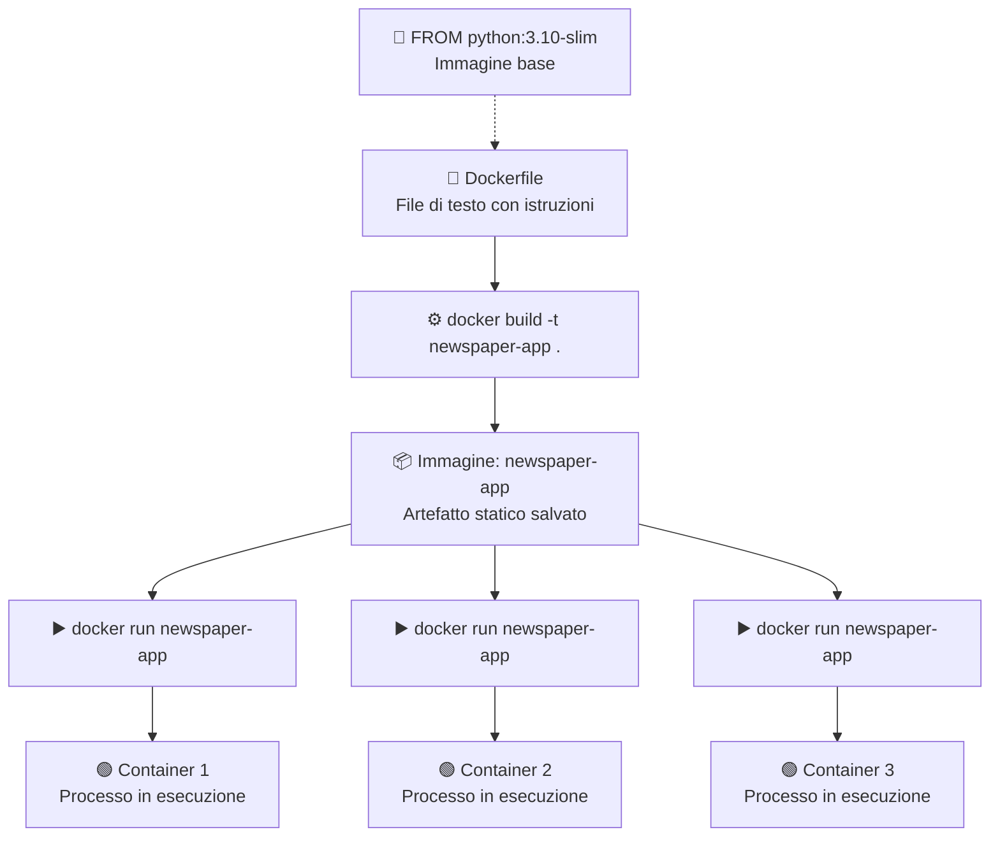

---

### 1.1.2 La Struttura a Layer del Dockerfile

Un aspetto fondamentale per capire l'efficienza di Docker è il sistema a **layer** (strati). Ogni istruzione nel Dockerfile crea un nuovo layer che viene impilato sopra il precedente, formando l'immagine finale come una "torta" a più strati.

Il vantaggio di questa architettura è il **caching**: quando ricostruisci un'immagine, Docker controlla se ogni layer è cambiato rispetto alla build precedente. Se un layer non è stato modificato, Docker lo riutilizza dalla cache invece di ricostruirlo da zero. Questo accelera enormemente i tempi di build.

Tuttavia, c'è una regola importante: **quando un layer cambia, tutti i layer successivi vengono invalidati e ricostruiti**. Ecco perché l'ordine delle istruzioni nel Dockerfile è cruciale per l'ottimizzazione.

La best practice è organizzare le istruzioni dalla più stabile alla più volatile:
1. **Prima**: istruzioni che cambiano raramente (immagine base, installazione tool di sistema)
2. **Poi**: dipendenze del progetto (requirements.txt)
3. **Infine**: il codice sorgente (che cambia spesso durante lo sviluppo)

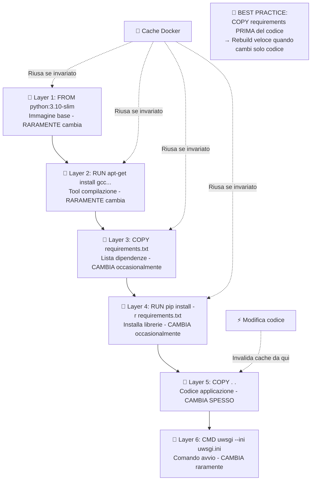

---

### 1.1.3 Docker Compose: Orchestrazione Multi-Container

Nella realtà, le applicazioni moderne raramente girano in isolamento. Un'applicazione web tipica ha bisogno di un database, magari una cache Redis, un server di code, ecc. Gestire manualmente ogni container (crearli, collegarli, avviarli nell'ordine giusto) sarebbe un incubo.

**Docker Compose** risolve questo problema. È uno strumento che permette di definire e gestire applicazioni multi-container attraverso un singolo file YAML (`docker-compose.yml`). In questo file descrivi tutti i servizi che compongono la tua applicazione, le loro configurazioni, come comunicano tra loro, e i volumi per i dati.

Con un solo comando (`docker-compose up`), Docker Compose:
1. Crea automaticamente una **rete privata** dove i container possono comunicare
2. Crea i **volumi** necessari per la persistenza dei dati
3. Costruisce le immagini se necessario (esegue `docker build`)
4. Avvia i container nell'**ordine corretto** rispettando le dipendenze

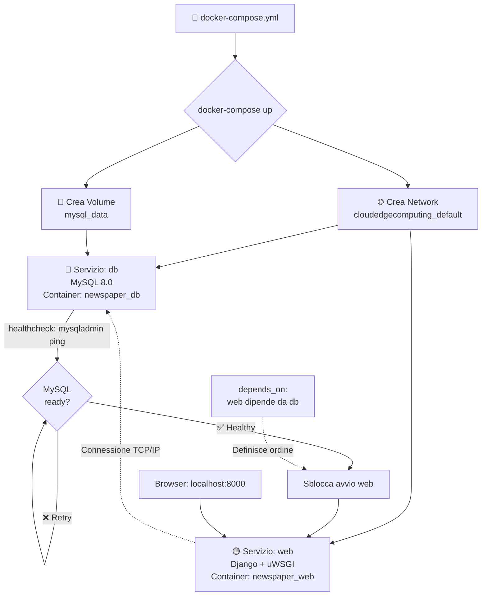

---

### 1.1.4 Networking: Come Comunicano i Container

Quando Docker Compose avvia i container, li collega tutti a una **rete virtuale privata**. Questa rete è isolata dal mondo esterno e permette ai container di comunicare tra loro in modo sicuro.

La magia sta nel **Docker DNS**: all'interno della rete Docker, ogni container può riferirsi agli altri usando il **nome del servizio** invece dell'indirizzo IP. Nel nostro caso, il container Django può connettersi a MySQL semplicemente usando `db:3306` come indirizzo. Docker intercetta questa richiesta e la traduce automaticamente nell'IP interno del container MySQL.

Perché è importante? Gli IP dei container sono **dinamici**: cambiano ogni volta che ricrei i container. Se hardcodassimo l'IP nel codice, smetterebbe di funzionare al prossimo restart. Usando i nomi di servizio, il codice rimane stabile e Docker si occupa della risoluzione.

Per il mondo esterno (il tuo browser), i container non sono direttamente accessibili. Il **port mapping** (`-p 8000:8000`) crea un "ponte" che collega una porta del tuo computer (localhost:8000) a una porta del container.

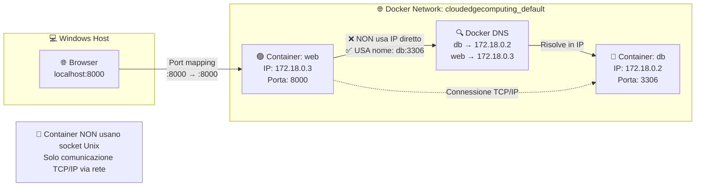

---

### 1.1.5 Volumi: Persistenza dei Dati

I container sono **effimeri** per natura: quando un container viene distrutto, tutto ciò che contiene (inclusi i dati) viene perso. Per un database questo sarebbe disastroso! I **volumi** risolvono questo problema permettendo ai dati di sopravvivere alla distruzione del container.

Esistono due tipi principali di volumi:

**Bind Mount**: collega una directory del tuo computer host direttamente dentro il container. Qualsiasi modifica fatta da una parte è immediatamente visibile dall'altra. Perfetto per lo sviluppo!

**Named Volume**: è uno spazio di storage gestito interamente da Docker, "nascosto" nel filesystem dell'host. I dati sono conservati in modo persistente da Docker anche se il container viene distrutto.

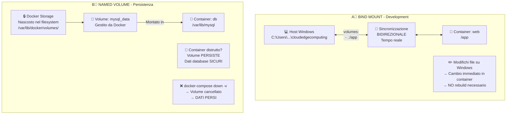

---

### 1.1.6 Variabili d'Ambiente: Configurazione Esterna

Una delle best practice fondamentali nello sviluppo software è la **separazione tra codice e configurazione**. Non vuoi hardcodare password, hostname o altre impostazioni nel codice sorgente.

Docker risolve questo problema attraverso le **variabili d'ambiente**. Nel `docker-compose.yml`, sotto la sezione `environment`, definiamo coppie chiave-valore che vengono "iniettate" nel container al momento dell'avvio.

Il punto cruciale è che **docker-compose non modifica mai il codice Python**. Il codice rimane generico (`os.environ.get('MYSQL_HOST')`), ed è l'ambiente di esecuzione che fornisce i valori concreti.

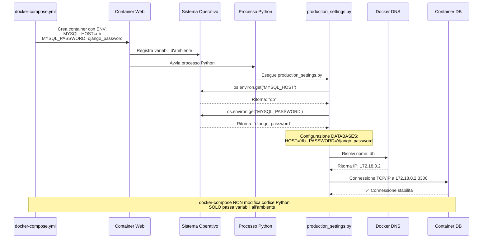

---

### 1.1.7 I Tre Comandi Fondamentali: build, run, compose up

Per lavorare con Docker, devi padroneggiare tre comandi principali, ognuno con uno scopo diverso:

**`docker build`** serve esclusivamente a creare immagini. Non avvia nessun container: è pura "compilazione".

**`docker run`** prende un'immagine esistente e crea un singolo container da essa. Utile per test rapidi ma richiede gestione manuale di network e volumi.

**`docker-compose up`** è il comando più potente per applicazioni reali. Automatizza tutto: costruisce le immagini, crea network e volumi, avvia tutti i container nell'ordine corretto.

```mermaid
flowchart TD
    subgraph Build["🔨 PERCORSO A: docker build"]
        A1[📄 Input: Dockerfile]
        A2[⚙️ docker build -t newspaper-app .]
        A3[📦 Output: Immagine]
        A4[❌ Nessun container creato<br/>Solo preparazione]
        
        A1 --> A2 --> A3 --> A4
    end
    
    subgraph Run["▶️ PERCORSO B: docker run"]
        B1[📦 Input: Immagine esistente]
        B2[⚙️ docker run -p 8000:8000 newspaper-app]
        B3[🟢 Output: 1 Container attivo]
        B4[⚠️ Manuale:<br/>- Devi creare network<br/>- Devi creare volumi<br/>- Devi avviare MySQL separatamente]
        
        B1 --> B2 --> B3 --> B4
    end
    
    subgraph Compose["🎼 PERCORSO C: docker-compose up"]
        C1[📄 Input: docker-compose.yml]
        C2[🔨 Build immagini se necessario]
        C3[🌐 Crea network automaticamente]
        C4[💾 Crea volumi automaticamente]
        C5[🔵 Avvia container db]
        C6[⏳ Aspetta healthcheck]
        C7[🟢 Avvia container web]
        C8[✅ Sistema completo funzionante]
        
        C1 --> C2 --> C3 --> C4 --> C5 --> C6 --> C7 --> C8
    end
    
    X[💡 QUANDO USARE:<br/>Build: Creare immagini<br/>Run: Test singolo container<br/>Compose: Ambiente completo]
```

---

## 1.2 Concetti CI/CD

**CI/CD** (Continuous Integration / Continuous Delivery) è una pratica fondamentale nello sviluppo software moderno che automatizza il processo di verifica, test e deployment del codice.

---

### 1.2.1 Continuous Integration (CI)

**Continuous Integration** significa che ogni volta che un sviluppatore fa push del codice, viene automaticamente eseguita una serie di controlli: il codice viene compilato, i test vengono eseguiti, la qualità viene verificata. Se qualcosa fallisce, lo sviluppatore viene notificato immediatamente, permettendo di correggere gli errori quando sono ancora "freschi" e facili da risolvere.

---

### 1.2.2 Continuous Delivery (CD)

**Continuous Delivery** estende questo concetto: dopo che il codice passa tutti i controlli CI, viene automaticamente preparato (e opzionalmente deployato) in un ambiente di staging o production. L'obiettivo è avere sempre codice "pronto per il rilascio".

---

### 1.2.3 GitLab CI/CD

Nel nostro progetto utilizziamo **GitLab CI/CD**, che offre:
- Runner gratuiti nel cloud per eseguire le pipeline
- Integrazione nativa con il repository Git
- Configurazione tramite un semplice file YAML (`.gitlab-ci.yml`)
- Badge, report e artifacts integrati nell'interfaccia

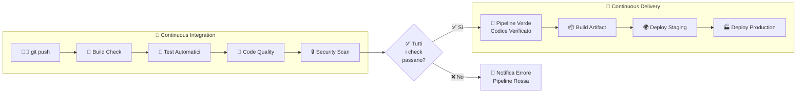

---

# PARTE 2: Contesto Progetto

## Obiettivo Generale

Creare un ambiente containerizzato riproducibile per un'applicazione Django che simula un ambiente production con MySQL, implementando pipeline CI/CD per garantire qualità del codice.

---

## Stack Tecnologico

| Componente | Tecnologia | Versione |
|------------|------------|----------|
| Framework Web | Django | 4.0 |
| Database Production | MySQL | 8.0 |
| Database Development | SQLite | Built-in |
| Application Server | uWSGI | 2.0.21 |
| Containerizzazione | Docker + Compose | Latest |
| CI/CD | GitLab CI | Cloud Runner |

---

## Panoramica Fasi

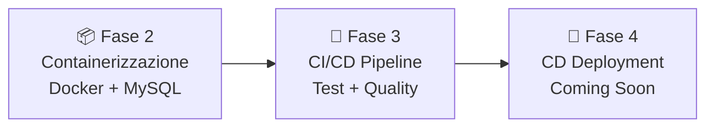

| Fase | Obiettivo | Stato |
|------|-----------|-------|
| Fase 2 | Containerizzazione Django + MySQL | ✅ Completata |
| Fase 3 | Pipeline CI/CD con GitLab | ✅ Completata |
| Fase 4 | Deployment automatico | 🔜 Prossima |

---

# PARTE 3: Fase 2 - Containerizzazione Docker

## Obiettivo

Containerizzare l'applicazione Django Newspaper con MySQL, creando un ambiente di sviluppo riproducibile che simula la production.

---

## Cosa Abbiamo Fatto

### File Creati

#### 1. Dockerfile

Ricetta per costruire l'immagine Django:

```dockerfile
FROM python:3.10-slim

ENV PYTHONUNBUFFERED=1 \
    PYTHONDONTWRITEBYTECODE=1

WORKDIR /app

# Dipendenze per compilare mysqlclient e uWSGI
RUN apt-get update && apt-get install -y \
    gcc \
    g++ \
    default-libmysqlclient-dev \
    pkg-config \
    python3-dev \
    && rm -rf /var/lib/apt/lists/*

COPY requirements.txt .
RUN pip install --no-cache-dir -r requirements.txt

COPY . .

RUN mkdir -p /app/logs

EXPOSE 8000

CMD ["uwsgi", "--ini", "uwsgi.ini"]
```

**Punti chiave**:
- Immagine base leggera: `python:3.10-slim`
- Layer caching: `requirements.txt` copiato prima del codice
- `EXPOSE 8000`: Documentazione della porta

---

#### 2. docker-compose.yml

Orchestrazione Django + MySQL:

```yaml
version: '3.8'

services:
  db:
    image: mysql:8.0
    container_name: newspaper_db
    restart: unless-stopped
    environment:
      MYSQL_DATABASE: blog
      MYSQL_USER: django
      MYSQL_PASSWORD: django_password
      MYSQL_ROOT_PASSWORD: root_password
    volumes:
      - mysql_data:/var/lib/mysql
    ports:
      - "3306:3306"
    healthcheck:
      test: ["CMD", "mysqladmin", "ping", "-h", "localhost"]
      timeout: 5s
      retries: 10

  web:
    build: .
    container_name: newspaper_web
    command: >
      sh -c "python manage.py migrate &&
             uwsgi --ini uwsgi.ini"
    volumes:
      - .:/app
    ports:
      - "8000:8000"
    environment:
      - DJANGO_SETTINGS_MODULE=django_project.production_settings
      - MYSQL_DATABASE=blog
      - MYSQL_USER=django
      - MYSQL_PASSWORD=django_password
      - MYSQL_HOST=db
      - MYSQL_PORT=3306
      - DJANGO_SECRET_KEY=dev-secret-key
    depends_on:
      db:
        condition: service_healthy

volumes:
  mysql_data:
```

**Elementi critici**:
- `healthcheck` su MySQL: Assicura che db sia pronto prima di avviare web
- `depends_on` con `condition: service_healthy`: Web aspetta db
- `volumes: - .:/app`: Bind mount per development
- `mysql_data`: Named volume per persistenza dati

---

#### 3. uwsgi.ini

Configurazione application server:

```ini
[uwsgi]
chdir = /app
module = django_project.wsgi:application
master = true
processes = 4
threads = 2
http = 0.0.0.0:8000
logto = /app/logs/uwsgi.log
log-maxsize = 50000000
py-autoreload = 1
pidfile = /app/uwsgi.pid
vacuum = true
die-on-term = true
```

---

### File Modificati

#### 1. requirements.txt

Aggiunte dipendenze mancanti:

```txt
asgiref==3.4.1
crispy-bootstrap5==0.6
dj-database-url==0.5.0
dj-email-url==1.0.2
Django==4.0
django-cache-url==3.2.3
django-crispy-forms==1.13.0
environs==9.3.5
marshmallow==3.14.1
mysqlclient==2.1.1    # ← Per Docker/MySQL
python-dotenv==0.19.2
sqlparse==0.4.2
whitenoise==5.3.0
uWSGI==2.0.21         # ← Aggiunto (mancava!)
```

---

#### 2. django_project/production_settings.py

Configurazione per leggere da variabili d'ambiente:

```python
import os

DATABASES = {
    'default': {
        'ENGINE': 'django.db.backends.mysql',
        'NAME': os.environ.get('MYSQL_DATABASE', 'blog'),
        'USER': os.environ.get('MYSQL_USER', 'django'),
        'PASSWORD': os.environ.get('MYSQL_PASSWORD'),
        'HOST': os.environ.get('MYSQL_HOST', 'db'),  # ← CRITICO
        'PORT': os.environ.get('MYSQL_PORT', '3306'),
        'OPTIONS': {
            'charset': 'utf8mb4',
        },
    }
}

SECRET_KEY = os.environ.get('DJANGO_SECRET_KEY', 'temp-secret')
DEBUG = False
ALLOWED_HOSTS = ['localhost', '127.0.0.1', 'web', '*']
```

---

## Problemi Riscontrati e Soluzioni

### 🔴 Problema 1: mysqlclient Non Compila su Windows

**Sintomo**:
```
fatal error C1083: Non è possibile aprire il file inclusione: 'mysql.h'
```

**Causa**: `mysqlclient` è una libreria Python con componenti C che richiedono compilazione. Su Windows serve Visual Studio Build Tools + MySQL header files.

**Soluzione**: Strategia duale basata su ambiente:

| Ambiente | Database | mysqlclient | Come Lavori |
|----------|----------|-------------|-------------|
| **Locale Windows** | SQLite | Commentato | `python manage.py runserver` |
| **Docker** | MySQL | Compila in Linux | `docker-compose up` |

---

### 🔴 Problema 2: Configurazione uWSGI Mancante

**Sintomo**: README menziona `uwsgi.ini.example` ma file non presente nel repository.

**Soluzione**: Creato `uwsgi.ini` manualmente con configurazione production-ready (vedi sopra).

---

### 🔴 Problema 3: Django Usa Socket invece di TCP/IP

**Sintomo**:
```
django.db.utils.OperationalError: (2002, "Can't connect to local server through socket '/run/mysqld/mysqld.sock' (2)")
```

**Causa**: Django cercava connessione via socket Unix invece che rete TCP/IP. In Docker, container comunicano **solo** via rete.

**Soluzione**: Specificare `HOST` esplicito in `production_settings.py`:
```python
'HOST': os.environ.get('MYSQL_HOST', 'db'),  # Forza TCP/IP
```

---

### 🔴 Problema 4: uWSGI Mancante in requirements.txt

**Sintomo**:
```
sh: 2: uwsgi: not found
newspaper_web exited with code 127
```

**Causa**: `uWSGI` non era elencato in `requirements.txt`.

**Soluzione**: Aggiunto `uWSGI==2.0.21` e rebuild:
```bash
docker-compose build --no-cache
docker-compose up
```

---

## Risultato Fase 2

✅ **Ambiente Docker funzionante** con:
- Container Django + uWSGI
- Container MySQL 8.0 con healthcheck
- Rete Docker per comunicazione
- Volumi per persistenza dati e sync codice

✅ **Workflow duale**:
- Development veloce su Windows con SQLite
- Test production-like con Docker + MySQL

---

# PARTE 4: Fase 3 - CI/CD Pipeline

## Obiettivo

Implementare pipeline CI automatizzata con GitLab CI per garantire qualità codice, test automatici e security scanning.

---

## Cosa Abbiamo Fatto

### Struttura Pipeline (`.gitlab-ci.yml`)

```yaml
stages:
  - build      # Verifica che il codice sia valido
  - test       # Esegue test e controlli qualità
  - security   # Scansione vulnerabilità
```

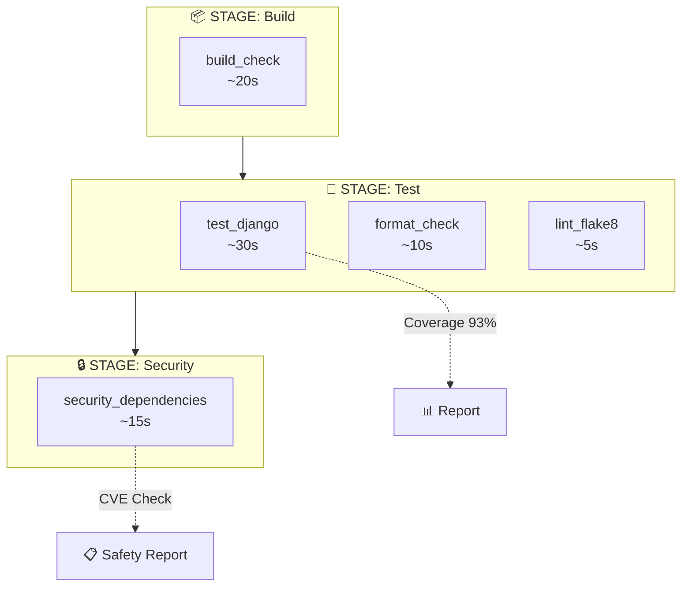

---

### Job Implementati

#### Build Check
```yaml
build_check:
  stage: build
  script:
    - python -m py_compile manage.py
    - python -m compileall .
```

#### Test Django + Coverage
```yaml
test_django:
  stage: test
  script:
    - pip install coverage
    - coverage run --source='.' manage.py test
    - coverage report
    - coverage xml
  coverage: '/TOTAL.*\s+(\d+%)$/'
  artifacts:
    reports:
      coverage_report:
        coverage_format: cobertura
        path: coverage.xml
```

#### Format Check (Black)
```yaml
format_check:
  stage: test
  script:
    - pip install black
    - black --check --line-length=120 .
```

#### Linting (Flake8)
```yaml
lint_flake8:
  stage: test
  script:
    - pip install flake8
    - flake8 --max-line-length=120 --exclude=migrations,venv
  allow_failure: true  # Warning only
```

#### Security Scan (Safety)
```yaml
security_dependencies:
  stage: security
  script:
    - pip install safety
    - safety check --file requirements.txt --full-report
  allow_failure: true  # Warning only
```

---

### Pre-commit Hooks

Per garantire codice formattato **prima** del push:

```yaml
# .pre-commit-config.yaml
repos:
  - repo: https://github.com/psf/black
    rev: 23.3.0
    hooks:
      - id: black
        args: ['--line-length=120']
  - repo: https://github.com/pre-commit/pre-commit-hooks
    rev: v4.4.0
    hooks:
      - id: trailing-whitespace
      - id: end-of-file-fixer
      - id: check-yaml
      - id: check-merge-conflict
```

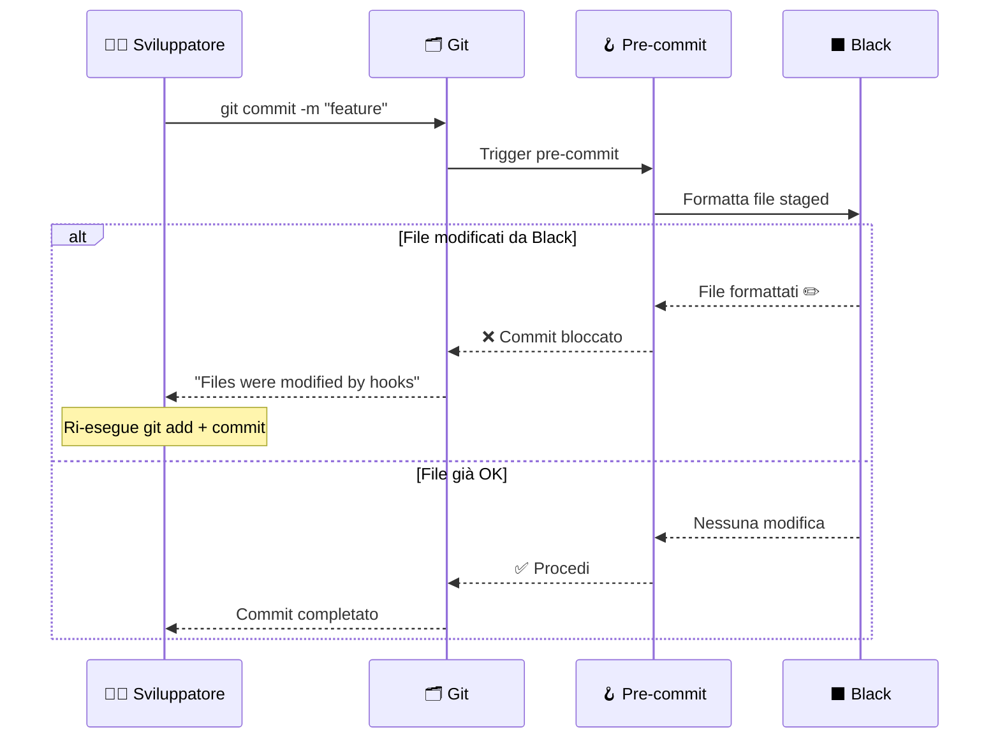

Setup:
```bash
pip install pre-commit
pre-commit install
```

---

## Problemi Riscontrati e Soluzioni

### 🔴 Problema 1: MySQL in CI Troppo Complesso

**Causa**: Usare MySQL richiederebbe un container separato, aumentando complessità e tempo.

**Soluzione**: SQLite in-memory per test CI:
```python
# settings.py
import sys
if 'test' in sys.argv:
    DATABASES['default'] = {
        'ENGINE': 'django.db.backends.sqlite3',
        'NAME': ':memory:',
    }
```

---

### 🔴 Problema 2: Black Fallisce su File Non Formattati

**Causa**: ~30 file nel codebase non erano formattati secondo Black.

**Soluzione**: Pre-commit hooks che formattano automaticamente prima del commit. La CI verifica ma trova sempre codice già formattato.

---

### 🔴 Problema 3: Flake8 Troppi Warning

**Causa**: ~20-30 warning per import inutilizzati, variabili non usate, ecc.

**Decisione**: `allow_failure: true` - Pipeline verde per progredire, warning visibili per future ottimizzazioni.

---

### 🔴 Problema 4: Type Checking (Mypy) Non Praticabile

**Causa**: Codebase senza type hints, richiederebbe tipizzare ~50+ funzioni.

**Decisione**: SCARTATO - Effort/ROI non giustificato per progetto didattico. Type hints aggiunti gradualmente in codice nuovo.

---

## Risultato Fase 3

✅ **Pipeline CI funzionante** con:
- Build verification
- Test automatici + coverage 93%
- Format check (Black)
- Linting (Flake8) - warning only
- Security scanning (Safety) - warning only

✅ **Developer Experience migliorata**:
- Pre-commit formatta codice automaticamente
- Badge README mostrano stato real-time
- Report scaricabili dagli artifacts

| Stage | Job | Durata | Comportamento |
|-------|-----|--------|---------------|
| Build | `build_check` | ~20s | ❌ Blocca |
| Test | `test_django` | ~30s | ❌ Blocca |
| Test | `format_check` | ~10s | ❌ Blocca |
| Test | `lint_flake8` | ~5s | ⚠️ Warning |
| Security | `security_dependencies` | ~15s | ⚠️ Warning |

**Tempo totale pipeline**: ~1m 20s

---

# PARTE 5: Architettura Finale e Workflow

## Architettura Sistema

```
┌─────────────────────────────────────────────────────────────────┐
│  WINDOWS HOST (Docker Desktop)                                   │
│                                                                   │
│  Browser: localhost:8000                                          │
│         ↓                                                         │
│  ┌─────────────────────────────────────────────────────────────┐ │
│  │  Docker Network: cloudedgecomputing_default                 │ │
│  │                                                              │ │
│  │  ┌────────────────────┐     ┌────────────────────┐         │ │
│  │  │ Container: db      │     │ Container: web     │         │ │
│  │  │ - MySQL 8.0        │◄────│ - Django 4.0       │         │ │
│  │  │ - Porta: 3306      │     │ - uWSGI            │         │ │
│  │  │ - Volume:          │     │ - Porta: 8000      │         │ │
│  │  │   mysql_data       │     │ - Bind mount: .    │         │ │
│  │  └────────────────────┘     └────────────────────┘         │ │
│  │         ↑                           ↑                       │ │
│  │    Dati persistenti            Codice live                  │ │
│  └─────────────────────────────────────────────────────────────┘ │
└─────────────────────────────────────────────────────────────────┘
```

---

## Workflow Development

### Opzione A: Development Locale (Windows + SQLite)

```bash
# Setup iniziale
python -m venv venv
venv\Scripts\activate
pip install -r requirements.txt  # Con mysqlclient commentato

# Workflow quotidiano
python manage.py runserver
# Browser: http://localhost:8000
```

**Quando usare**: Sviluppo veloce, modifiche piccole, test immediati.

---

### Opzione B: Docker Production-like (Linux + MySQL)

```bash
# Prima volta: build immagini
docker-compose build

# Avvio ambiente completo
docker-compose up

# Browser: http://localhost:8000
# Django connesso a MySQL in container

# Fermare
docker-compose down

# Fermare E cancellare dati database
docker-compose down -v
```

**Quando usare**: Test con MySQL, verifica migrazioni, simulare production.

---

## Workflow CI/CD

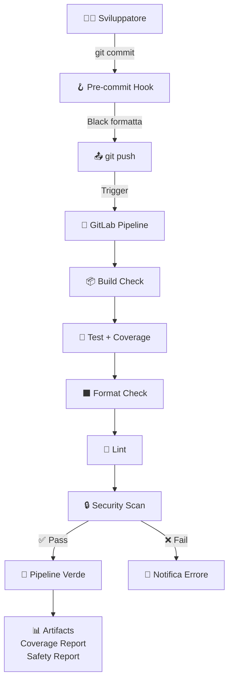

---

## Prossimi Passi (Fase 4: CD)

- [ ] Setup GitLab Container Registry
- [ ] Automatizzare build immagine Docker
- [ ] Deploy automatico su ambiente staging
- [ ] (Opzionale) Deploy production con approval manuale

---

# PARTE 6: Comandi Utili

## Docker & Docker Compose

```bash
# Build immagini
docker-compose build

# Build forzando no cache
docker-compose build --no-cache

# Avvio (foreground, vedi log)
docker-compose up

# Avvio (background, detached)
docker-compose up -d

# Stop container (dati persistono)
docker-compose down

# Stop + cancella volumi (dati persi!)
docker-compose down -v

# Restart singolo servizio
docker-compose restart web

# Vedere log
docker-compose logs web
docker-compose logs -f web  # Follow mode
```

---

## Debug e Ispezione

```bash
# Lista container attivi
docker ps

# Entrare in container con shell
docker exec -it newspaper_web bash
docker exec -it newspaper_db bash

# Vedere variabili d'ambiente
docker exec newspaper_web env | grep MYSQL

# Verificare volumi
docker volume ls
docker volume inspect cloudedgecomputing_mysql_data

# Vedere network
docker network ls
docker network inspect cloudedgecomputing_default
```

---

## Django in Container

```bash
# Migrazioni
docker-compose exec web python manage.py makemigrations
docker-compose exec web python manage.py migrate

# Creare superuser
docker-compose exec web python manage.py createsuperuser

# Shell Django
docker-compose exec web python manage.py shell

# Test
docker-compose exec web python manage.py test accounts articles pages
```

---

## Git & Pre-commit

```bash
# Setup pre-commit
pip install pre-commit
pre-commit install

# Eseguire manualmente su tutti i file
pre-commit run --all-files

# Skip pre-commit per commit urgente
git commit --no-verify -m "hotfix"
```

---

## Pulizia Sistema

```bash
# Rimuovi container fermi
docker container prune

# Rimuovi immagini inutilizzate
docker image prune

# Rimuovi volumi non usati
docker volume prune

# Pulizia completa (ATTENZIONE!)
docker system prune -a --volumes
```

---

**Fine documentazione** - Ultimo aggiornamento: 25 Gennaio 2026
