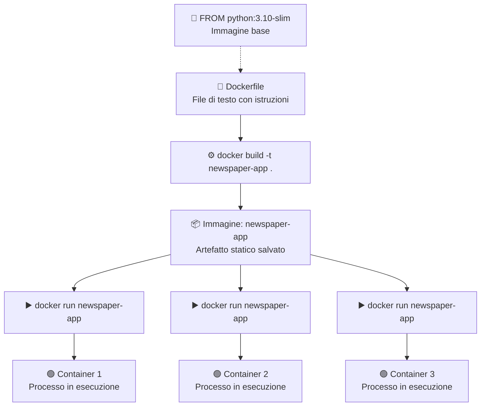
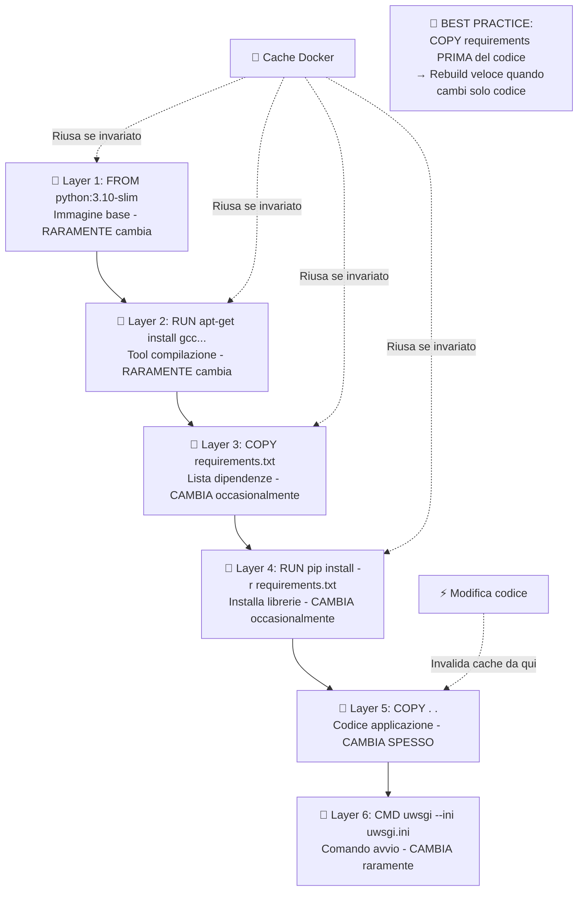
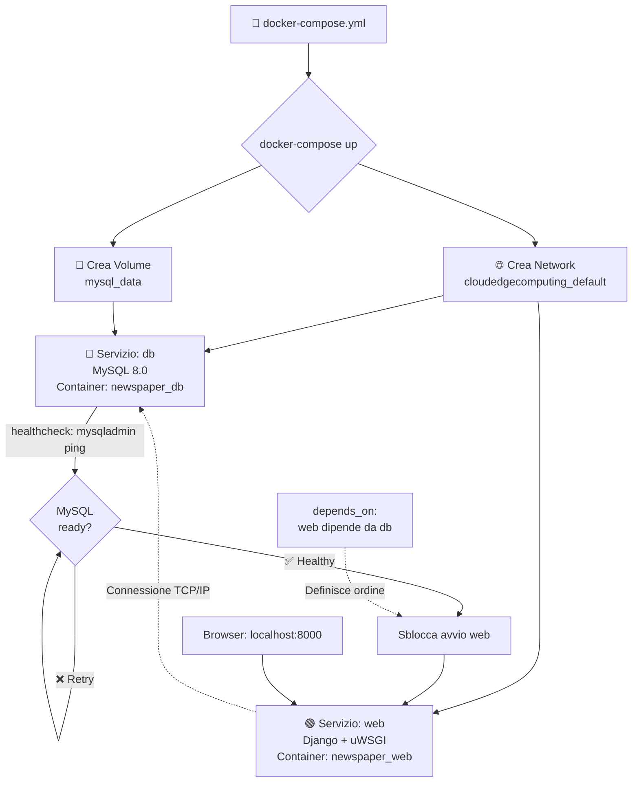
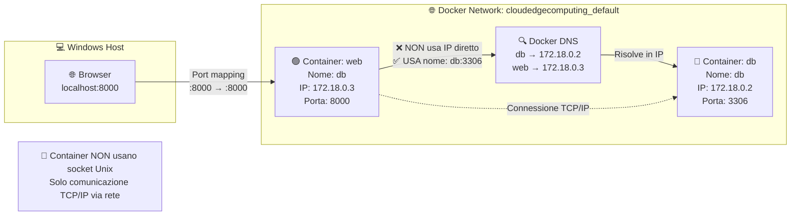
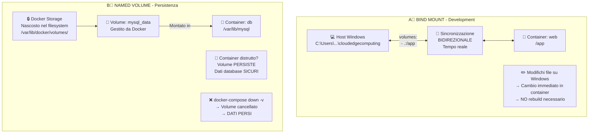
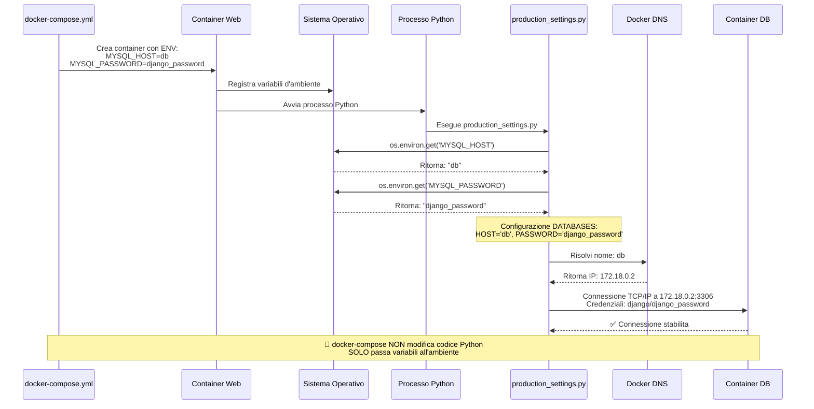

```mermaid
flowchart TD
    subgraph Build["🔨 PERCORSO A: docker build"]
        A1[📄 Input: Dockerfile]
        A2[⚙️ docker build -t newspaper-app .]
        A3[📦 Output: Immagine]
        A4[❌ Nessun container creato<br/>Solo preparazione]
        
        A1 --> A2 --> A3 --> A4
    end
    
    subgraph Run["▶️ PERCORSO B: docker run"]
        B1[📦 Input: Immagine esistente]
        B2[⚙️ docker run -p 8000:8000 newspaper-app]
        B3[🟢 Output: 1 Container attivo]
        B4[⚠️ Manuale:<br/>- Devi creare network<br/>- Devi creare volumi<br/>- Devi avviare MySQL separatamente]
        
        B1 --> B2 --> B3 --> B4
    end
    
    subgraph Compose["🎼 PERCORSO C: docker-compose up"]
        C1[📄 Input: docker-compose.yml]
        C2[🔨 Build immagini se necessario]
        C3[🌐 Crea network automaticamente]
        C4[💾 Crea volumi automaticamente]
        C5[🔵 Avvia container db]
        C6[⏳ Aspetta healthcheck]
        C7[🟢 Avvia container web]
        C8[✅ Sistema completo funzionante]
        
        C1 --> C2 --> C3 --> C4 --> C5 --> C6 --> C7 --> C8
    end
    
    X[💡 QUANDO USARE:<br/>Build: Creare immagini<br/>Run: Test singolo container<br/>Compose: Ambiente completo]
```

# Progetto Cloud and Edge Computing - Django Newspaper
## Setup Docker e Containerizzazione

**Data**: 24 Gennaio 2026  
**Obiettivo**: Containerizzare applicazione Django + MySQL per ambiente production-like

***

## 📋 Indice

1. [Concetti Docker](#concetti-docker)
1. [Contesto Progetto](#contesto-progetto)
2. [Problemi Affrontati e Soluzioni](#problemi-affrontati-e-soluzioni)
3. [File Creati/Modificati](#file-creatimodificati)
4. [Workflow Finale](#workflow-finale)
5. [Architettura Risultante](#architettura-risultante)
6. [Lezioni Apprese](#lezioni-apprese)
7. [Comandi Utili](#comandi-utili)

***

## Concetti Docker

Docker è una piattaforma di containerizzazione che permette di "impacchettare" applicazioni con tutte le loro dipendenze in unità isolate chiamate **container**. Prima di entrare nei dettagli del nostro progetto, è fondamentale comprendere i concetti base che stanno alla radice di questa tecnologia.

---

### 1. Dal Dockerfile al Container: Il Workflow Fondamentale

Il cuore di Docker ruota attorno a tre elementi principali: **Dockerfile**, **Immagine** e **Container**.

Il **Dockerfile** è un semplice file di testo che contiene una serie di istruzioni che descrivono come costruire l'ambiente per la nostra applicazione. È come una "ricetta" che elenca tutti gli ingredienti (sistema operativo base, librerie, dipendenze) e i passaggi (copia file, installa pacchetti, configura) necessari per preparare il "piatto" finale.

Quando eseguiamo il comando `docker build`, Docker legge il Dockerfile e crea un'**Immagine**. L'immagine è un artefatto statico, immutabile, che contiene tutto il necessario per eseguire l'applicazione. Puoi pensarla come un file `.exe` o un'istantanea (snapshot) del sistema in un momento preciso. L'immagine viene salvata localmente e può essere condivisa tramite registry come Docker Hub.

Infine, quando eseguiamo `docker run`, Docker prende l'immagine e crea un **Container**. Il container è un processo in esecuzione, un'istanza "viva" dell'immagine. La differenza fondamentale è che l'immagine è statica (non cambia), mentre il container è dinamico (gira, consuma CPU, memoria, può essere fermato e riavviato).

Un concetto cruciale: **da una singola immagine possono nascere multipli container indipendenti**. È come avere un unico stampo (l'immagine) da cui puoi creare quante copie vuoi (i container), ognuna che gira in modo isolato dalle altre.



---

### 2. La Struttura a Layer del Dockerfile

Un aspetto fondamentale per capire l'efficienza di Docker è il sistema a **layer** (strati). Ogni istruzione nel Dockerfile crea un nuovo layer che viene impilato sopra il precedente, formando l'immagine finale come una "torta" a più strati.

Il vantaggio di questa architettura è il **caching**: quando ricostruisci un'immagine, Docker controlla se ogni layer è cambiato rispetto alla build precedente. Se un layer non è stato modificato, Docker lo riutilizza dalla cache invece di ricostruirlo da zero. Questo accelera enormemente i tempi di build.

Tuttavia, c'è una regola importante: **quando un layer cambia, tutti i layer successivi vengono invalidati e ricostruiti**. Ecco perché l'ordine delle istruzioni nel Dockerfile è cruciale per l'ottimizzazione.

La best practice è organizzare le istruzioni dalla più stabile alla più volatile:
1. **Prima**: istruzioni che cambiano raramente (immagine base, installazione tool di sistema)
2. **Poi**: dipendenze del progetto (requirements.txt)
3. **Infine**: il codice sorgente (che cambia spesso durante lo sviluppo)

Nel nostro progetto, copiamo `requirements.txt` e installiamo le dipendenze **prima** di copiare tutto il codice. Così, quando modifichiamo solo il codice Python, Docker riusa i layer delle dipendenze dalla cache e deve ricostruire solo l'ultimo layer. Il risultato? Rebuild in pochi secondi invece che minuti.



---

### 3. Docker Compose: Orchestrazione Multi-Container

Nella realtà, le applicazioni moderne raramente girano in isolamento. Un'applicazione web tipica ha bisogno di un database, magari una cache Redis, un server di code, ecc. Gestire manualmente ogni container (crearli, collegarli, avviarli nell'ordine giusto) sarebbe un incubo.

**Docker Compose** risolve questo problema. È uno strumento che permette di definire e gestire applicazioni multi-container attraverso un singolo file YAML (`docker-compose.yml`). In questo file descrivi tutti i servizi che compongono la tua applicazione, le loro configurazioni, come comunicano tra loro, e i volumi per i dati.

Con un solo comando (`docker-compose up`), Docker Compose:
1. Crea automaticamente una **rete privata** dove i container possono comunicare
2. Crea i **volumi** necessari per la persistenza dei dati
3. Costruisce le immagini se necessario (esegue `docker build`)
4. Avvia i container nell'**ordine corretto** rispettando le dipendenze

Nel nostro progetto, abbiamo due servizi: `db` (MySQL) e `web` (Django). Il servizio `web` dipende da `db` attraverso la direttiva `depends_on`. Ma non basta che il container MySQL sia avviato: deve essere **pronto** ad accettare connessioni. Per questo usiamo un **healthcheck** che verifica periodicamente se MySQL risponde, e solo quando è "healthy" viene avviato Django.



---

### 4. Networking: Come Comunicano i Container

Quando Docker Compose avvia i container, li collega tutti a una **rete virtuale privata**. Questa rete è isolata dal mondo esterno e permette ai container di comunicare tra loro in modo sicuro.

La magia sta nel **Docker DNS**: all'interno della rete Docker, ogni container può riferirsi agli altri usando il **nome del servizio** invece dell'indirizzo IP. Nel nostro caso, il container Django può connettersi a MySQL semplicemente usando `db:3306` come indirizzo. Docker intercetta questa richiesta e la traduce automaticamente nell'IP interno del container MySQL.

Perché è importante? Gli IP dei container sono **dinamici**: cambiano ogni volta che ricrei i container. Se hardcodassimo l'IP nel codice, smetterebbe di funzionare al prossimo restart. Usando i nomi di servizio, il codice rimane stabile e Docker si occupa della risoluzione.

Per il mondo esterno (il tuo browser), i container non sono direttamente accessibili. Il **port mapping** (`-p 8000:8000`) crea un "ponte" che collega una porta del tuo computer (localhost:8000) a una porta del container. Così puoi accedere all'applicazione dal browser.

Un punto critico che abbiamo affrontato: in Docker, i container comunicano **sempre via rete TCP/IP**, mai via socket Unix. Questo ha richiesto una modifica alla configurazione Django per forzare la connessione di rete invece del socket locale.



---

### 5. Volumi: Persistenza dei Dati

I container sono **effimeri** per natura: quando un container viene distrutto, tutto ciò che contiene (inclusi i dati) viene perso. Per un database questo sarebbe disastroso! I **volumi** risolvono questo problema permettendo ai dati di sopravvivere alla distruzione del container.

Esistono due tipi principali di volumi:

**Bind Mount**: collega una directory del tuo computer host direttamente dentro il container. Qualsiasi modifica fatta da una parte è immediatamente visibile dall'altra. Nel nostro progetto, usiamo un bind mount (`- .:/app`) per il codice Django: quando modifichi un file Python sul tuo Windows, la modifica è istantaneamente disponibile dentro il container, senza bisogno di rebuild. Perfetto per lo sviluppo!

**Named Volume**: è uno spazio di storage gestito interamente da Docker, "nascosto" nel filesystem dell'host. Il container lo vede come una directory normale, ma i dati sono conservati in modo persistente da Docker. Usiamo un named volume (`mysql_data`) per il database MySQL: anche se distruggi e ricrei il container MySQL, i dati del database rimangono intatti.

Attenzione al comando `docker-compose down -v`: il flag `-v` elimina anche i volumi! Usalo solo quando vuoi davvero cancellare tutti i dati e ripartire da zero.



---

### 6. Variabili d'Ambiente: Configurazione Esterna

Una delle best practice fondamentali nello sviluppo software è la **separazione tra codice e configurazione**. Non vuoi hardcodare password, hostname o altre impostazioni nel codice sorgente: sarebbe un rischio di sicurezza e renderebbe difficile deployare la stessa applicazione in ambienti diversi (development, staging, production).

Docker risolve elegantemente questo problema attraverso le **variabili d'ambiente**. Nel `docker-compose.yml`, sotto la sezione `environment`, definiamo coppie chiave-valore che vengono "iniettate" nel container al momento dell'avvio.

Il flusso è il seguente:
1. Docker Compose legge la configurazione dal file YAML
2. Quando crea il container, imposta le variabili nel sistema operativo interno
3. L'applicazione Python usa `os.environ.get('NOME_VARIABILE')` per leggere questi valori
4. Django configura la connessione al database usando i valori letti

Il punto cruciale è che **docker-compose non modifica mai il codice Python**. Il codice rimane generico (`os.environ.get('MYSQL_HOST')`), ed è l'ambiente di esecuzione che fornisce i valori concreti. Puoi deployare lo stesso codice ovunque, cambiando solo le variabili d'ambiente.



---

### 7. I Tre Comandi Fondamentali: build, run, compose up

Per lavorare con Docker, devi padroneggiare tre comandi principali, ognuno con uno scopo diverso:

**`docker build`** serve esclusivamente a creare immagini. Prende un Dockerfile come input, esegue tutte le istruzioni, e produce un'immagine salvata localmente. Non avvia nessun container: è pura "compilazione".

**`docker run`** prende un'immagine esistente e crea un singolo container da essa. È utile per test rapidi o per eseguire container standalone, ma ha dei limiti: devi gestire manualmente network, volumi, e se hai più container devi avviarli uno per uno coordinandoti da solo.

**`docker-compose up`** è il comando più potente per applicazioni reali. Legge il file `docker-compose.yml` e automatizza tutto: costruisce le immagini se necessario, crea network e volumi, avvia tutti i container nell'ordine corretto rispettando le dipendenze. Con un solo comando hai l'intero stack funzionante.

Nel nostro workflow quotidiano, usiamo quasi sempre `docker-compose up` per avviare l'ambiente di sviluppo, e `docker-compose down` per fermarlo. Gli altri comandi servono per situazioni specifiche (debug, test isolati, ecc.).



---

## Contesto Progetto

**Repository**: Fork da `gitlab.com/frfaenza/cloudedgecomputing` (branch Django Newspaper)

**Stack Tecnologico**:
- Django 4.0
- MySQL 8.0 (production)
- SQLite (development locale)
- uWSGI (application server)
- Docker + docker-compose

**Obiettivo Fase 2**: Creare ambiente containerizzato riproducibile che simula production con MySQL.

***

## Problemi Affrontati e Soluzioni

### 🔴 Problema 1: mysqlclient Non Compila su Windows

**Sintomo**:
```
fatal error C1083: Non è possibile aprire il file inclusione: 'mysql.h'
```

**Causa**: 
- `mysqlclient` è libreria Python con componenti C che richiedono compilazione
- Su Windows serve Visual Studio Build Tools + MySQL header files (`mysql.h`)
- Header MySQL mancanti sul sistema

**Soluzione Temporanea**:
```txt
# requirements.txt per development locale (Windows)
# mysqlclient==2.1.1  ← commentato
```

Questo permette di lavorare in locale con SQLite senza blocchi.

**Soluzione Definitiva** (vedi Problema 5): Usare Docker con Linux dove mysqlclient compila senza problemi.

***

### 🔴 Problema 2: Configurazione uWSGI Mancante

**Sintomo**: README menziona `uwsgi.ini.example` ma file non presente nel repository.

**Soluzione**: Creato `uwsgi.ini` manualmente:

```ini
[uwsgi]
chdir = /app
module = django_project.wsgi:application
master = true
processes = 4
threads = 2
http = 0.0.0.0:8000
logto = /app/logs/uwsgi.log
log-maxsize = 50000000
py-autoreload = 1
pidfile = /app/uwsgi.pid
vacuum = true
die-on-term = true
```

**Configurazione chiave**:
- `chdir = /app`: Directory lavoro (corrisponde a WORKDIR nel Dockerfile)
- `processes = 4`: 4 worker per gestire richieste parallele
- `http = 0.0.0.0:8000`: Ascolta su tutte le interfacce, porta 8000

***

### 🔴 Problema 3: Containerizzazione Django

**Obiettivo**: Creare immagine Docker con Django + dipendenze.

**Soluzione**: Creato `Dockerfile`:

```dockerfile
FROM python:3.10-slim

ENV PYTHONUNBUFFERED=1 \
    PYTHONDONTWRITEBYTECODE=1

WORKDIR /app

# Dipendenze per compilare mysqlclient e uWSGI
RUN apt-get update && apt-get install -y \
    gcc \
    g++ \
    default-libmysqlclient-dev \
    pkg-config \
    python3-dev \
    && rm -rf /var/lib/apt/lists/*

COPY requirements.txt .
RUN pip install --no-cache-dir -r requirements.txt

COPY . .

RUN mkdir -p /app/logs

EXPOSE 8000

CMD ["uwsgi", "--ini", "uwsgi.ini"]
```

**Punti chiave**:
- Immagine base leggera: `python:3.10-slim`
- Installa tool compilazione: `gcc`, `g++`, `python3-dev`
- Layer caching: `requirements.txt` copiato prima del codice (ottimizzazione)
- `EXPOSE 8000`: Documentazione, non apre porta (lo fa docker-compose)

***

### 🔴 Problema 4: Orchestrazione Django + MySQL

**Obiettivo**: Far comunicare container Django e MySQL.

**Soluzione**: Creato `docker-compose.yml`:

```yaml
version: '3.8'

services:
  db:
    image: mysql:8.0
    container_name: newspaper_db
    restart: unless-stopped
    environment:
      MYSQL_DATABASE: blog
      MYSQL_USER: django
      MYSQL_PASSWORD: django_password
      MYSQL_ROOT_PASSWORD: root_password
    volumes:
      - mysql_data:/var/lib/mysql
    ports:
      - "3306:3306"
    healthcheck:
      test: ["CMD", "mysqladmin", "ping", "-h", "localhost"]
      timeout: 5s
      retries: 10

  web:
    build: .
    container_name: newspaper_web
    command: >
      sh -c "python manage.py migrate &&
             uwsgi --ini uwsgi.ini"
    volumes:
      - .:/app
    ports:
      - "8000:8000"
    environment:
      - DJANGO_SETTINGS_MODULE=django_project.production_settings
      - MYSQL_DATABASE=blog
      - MYSQL_USER=django
      - MYSQL_PASSWORD=django_password
      - MYSQL_HOST=db
      - MYSQL_PORT=3306
      - DJANGO_SECRET_KEY=dev-secret-key
    depends_on:
      db:
        condition: service_healthy

volumes:
  mysql_data:
```

**Elementi critici**:
- `healthcheck` su MySQL: Assicura che db sia pronto prima di avviare web
- `depends_on` con `condition: service_healthy`: Web aspetta db
- `volumes: - .:/app`: Bind mount per development (modifiche immediate)
- `volumes: mysql_data`: Named volume per persistenza dati
- `MYSQL_HOST=db`: Nome servizio, Docker risolve in IP automaticamente

***

### 🔴 Problema 5: mysqlclient in Container vs Locale

**Situazione**: mysqlclient non compila su Windows ma serve per MySQL.

**Soluzione**: Strategia duale basata su ambiente.

**requirements.txt** (committato su Git, versione completa):
```txt
asgiref==3.4.1
crispy-bootstrap5==0.6
dj-database-url==0.5.0
dj-email-url==1.0.2
Django==4.0
django-cache-url==3.2.3
django-crispy-forms==1.13.0
environs==9.3.5
marshmallow==3.14.1
mysqlclient==2.1.1  ← Attivo per Docker
python-dotenv==0.19.2
sqlparse==0.4.2
whitenoise==5.3.0
uWSGI==2.0.21      ← Aggiunto (mancava!)
```

**Workflow risultante**:

| Ambiente | Database | mysqlclient | Come Lavori |
|----------|----------|-------------|-------------|
| **Locale Windows** | SQLite | ❌ Commentato in requirements locale | `python manage.py runserver` |
| **Docker** | MySQL | ✅ Compila in Linux | `docker-compose up` |

**Vantaggio**: 
- Development veloce su Windows con SQLite
- Test production-like con Docker + MySQL quando necessario
- Stesso codice, configurazione diversa

***

### 🔴 Problema 6: Django Usa Socket invece di TCP/IP

**Sintomo**:
```
django.db.utils.OperationalError: (2002, "Can't connect to local server through socket '/run/mysqld/mysqld.sock' (2)")
```

**Causa**: Django cercava connessione via socket Unix (file system locale) invece che rete TCP/IP. In Docker, container comunicano **solo** via rete.

**Soluzione**: Modificato `django_project/production_settings.py`:

```python
import os

DATABASES = {
    'default': {
        'ENGINE': 'django.db.backends.mysql',
        'NAME': os.environ.get('MYSQL_DATABASE', 'blog'),
        'USER': os.environ.get('MYSQL_USER', 'django'),
        'PASSWORD': os.environ.get('MYSQL_PASSWORD'),
        'HOST': os.environ.get('MYSQL_HOST', 'db'),  # ← CRITICO
        'PORT': os.environ.get('MYSQL_PORT', '3306'),
        'OPTIONS': {
            'charset': 'utf8mb4',
        },
    }
}

SECRET_KEY = os.environ.get('DJANGO_SECRET_KEY', 'temp-secret')
DEBUG = False
ALLOWED_HOSTS = ['localhost', '127.0.0.1', 'web', '*']
```

**Chiave della soluzione**:
- `'HOST': os.environ.get('MYSQL_HOST', 'db')` → Forza connessione TCP/IP
- docker-compose passa `MYSQL_HOST=db` come variabile d'ambiente
- Django usa nome servizio `db`, Docker risolve in IP container MySQL
- Comunicazione via rete invece che socket

***

### 🔴 Problema 7: uWSGI Mancante in requirements.txt

**Sintomo**:
```
sh: 2: uwsgi: not found
newspaper_web exited with code 127
```

**Causa**: `uWSGI` non era elencato in `requirements.txt`, quindi non installato nel container.

**Soluzione**: Aggiunto `uWSGI==2.0.21` a requirements.txt.

**Nota**: Richiede rebuild del container:
```bash
docker-compose build --no-cache
docker-compose up
```

***

## File Creati/Modificati

### ✅ File Nuovi

1. **`Dockerfile`**: Ricetta per costruire immagine Django
2. **`docker-compose.yml`**: Orchestrazione Django + MySQL
3. **`uwsgi.ini`**: Configurazione uWSGI application server

### ✏️ File Modificati

1. **`requirements.txt`**: 
   - Aggiunto `uWSGI==2.0.21`
   - Mantenuto `mysqlclient==2.1.1` (per Docker)

2. **`django_project/production_settings.py`**:
   - Modificato `DATABASES` per leggere da variabili d'ambiente
   - Aggiunto `'HOST'` esplicito per forzare TCP/IP
   - Configurato `SECRET_KEY` da variabile d'ambiente

***

## Workflow Finale

### Development Locale (Windows + SQLite)

```bash
# Setup iniziale
python -m venv venv
venv\Scripts\activate
pip install -r requirements.txt  # Con mysqlclient commentato

# Workflow quotidiano
python manage.py runserver
# Browser: http://localhost:8000

# Modifiche immediate, SQLite come database
```

**Quando usare**: Sviluppo veloce, modifiche piccole, test immediati.

***

### Docker Production-like (Linux + MySQL)

```bash
# Prima volta: build immagini
docker-compose build

# Avvio ambiente completo
docker-compose up

# Browser: http://localhost:8000
# Django connesso a MySQL in container

# Fermare
docker-compose down

# Fermare E cancellare dati database
docker-compose down -v
```

**Quando usare**: Test con MySQL, verifica migrazioni, simulare production, debugging configurazione.

***

## Architettura Risultante

```
┌─────────────────────────────────────────────────────┐
│  WINDOWS HOST (Docker Desktop)                      │
│                                                      │
│  Browser: localhost:8000                             │
│         ↓                                            │
│  ┌────────────────────────────────────────────────┐ │
│  │  Docker Network: cloudedgecomputing_default    │ │
│  │                                                 │ │
│  │  ┌──────────────────┐   ┌──────────────────┐  │ │
│  │  │ Container: db    │   │ Container: web   │  │ │
│  │  │ - MySQL 8.0      │◄──│ - Django 4.0     │  │ │
│  │  │ - Porta: 3306    │   │ - uWSGI          │  │ │
│  │  │ - Volume:        │   │ - Porta: 8000    │  │ │
│  │  │   mysql_data     │   │ - Bind mount: .  │  │ │
│  │  └──────────────────┘   └──────────────────┘  │ │
│  │         ↑                        ↑             │ │
│  │    Dati persistenti         Codice live       │ │
│  └────────────────────────────────────────────────┘ │
└─────────────────────────────────────────────────────┘
```

**Comunicazione**:
- Web → db via nome servizio (`db:3306`)
- Docker DNS risolve `db` → IP container MySQL
- Browser → Web via port mapping (`localhost:8000` → `web:8000`)

***

## Lezioni Apprese

### 💡 Concetti Docker Chiave

1. **Dockerfile vs docker-compose**:
   - Dockerfile = ricetta per UN container
   - docker-compose = orchestra MULTIPLI container

2. **Immagine vs Container**:
   - Immagine = file statico (come `.exe`)
   - Container = processo in esecuzione (programma che gira)

3. **Build vs Run**:
   - `docker build` = crea immagine (compila)
   - `docker run` / `docker-compose up` = esegue container (lancia programma)

4. **Volumi**:
   - **Bind mount** (`- .:/app`) = sincronizzazione codice live (development)
   - **Named volume** (`mysql_data`) = persistenza dati (database)

5. **Networking Docker**:
   - Container comunicano via rete privata
   - Si riferiscono per nome (Docker DNS)
   - Non usano socket Unix

6. **Variabili d'Ambiente**:
   - docker-compose le **passa** al container
   - Python le **legge** con `os.environ.get()`
   - docker-compose **NON modifica** il codice

***

### 🎯 Best Practices Applicate

✅ **Layer caching**: `requirements.txt` copiato prima del codice nel Dockerfile  
✅ **Healthcheck**: MySQL deve essere ready prima di Django  
✅ **depends_on**: Ordine avvio gestito automaticamente  
✅ **Volumi persistenti**: Dati database sopravvivono a restart  
✅ **Bind mount development**: Modifiche codice immediate senza rebuild  
✅ **Variabili d'ambiente**: Configurazione separata da codice  
✅ **Named volumes dichiarati**: Evita volume anonimi

***

### ⚠️ Errori Comuni Evitati

❌ Provare a compilare mysqlclient nativamente su Windows  
❌ Avviare Django prima che MySQL sia pronto (risolto con healthcheck)  
❌ Usare socket Unix invece di TCP/IP in Docker  
❌ Dimenticare dipendenze (uWSGI)  
❌ Non persistere dati database (risolto con named volume)  
❌ Hardcodare configurazione nel codice invece di usare variabili d'ambiente

***

## Comandi Utili

### Gestione Container

```bash
# Build immagini
docker-compose build

# Build forzando no cache
docker-compose build --no-cache

# Avvio (foreground, vedi log)
docker-compose up

# Avvio (background, detached)
docker-compose up -d

# Stop container (dati persistono)
docker-compose down

# Stop + cancella volumi (dati persi!)
docker-compose down -v

# Restart singolo servizio
docker-compose restart web

# Vedere log
docker-compose logs web
docker-compose logs -f web  # Follow mode
```

### Debug e Ispezione

```bash
# Lista container attivi
docker ps

# Entrare in container con shell
docker exec -it newspaper_web bash
docker exec -it newspaper_db bash

# Vedere variabili d'ambiente
docker exec newspaper_web env | grep MYSQL

# Verificare volumi
docker volume ls
docker volume inspect cloudedgecomputing_mysql_data

# Vedere network
docker network ls
docker network inspect cloudedgecomputing_default
```

### Django in Container

```bash
# Migrazioni
docker-compose exec web python manage.py makemigrations
docker-compose exec web python manage.py migrate

# Creare superuser
docker-compose exec web python manage.py createsuperuser

# Shell Django
docker-compose exec web python manage.py shell

# Test
docker-compose exec web python manage.py test accounts articles pages
```

### Pulizia Sistema

```bash
# Rimuovi container fermi
docker container prune

# Rimuovi immagini inutilizzate
docker image prune

# Rimuovi volumi non usati
docker volume prune

# Pulizia completa (ATTENZIONE!)
docker system prune -a --volumes
```

***

## Prossimi Passi (Fase 3)

- [ ] Creare `.gitlab-ci.yml` per pipeline CI/CD
- [ ] Configurare test automatici su push
- [ ] Setup GitLab Runner per deployment
- [ ] Automatizzare deploy in ambiente production simulato

***


**Note**: Questo documento verrà aggiornato con le fasi successive (CI/CD, deployment, monitoring).

***

