# 📚 Es03-RMI - Remote Method Invocation (RMI)

## 🎯 Panoramica del Sistema

Questo esercizio implementa un sistema **client-server** basato su **RMI (Remote Method Invocation)** di Java per l'inversione di stringhe. Il sistema dimostra i concetti fondamentali della programmazione distribuita e dell'invocazione di metodi remoti.


## 🚀 Come Usare la Versione RMI

### **1️⃣ Compilazione**
```bash
cd Es03-RMI

# Compila tutti i file
javac StringReverseInterface.java
javac StringReverseServerRMI.java
javac StringReverseClientRMI.java
```

### **2️⃣ Esecuzione**

**Terminale 1 - Server RMI:**
```bash
java StringReverseServerRMI
```

**Terminale 2 - Client RMI:**
```bash
java StringReverseClientRMI
```

### **3️⃣ Test**
1. Avvia il **server RMI** (Terminale 1)
2. Avvia il **client RMI** (Terminale 2)
3. Inserisci una stringa quando richiesto
4. Osserva la stringa invertita!

```mermaid
sequenceDiagram
    participant Client as CLIENT RMI
    participant Registry as REGISTRY RMI (port 1099)
    participant Server as SERVER RMI

    Note over Server,Registry: Avvio server
    Server->>Registry: 1) create/export → bind("StringReverseService")

    Note over Client,Registry: Avvio client
    Client->>Registry: 2) lookup("StringReverseService")
    Registry-->>Client: stub (riferimento remoto)

    Client->>Server: 3) invoke reverseString(input) [tramite stub]
    Server-->>Client: 4) return result
```



---

## 📖 Componenti RMI

### **1. Interface Remota** (`StringReverseInterface.java`)
```java
import java.rmi.Remote;
import java.rmi.RemoteException;

public interface StringReverseInterface extends Remote {
    String reverseString(String input) throws RemoteException;
}
```
- **Estende `Remote`**: Marca l'interfaccia come invocabile remotamente
- **`RemoteException`**: Ogni metodo deve dichiarare questa eccezione, siccome dichiara che il metodo può generare errori di rete
- **Definisce contratto**: Metodi disponibili ai client remoti e che il server deve implementare

È come un "contratto" che dice al server: "Tu DEVI fornire questo metodo, e il client DEVE sapere che può fallire per motivi di rete"

### **2. Implementazione Server** (`StringReverseServerRMI.java`)
```java
public class StringReverseServerRMI implements StringReverseInterface {
    
    @Override
    public String reverseString(String input) throws RemoteException {
        return new StringBuilder(input).reverse().toString();
    }
    
    public static void main(String[] args) {
        // 1. Crea oggetto remoto
        // 2. Esporta oggetto (UnicastRemoteObject.exportObject)
        // 3. Registra nel Registry RMI
    }
}
```
- Eredita da una classe speciale che rende l'oggetto "esportabile" in rete:
    - Gestisce automaticamente la comunicazione TCP
    - Permette ai client remoti di chiamare i suoi metodi
- Implementa il contratto della nostra interfaccia, quindi fornisce la logica per `reverseString()`
- Ottiene un riferimento al **Registry RMI** e registra l'oggetto remoto con un nome simbolico (es. `"StringReverseService"`)

È come dire: "Voglio che il mio oggetto sia raggiungibile via rete (UnicastRemoteObject) e che implementi il contratto (StringReverseInterface)"

### **3. Client RMI** (`StringReverseClientRMI.java`)
```java
// 1. Connessione al Registry
Registry registry = LocateRegistry.getRegistry("localhost", 1099);

// 2. Lookup dell'oggetto remoto
StringReverseInterface stub = 
    (StringReverseInterface) registry.lookup("StringReverseService");

// 3. Invocazione metodo remoto
String result = stub.reverseString("Ciao");
```

- Si connette al **Registry RMI** per cercare l'oggetto remoto registrato. Usa la porta standard `1099`
- Ricerca l'oggetto remoto tramite il nome simbolico usato dal server
- Ottiene uno **stub** (proxy) che rappresenta l'oggetto remoto
- Invoca il metodo `reverseString()` sullo stub, che inoltra la chiamata al server remoto
---


## 🎓 Concetti RMI Fondamentali

### **Remote Method Invocation (RMI)**
- Permette di invocare metodi su oggetti che risiedono in JVM diverse
- Trasparenza della distribuzione: il client chiama metodi come se fossero locali
- Marshalling/Unmarshalling automatico dei parametri e risultati

### **Registry RMI**
- Servizio di naming distribuito (porta 1099)
- Associa nomi simbolici a oggetti remoti
- Permette ai client di trovare oggetti remoti tramite `lookup()`

### **Stub e Skeleton**
- **Stub**: Proxy lato client che rappresenta l'oggetto remoto
- **Skeleton**: Ricevitore lato server (generato automaticamente da Java 5+)
- Gestiscono comunicazione di rete in modo trasparente

### **Serializzazione**
- Parametri e risultati devono essere `Serializable` o tipi primitivi
- Java gestisce automaticamente marshalling/unmarshalling
- Permette passaggio di oggetti complessi tra JVM

---

## 💡 Esempio di Esecuzione RMI

### **Output Server:**
```
==================================================
SERVER RMI - String Reverse
==================================================
✓ Registry RMI creato sulla porta 1099
✓ Servizio 'StringReverseService' registrato nel Registry
✓ Server RMI pronto per ricevere chiamate remote
──────────────────────────────────────────────────
In attesa di richieste...

📥 Ricevuta richiesta: "Algoritmi Distribuiti"
🔄 Stringa invertita: "itiubirtsid imtirogla"
📤 Risposta inviata al client
```

### **Output Client:**
```
==================================================
CLIENT RMI - String Reverse
==================================================
✓ Connesso al Registry RMI su localhost:1099
✓ Riferimento a 'StringReverseService' ottenuto
──────────────────────────────────────────────────

📝 Inserisci una stringa da invertire: Algoritmi Distribuiti
📤 Invio richiesta al server RMI...
📥 Risposta ricevuta dal server!

==================================================
✅ RISULTATO FINALE
==================================================
Originale: Algoritmi Distribuiti
Invertita: itiubirtsid imtirogla
==================================================
```

---

## 📝 Note Tecniche

### **Porta Registry RMI**: `1099`
- Porta standard per RMI Registry
- Modificabile con `LocateRegistry.createRegistry(porta)`

### **Nome Servizio**: `"StringReverseService"`
- Nome simbolico per lookup nel Registry
- Modificabile a piacere (deve corrispondere tra server e client)

### **Host**: `localhost`
- Per esecuzione locale
- Per rete: sostituire con hostname/IP del server

### **Versione Java**: Java 8+
- RMI è disponibile dalla JDK 1.1
- Versioni moderne (17+) hanno Security Manager opzionale

---

## 📚 Vantaggi di RMI

✅ **Trasparenza**: Il client invoca metodi come se fossero locali  
✅ **Type Safety**: Controllo dei tipi a compile-time  
✅ **Serializzazione automatica**: Nessuna gestione manuale  
✅ **Object-Oriented**: Mantiene paradigma OOP in sistemi distribuiti  
✅ **Registry**: Sistema di naming integrato  

---

*Esercitazione per il corso di Algoritmi Distribuiti - Dicembre 2025*
