# 📚 Es03-RMI - Greet and Local Time (RMI)

## 🎯 Panoramica del Sistema

Questo esercizio implementa un sistema **client-server** basato su **RMI (Remote Method Invocation)** di Java per il saluto di utenti e l'ottenimento dell'ora locale del server. Il sistema dimostra i concetti fondamentali della programmazione distribuita e dell'invocazione di metodi remoti.


## 🚀 Come Usare la Versione RMI

### **1️⃣ Compilazione**
```bash
cd Es03-RMI/02_greet_and_local_time

# Compila tutti i file
javac GreetLocalTimeInterface.java
javac GreetLocalTimeServer.java
javac GreetLocalTimeClient.java
```

### **2️⃣ Esecuzione**

**Terminale 1 - Server RMI:**
```bash
java GreetLocalTimeServer
```

**Terminale 2 - Client RMI:**
```bash
java GreetLocalTimeClient
```

### **3️⃣ Test**
1. Avvia il **server RMI** (Terminale 1)
2. Avvia il **client RMI** (Terminale 2)
3. Osserva i saluti personalizzati e l'ora locale del server!

```mermaid
sequenceDiagram
    participant Client as CLIENT RMI
    participant Registry as REGISTRY RMI (port 1099)
    participant Server as SERVER RMI

    Note over Server,Registry: Avvio server
    Server->>Registry: 1) create/export → rebind("GreetLocalTimeService")

    Note over Client,Registry: Avvio client
    Client->>Registry: 2) lookup("GreetLocalTimeService")
    Registry-->>Client: stub (riferimento remoto)

    Client->>Server: 3) invoke greetUser("Alice") [tramite stub]
    Server-->>Client: 4) return greeting message
    
    Client->>Server: 5) invoke getLocalTime() [tramite stub]
    Server-->>Client: 6) return local time
```



---

## 📖 Componenti RMI

### **1. Interface Remota** (`GreetLocalTimeInterface.java`)
```java
import java.rmi.Remote;
import java.rmi.RemoteException;

public interface GreetLocalTimeInterface extends Remote {
    String greetUser(String name) throws RemoteException;
    String getLocalTime() throws RemoteException;
}
```
- **Estende `Remote`**: Marca l'interfaccia come invocabile remotamente
- **`RemoteException`**: Ogni metodo deve dichiarare questa eccezione, poiché il metodo può generare errori di rete
- **Definisce contratto**: Metodi disponibili ai client remoti che il server deve implementare

È il "contratto" che dice al server: "Tu DEVI fornire questi metodi, e il client SA che possono fallire per motivi di rete"

### **2. Implementazione Server** (`GreetLocalTimeServer.java`)
```java
public class GreetLocalTimeServer extends UnicastRemoteObject implements GreetLocalTimeInterface {
    private static final long serialVersionUID = 1L;
    
    @Override
    public String greetUser(String name) throws RemoteException {
        return "Ciao, " + name + "! Benvenuto al server RMI.";
    }
    
    @Override
    public String getLocalTime() throws RemoteException {
        return java.time.LocalTime.now().toString();
    }
    
    public static void main(String[] args) {
        // 1. Crea oggetto remoto
        // 2. Esporta oggetto (UnicastRemoteObject)
        // 3. Registra nel Registry RMI con rebind()
    }
}
```
- **Eredita da `UnicastRemoteObject`**: Rende l'oggetto "esportabile" in rete
    - Gestisce automaticamente la comunicazione TCP
    - Permette ai client remoti di chiamare i suoi metodi
- **Implementa `GreetLocalTimeInterface`**: Fornisce la logica per i metodi remoti
- **`serialVersionUID`**: Campo obbligatorio per la serializzazione RMI
- Ottiene un riferimento al **Registry RMI** e registra l'oggetto remoto con un nome simbolico (`"GreetLocalTimeService"`)

È come dire: "Voglio che il mio oggetto sia raggiungibile via rete e che implementi il contratto definito"

### **3. Client RMI** (`GreetLocalTimeClient.java`)
```java
// 1. Connessione al Registry
Registry registry = LocateRegistry.getRegistry(1099);

// 2. Lookup dell'oggetto remoto
GreetLocalTimeInterface stub = 
    (GreetLocalTimeInterface) registry.lookup("GreetLocalTimeService");

// 3. Invocazione metodi remoti
String greeting = stub.greetUser("Alice");
String localTime = stub.getLocalTime();
```

- Si connette al **Registry RMI** per cercare l'oggetto remoto registrato
- Ricerca l'oggetto remoto tramite il nome simbolico `"GreetLocalTimeService"`
- Ottiene uno **stub** (proxy) che rappresenta l'oggetto remoto
- Invoca i metodi `greetUser()` e `getLocalTime()` sullo stub, che inoltrano le chiamate al server remoto

---


## 🎓 Concetti RMI Fondamentali

### **Remote Method Invocation (RMI)**
- Permette di invocare metodi su oggetti che risiedono in JVM diverse
- Trasparenza della distribuzione: il client chiama metodi come se fossero locali
- Marshalling/Unmarshalling automatico dei parametri e risultati

### **Registry RMI**
- Servizio di naming distribuito (porta 1099 per default)
- Associa nomi simbolici a oggetti remoti
- Permette ai client di trovare oggetti remoti tramite `lookup()`
- **Metodi principali:**
  - `bind()`: Registra un nuovo oggetto
  - `rebind()`: Registra o sostituisce un oggetto
  - `lookup()`: Ricerca un oggetto remoto

### **Stub e Skeleton**
- **Stub**: Proxy lato client che rappresenta l'oggetto remoto
- **Skeleton**: Ricevitore lato server (generato automaticamente da Java 5+)
- Gestiscono comunicazione di rete in modo trasparente

### **Serializzazione**
- Parametri e risultati devono essere `Serializable` o tipi primitivi
- Java gestisce automaticamente marshalling/unmarshalling
- Permette passaggio di oggetti complessi tra JVM
- Il campo `serialVersionUID` è importante per garantire compatibilità

---

## 💡 Esempio di Esecuzione RMI

### **Output Server:**
```
==================================================
SERVER RMI - Greet and Local Time
==================================================
✓ Registry RMI creato sulla porta 1099
✓ Servizio 'GreetLocalTimeService' registrato nel Registry
✓ Server RMI pronto per ricevere chiamate remote
──────────────────────────────────────────────────
 Ricevuta richiesta di saluto per: Alice
 Ricevuta richiesta per l'ora locale
```

### **Output Client:**
```
==================================================
CLIENT RMI - Greet and Local Time
==================================================
✓ Connesso al Registry RMI sulla porta 1099
✓ Riferimento a 'GreetLocalTimeService' ottenuto
──────────────────────────────────────────────────
📥 Risposta ricevuta dal server!
Greeting: Ciao, Alice! Benvenuto al server RMI.
Local Time: 14:35:22.123456789
✓ Client RMI terminato
```

---

## 📝 Note Tecniche

### **Porta Registry RMI**: `1099`
- Porta standard per RMI Registry
- Modificabile con `LocateRegistry.createRegistry(porta)`

### **Nome Servizio**: `"GreetLocalTimeService"`
- Nome simbolico per lookup nel Registry
- Modificabile a piacere (deve corrispondere tra server e client)
- Usare `rebind()` se il servizio è già registrato

### **Host**: `localhost`
- Per esecuzione locale
- Per rete: sostituire con hostname/IP del server

### **Versione Java**: Java 8+
- RMI è disponibile dalla JDK 1.1
- Versioni moderne (17+) hanno Security Manager opzionale

### **Gestione delle Eccezioni**
- `RemoteException`: Errori di comunicazione di rete
- `NotBoundException`: Servizio non trovato nel Registry
- `ConnectException`: Impossibile connettersi al Registry

---

## 📚 Vantaggi di RMI

✅ **Trasparenza**: Il client invoca metodi come se fossero locali  
✅ **Type Safety**: Controllo dei tipi a compile-time  
✅ **Serializzazione automatica**: Nessuna gestione manuale  
✅ **Object-Oriented**: Mantiene paradigma OOP in sistemi distribuiti  
✅ **Registry**: Sistema di naming integrato  
✅ **Semplicità**: Nessuna necessità di serializzazione manuale JSON/XML  

---


*Esercitazione per il corso di Algoritmi Distribuiti - Dicembre 2025*