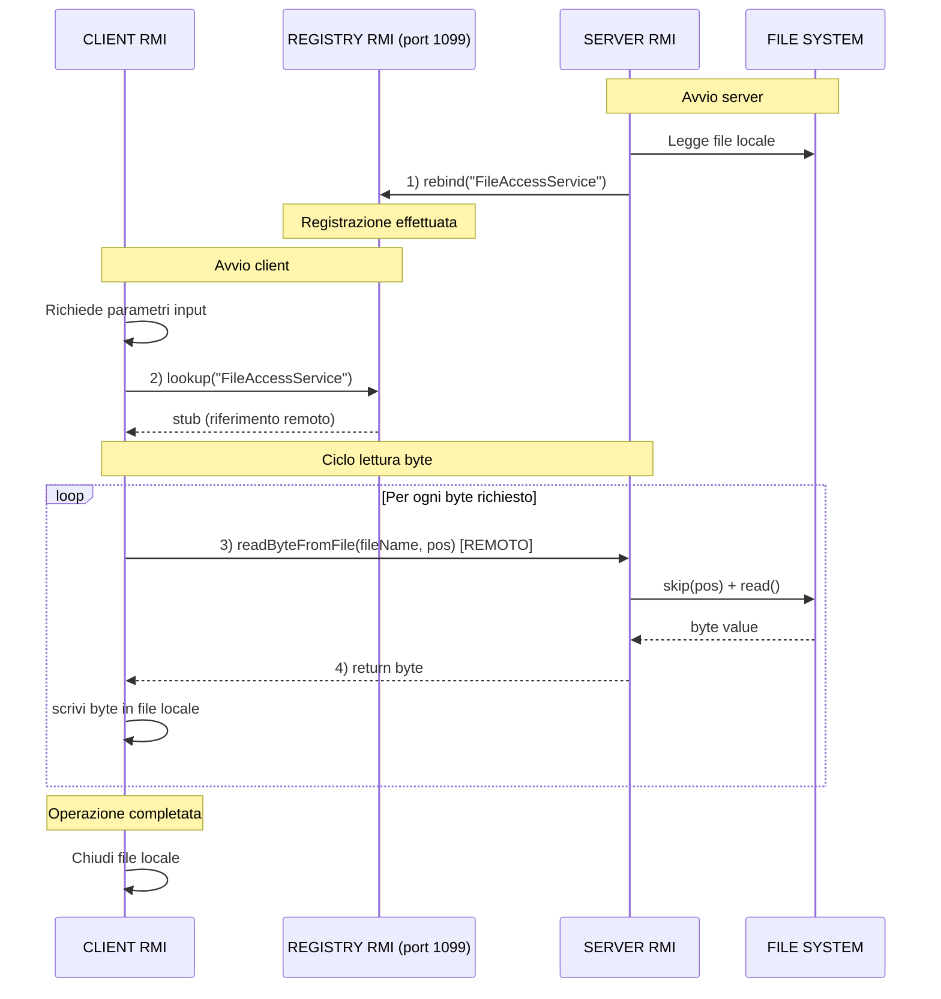

# 📚 Es03-RMI - File Access (RMI)

## 🎯 Panoramica del Sistema

Questo esercizio implementa un sistema **client-server** basato su **RMI (Remote Method Invocation)** di Java per l'accesso remoto ai file. 

---

## 🚀 Come Usare il Sistema

### **1️⃣ Preparazione**

Prima di eseguire, crea un file di input sul server:
```bash
cd Es03-RMI/03_file_access

# Windows PowerShell: Crea il file test.txt
"Hello RMI File Access System!" | Out-File -Encoding UTF8 input.txt

# Linux/Mac: Usa echo
echo "Hello RMI File Access System!" > input.txt
```

### **2️⃣ Compilazione**
```bash
# Compila tutti i file
javac FileAccessInterface.java
javac FileAccessServer.java
javac FileAccessClient.java
```

### **3️⃣ Esecuzione**

**Terminale 1 - Server RMI:**
```bash
java FileAccessServer
```

**Terminale 2 - Client RMI:**
```bash
java FileAccessClient
```

Durante l'esecuzione del client, inserisci i parametri richiesti:
```
Inserisci il nome del file remoto (sul server): input.txt
Inserisci il nome del file di output (locale): output.txt
Quanti byte desideri leggere: 10
```

### **4️⃣ Verifica dei risultati**

Dopo l'esecuzione, il client avrà creato `output.txt` con i dati letti dal server.

```bash
# Visualizza il file generato
cat output.txt
type output.txt  # Windows
```

---

## 📊 Diagramma di Interazione



---

## 📖 Componenti RMI

### **1. Interface Remota** (`FileAccessInterface.java`)

```java
public interface FileAccessInterface extends Remote {
    byte readByteFromFile(String fileName, long position) throws RemoteException;
}
```

**Responsabilità:**
- Definisce il "contratto" tra client e server
- Dichiara UN metodo remoto: `readByteFromFile()`
- Specifica le eccezioni che possono essere lanciate

**Parametri del metodo:**
- `fileName`: Percorso del file sul server (es. `"input.txt"`)
- `position`: Posizione (offset 0-based) del byte da leggere
  - Esempio: position=0 legge il primo byte, position=5 legge il sesto byte

**Valore di ritorno:**
- Il byte letto (0-255)
- `-1` per indicare errore o fine file (EOF)

**Eccezioni:**
- `RemoteException`: Lanciata se errore di rete o I/O

---

### **2. Server** (`FileAccessServer.java`)

```java
public class FileAccessServer extends UnicastRemoteObject implements FileAccessInterface {
    @Override
    public byte readByteFromFile(String fileName, long position) throws RemoteException { ... }
    
    public static void main(String[] args) { ... }
}
```

- **Implementa l'interfaccia remota**: Fornisce la logica per `readByteFromFile()`
La funzione apre il file, si sposta alla posizione richiesta e legge un byte.

---

### **3. Client** (`FileAccessClient.java`)


Il client richiede i parametri interattivamente:
```
Inserisci il nome del file remoto (sul server): input.txt
Inserisci il nome del file di output (locale): output.txt
Quanti byte desideri leggere: 10
```

Esattamente come negli esercizi precedenti, il client ottiene lo stub remoto dal registry e invoca `readByteFromFile()` per ogni byte richiesto, scrivendolo nel file locale.
---


## 💡 Esempi di Esecuzione

### **Scenario: Leggere i primi 5 byte di "Hello"**

**Output Server:**
```
==================================================
SERVER RMI - File Access
==================================================
✓ Registry RMI creato sulla porta 1099
✓ Servizio 'FileAccessService' registrato nel Registry
✓ Server RMI pronto per ricevere richieste di accesso ai file
==================================================
📥 Richiesta ricevuta: file='input.txt', posizione=0
✓ Byte letto: 72 (char: 'H')
📥 Richiesta ricevuta: file='input.txt', posizione=1
✓ Byte letto: 101 (char: 'e')
📥 Richiesta ricevuta: file='input.txt', posizione=2
✓ Byte letto: 108 (char: 'l')
📥 Richiesta ricevuta: file='input.txt', posizione=3
✓ Byte letto: 108 (char: 'l')
📥 Richiesta ricevuta: file='input.txt', posizione=4
✓ Byte letto: 111 (char: 'o')
```

**Output Client:**
```
==================================================
CLIENT RMI - File Access
==================================================

📝 Configurazione del client RMI

Inserisci il nome del file remoto (sul server): input.txt
Inserisci il nome del file di output (locale): output.txt
Quanti byte desideri leggere: 5

──────────────────────────────────────────────────
Parametri configurati:
  • File remoto: input.txt
  • File locale: output.txt
  • Byte da leggere: 5
──────────────────────────────────────────────────

✓ Connesso al Registry RMI sulla porta 1099
✓ Riferimento a 'FileAccessService' ottenuto
──────────────────────────────────────────────────
📝 File di output aperto: output.txt
📝 Byte 0 scritto: 72 (char: 'H')
📝 Byte 1 scritto: 101 (char: 'e')
📝 Byte 2 scritto: 108 (char: 'l')
📝 Byte 3 scritto: 108 (char: 'l')
📝 Byte 4 scritto: 111 (char: 'o')
──────────────────────────────────────────────────
✓ Operazione completata!
✓ Dati scritti in: output.txt
```

**File output.txt creato:**
```
Hello
```

---

## 📚 Vantaggi di questo sistema RMI

✅ **Accesso remoto trasparente**: Come se il file fosse locale  
✅ **Selettivo**: Leggi solo i byte che ti servono  
✅ **Type-safe**: Compilazione controlla i tipi  
✅ **Sicuro**: Finally garantisce chiusura file  
✅ **Scalabile**: Il registry permette di aggiungere server  
✅ **Input interattivo**: Parametri da utente, non hardcodati  

---


*Esercitazione per il corso di Algoritmi Distribuiti - Dicembre 2025*